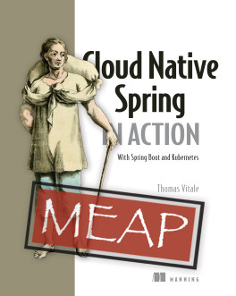

# 云原生 Spring 实战 (基于 Spring boot 和 Kubernetes)

《Cloud Native Spring in Action With Spring Boot and Kubernetes》 预计将于 2022 年春出版。现在的翻译基于 Manning 出版社的 MEAP 版本。



地址：https://www.manning.com/books/cloud-native-spring-in-action

LiveBook: https://livebook.manning.com/book/cloud-native-spring-in-action

源码地址：https://github.com/ThomasVitale/cloud-native-spring-in-action


## 强烈推荐您购买此书
## 尊重作者，保护版权

翻译说明：
* 中文翻译工作都在 cn-translate 目录下
* 书中使用到的图片都放在 cn-translate/assets 目录下，使用时注意路径。
* 翻译中所有涉及读者称谓的都用 **`您`**，不用 `你`。
* 引用书中的代码时标识语言，如：` ```java `
* 引用配置时指定类型，如： `  ```yaml  或 ```xml  `
* 引用命令时指定类型，如`  ```bash  `


**进度：**

| 章节 | 完成度 |
| :--- | :--- |
| Welcome | 完成 |
| Part 1 Cloud Native |  |
| 1 - Introduction to cloud native | 完成 |
| 2 - Cloud native patterns and technologies | **进行中** |

GitHub地址：[https://github.com/LeonLi0102/cloud-native-spring-in-action-translate.git](https://github.com/LeonLi0102/cloud-native-spring-in-action-translate.git)


GitBook地址：[https://leonli0102.github.io/cloud-native-spring-in-action/](https://leonli0102.github.io/cloud-native-spring-in-action/)
