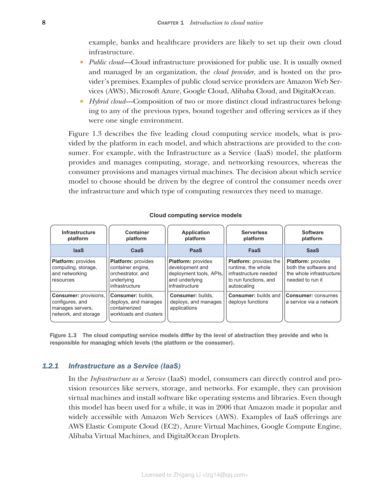

### 1.2.5 软件即服务（SaaS）

软件即服务（Software as a Service，SaaS）是最高层次的抽象。使用 SaaS，你直接使用通过互联网提供的软件应用程序，而无需安装、维护或更新任何东西。所有的事情都由提供商处理。

**SaaS 的特点：**

* 你负责使用软件
* 云提供商管理一切：基础设施、平台和应用程序
* 按订阅或使用量付费
* 通过 Web 浏览器或 API 访问

**常见的 SaaS 示例：**

* Gmail、Outlook（电子邮件）
* Salesforce（CRM）
* Slack（团队协作）
* GitHub（代码托管）
* Netflix（视频流媒体）

**适用场景：**

* 需要现成的业务应用程序
* 不想自己构建和维护软件
* 需要快速开始使用
* 希望自动获得更新和新功能

**示例：** 使用 GitHub 托管代码仓库，你只需要将代码推送到 GitHub，不需要管理 Git 服务器或处理备份、安全更新等问题。

#### 服务模型对比

| 模型 | 你管理什么 | 云提供商管理什么 |
|------|-----------|----------------|
| IaaS | 应用、数据、运行时、中间件、操作系统 | 虚拟化、服务器、存储、网络 |
| CaaS | 应用、数据、容器 | 编排、虚拟化、服务器、存储、网络 |
| PaaS | 应用、数据 | 运行时、中间件、操作系统、虚拟化、服务器 |
| FaaS | 函数代码 | 运行时、中间件、操作系统、虚拟化、服务器 |
| SaaS | 无 | 一切 |

**图 1.3 云计算服务模型的不同之处在于它们提供的抽象级别，以及由谁（平台或消费者）负责管理哪些层级。**

对于云原生应用程序开发，CaaS 和 PaaS 是最常见的选择。CaaS（如 Kubernetes）提供了更多控制权，适合需要精细管理的场景；PaaS（如 Heroku）提供了更高的抽象，适合快速开发和部署。
