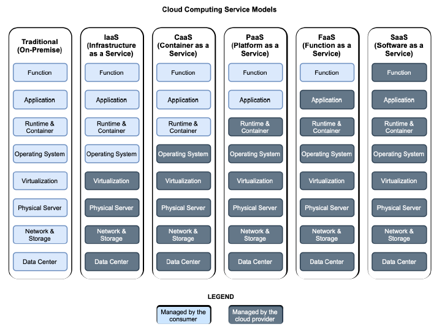

# 1.2 云和云计算模型

在关注主要角色，即云原生应用程序之前，我想先介描述一下我们这个旅程发生的地点，也是云原生应用程序运行的环境：云。如下图所示，我将在本节中定义云及其主要特性。如图 1.2 所总结的，如果云原生应用程序设计为在云环境中良好运行，您应该要知道那是什么样的环境。

**图 1.2 云是一种以不同计算模型为特征的 IT 基础设施，云供应商根据消费者需求的不同控制程度来提供服务。**  

云是一种根据云计算模型，支持向消费者交付计算资源的 IT 基础设施。国家标准与技术研究所（NIST）对云计算的定义如下：

*云计算是一种模型，它支持对网络进行无处不在、方便的按需访问可配置计算资源的共享池（例如，网络、服务器、存储器、应用程序和服务等），可以用最少的管理工作与服务提供者交互。*

就像你从供应商那里获得电力，而不是自己发电一样。通过云您可以获得作为商品的计算资源（例如，服务器、存储和网络）。

云提供商管理底层云基础设施，因此消费者无需担心机器或网络等物理资源。迁移到云的公司可以通过网络（通常是 Internet）获取计算资源。通常会使用一组 API 形成自助服务，根据需要按需调配和扩展资源。

弹性是该模型的主要特征之一：计算资源可以根据需求动态调配和发布。

*弹性是指系统能够通过资源调配来适应工作负载变化的程度，以自主方式进行资源调配，以便在每个时间点，使可用资源与当前需求尽可能匹配。*

传统 IT 基础设施无法提供弹性能力。公司必须计算所需的最大计算能力，并建立支持该能力的基础设施，即使大部分情况下只是偶尔需要。随着云计算模型的出现，计算资源受到监控，消费者只为他们实际使用的东西付费。

对于云基础设施应该在哪里或应该由谁提供，没有严格的要求。云服务有几种部署模型，主要是私有云、公共云和混合云。

* 私有云。为单个组织使用而配置的云基础架构。可以由组织本身或第三方管理，也可以内部部署或外部托管。对于要处理敏感数据或非常关键系统的组织，私有云通常是云计算的首选选项。这也是一个常见选择，完全控制基础设施以符合特定法律和法规，像《通用数据保护条例》（GDPR）或《加州消费者隐私法》（CCPA）。例如，银行和医疗服务提供商很可能建立自己的云基础设施。

* 公共云。为公共使用而配置的云基础架构。它通常是由某组织所有并提供管理，也就是云服务商，都托管在提供商的场所。公有云服务提供商的例子有 Amazon Web Services（AWS）、Microsoft Azure 和 Google Cloud。

* 混合云。由两个或多个不同的云基础架构组成，由前面的类型绑定在一起并提供服务，就好像它们是一个单一的环境。

云计算模型提供了五种主要的服务模型，具体取决于给消费者提供哪些功能。关于选择哪种服务模型的决策，应该是由消费者对基础设施的需求控制程度，以及他们需要管理的哪种类型的计算资源。图 1.3 显示了领先的云计算服务与传统基础设施的比较模型，并显示了维护每个基础设施级别的人员：消费者或云提供商。

**图 1.3 云计算服务模型。它们的不同之处在于它们提供的抽象级别（例如，使用 IaaS，用户管理虚拟机）以及谁负责管理哪些虚拟机
级别（例如，对于 CaaS，使用者管理容器，提供者管理底层容器基础设施）。**

