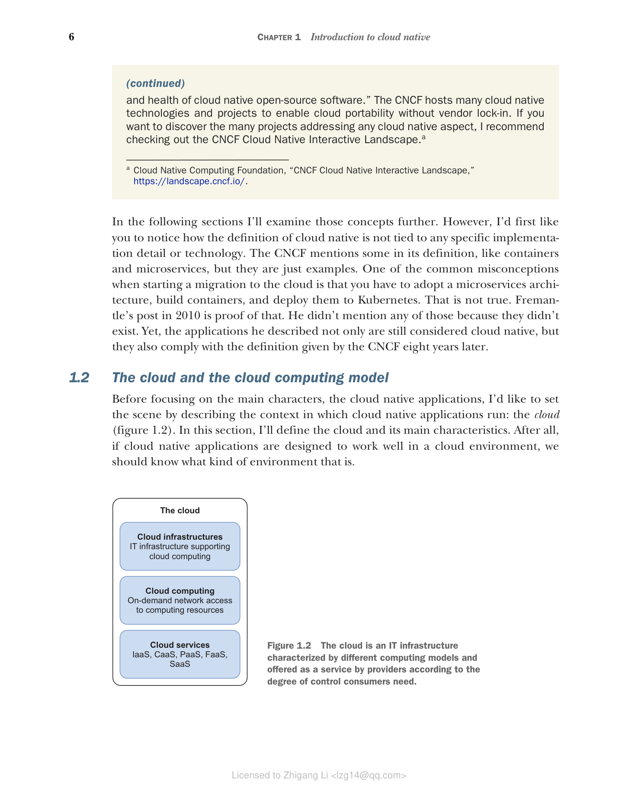

## 1.2 云和云计算模型

云（Cloud）是一个广泛使用的术语，但它的含义是什么？根据美国国家标准与技术研究院（NIST）的定义，云计算是一种模型，它能够实现对共享的可配置计算资源池（如网络、服务器、存储、应用和服务）的便捷、按需网络访问，这些资源可以快速供应和释放，只需最少的管理或与云服务提供商的交互。

这个定义突出了云计算的关键特征：

* **按需自助服务**——用户可以根据需要自动获取计算资源，无需人工干预。
* **广泛的网络访问**——资源可以通过网络从各种设备访问。
* **资源池化**——多个用户共享计算资源，资源根据需求动态分配。
* **快速弹性**——资源可以快速扩展或收缩。
* **可度量的服务**——资源使用情况可以被监控、计量和计费。

云计算通过不同的服务模型提供这些能力，每种模型都提供了不同程度的抽象和控制。让我们来看看主要的云计算服务模型。

**图 1.2 云是一种IT基础设施，其特点是采用不同的计算模型，由提供商根据消费者所需的控制程度以服务形式提供。**
