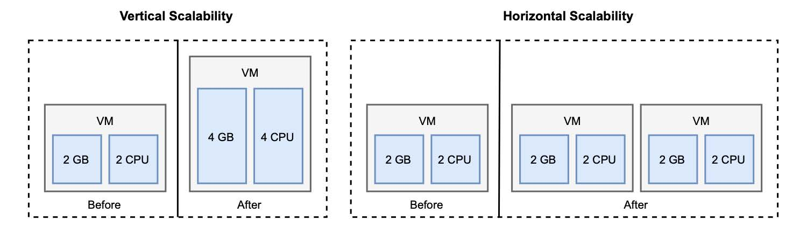

### 1.3.1 扩展性

云原生应用程序是可扩展的，这意味着如果需要，它可以为不断增加的工作负载提供额外的资源。根据这些额外资源的性质，可分为垂直扩展和水平扩展。

* **垂直扩展**。垂直缩放或上下缩放，这意味着给计算节点添加或删除硬件资源，如 CPU 或 内存。这种方法是有限度的，因为不可能无限添加硬件资源。另一方面，应用程序不需要做什么特殊设计就可以缩放。

* **水平扩展**。水平缩放或内外缩放，意味着添加更多计算节点或容器（例如，当使用 Kubernetes 时）到系统中。这种方法与垂直扩展不同，几乎没有限制，但它需要应用程序要特别处理以支持水平扩展。

传统系统通常会在工作负载增加的情况下采用垂直扩展。添加 CPU 和内存是应用程序支持更多用户，而无需（重新）设计以实现扩展的常用方法。在特定情况下，这仍然是一个不错的选择，但是云需要其他东西。

在云中，一切都是动态不断变化的，水平扩展是首选。基于云计算模型提供的抽象级别，可以直接启动应用程序的新实例，而不是增加已经运行的机器的计算能力。因为云是有弹性的，所以可以在短时间内动态地进行缩放。我把弹性作为一个主要特性来讨论：根据需求主动采取行动，调配和释放计算资源。可伸缩性是弹性的先决条件。

图 1.5 显示了垂直扩展和水平扩展之间的区别。在垂直扩展情况下，我们通过向现有虚拟机添加更多资源来扩展。在水平扩展情况下，我们添加另一个虚拟机，以帮助现有虚拟机处理额外的工作负载。

**图1.5 当您需要支持不断增加的工作负载时，垂直扩展模型将添加硬件资源给计算节点，而水平扩展模型将增加更多计算节点。**
  

