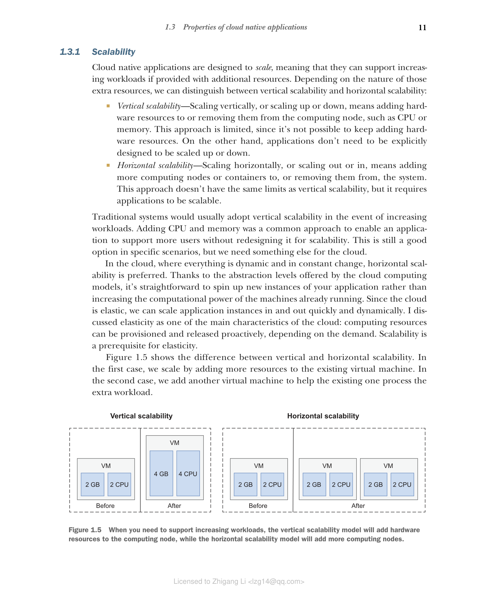

### 1.3.1 可扩展性

可扩展性是云原生应用程序的核心特性之一。它指的是应用程序能够根据负载的变化动态地增加或减少资源，同时保持性能和服务质量。

**两种主要的扩展方式：**

* **垂直扩展（Scale Up/Down）**——增加或减少单个实例的资源（CPU、内存）。这种方式简单但有限，因为单个机器的资源是有上限的。
* **水平扩展（Scale Out/In）**——增加或减少实例数量。这是云原生应用程序的首选方式，因为理论上可以无限扩展。



**图 1.5 当需要支持不断增长的工作负载时，垂直扩展模型会为计算节点增加硬件资源，而水平扩展模型则会增加更多的计算节点。**

**云原生可扩展性的关键原则：**

* **无状态设计**——应用程序实例不保存客户端会话数据，任何请求可以被任何实例处理。这使得水平扩展变得简单。
* **外部化状态**——将状态存储在外部服务中（如数据库、缓存），而不是应用程序内存中。
* **快速启动**——应用程序应该能够快速启动，以便在负载增加时快速扩展新实例。
* **优雅关闭**——在缩减实例时，能够优雅地处理现有请求，避免数据丢失。

**自动扩展：**

云平台提供自动扩展功能，可以根据配置的指标（如 CPU 使用率、请求延迟、队列长度）自动调整实例数量。例如，Kubernetes 的 Horizontal Pod Autoscaler（HPA）可以根据 CPU 使用率自动扩展 Pod 数量。

```yaml
# Kubernetes HPA 配置示例
apiVersion: autoscaling/v2
kind: HorizontalPodAutoscaler
metadata:
 name: catalog-service-hpa
spec:
 scaleTargetRef:
 apiVersion: apps/v1
 kind: Deployment
 name: catalog-service
 minReplicas: 2
 maxReplicas: 10
 metrics:
 - type: Resource
 resource:
 name: cpu
 target:
 type: Utilization
 averageUtilization: 70
```

这个配置定义了：当 CPU 使用率超过 70% 时，自动扩展到最多 10 个实例；当负载降低时，缩减到最少 2 个实例。
