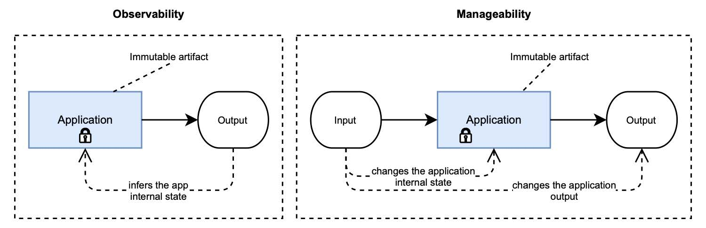

### 1.3.4 可观测性

可观测性是来自控制理论的一个特性。考察一个系统时，可观察性是一种通过衡量外部输出，来推断其内部状态的方法。在软件工程中，系统是一个单一的应用程序或一个分布式系统。整体外部输出可以是度量、日志和跟踪等数据。图 1.6 显示了可观测性是如何工作的。

**图 1.6 可观测性指的是通过外部输出推断应用程序的内部状态。可管理性是指通过外部输入来改变内部状态和输出。在这两种情况下，应用程序本身不会更改。它是不可变的。**  

Twitter 的可观测性工程团队确定了可观测性的四大支柱：
* **监测**。监视是关于测量应用程序的某些特定方面，以获得有关其整体健康状况的信息并识别故障。在本书中，您将利用 Spring Boot Actuator 的监控功能，并将 Prometheus 与 Spring 集成来导出有关应用程序的相关度量信息。
* **警报/可视化**。收集有关系统状态的数据只有在使用时才有用。在监测到应用程序发现故障时，应触发警报，并且应该采取一些措施来处理它。定制监控大盘用于可视化收集的数据，并将其绘制在相关图表中，旨在提供系统运行的良好视图。在本书中，您将了解如何使用 Grafana 可视化从云原生应用程序收集的数据。
* **分布式系统跟踪基础设施**。在分布式系统中，仅仅跟踪每个子系统的行为是不够的。跟踪数据流经的不同子系统非常重要。在本书中，您将使用 Spring Cloud Sleuth 进行分布式链路跟踪，并整合 Spring 与 Jaeger，以对跟踪数据进行可视化。
* **日志聚合/分析**。跟踪应用程序中的主要事件至关重要，可以推断软件的行为并在出现问题时进行调试。在云原生系统中，应聚合和收集日志，以便更好地了解系统行为，才有可能进行分析，从数据中挖掘信息。在本书中，我将较多地讨论日志。您将学习使用 EFK 技术栈（Elastic、Fluentd、Kibana）来收集和可视化日志。
