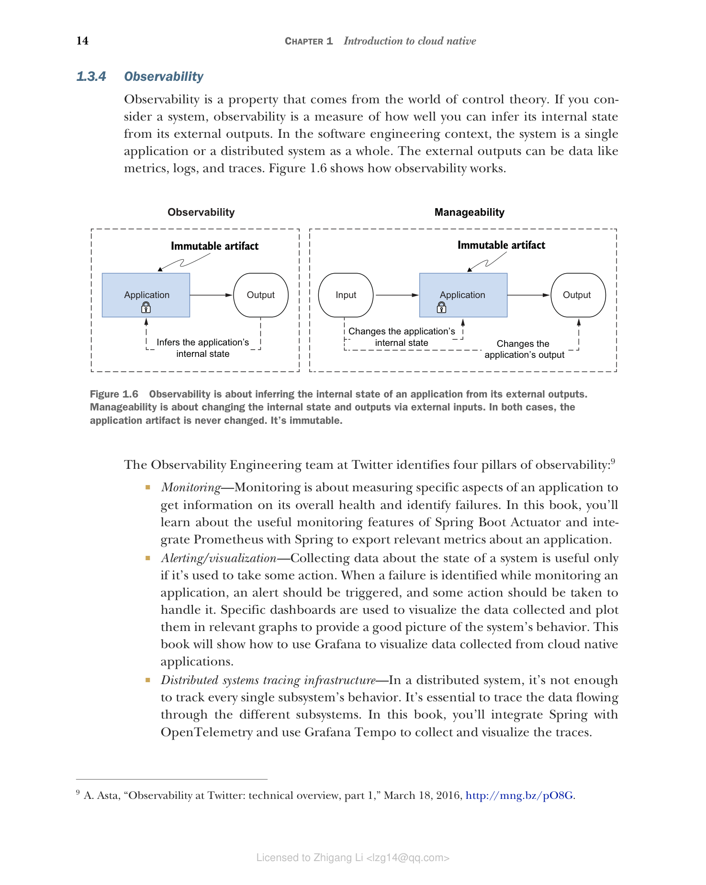

### 1.3.4 可观测性

可观测性是从外部推断系统内部状态的能力。在分布式系统中，传统的调试方法（如查看日志或附加调试器）往往不够用，因为系统由多个服务组成，分布在多台机器上。可观测性通过三个关键支柱来解决这个问题：日志、指标和追踪。



**图 1.6 可观测性是通过外部输出来推断应用程序内部状态。可管理性是通过外部输入来改变内部状态和输出。在这两种情况下，应用程序工件都不会被改变，它是不可变的。**

**可观测性的三大支柱：**

* **日志（Logs）**——记录系统中发生的事件。日志是时间序列的、不可变的记录，可以用来了解系统在特定时间点发生了什么。
 
```java
// 结构化日志示例
log.info("User login successful, userId={}, ip={}, duration={}ms", 
 userId, clientIp, duration);
```

* **指标（Metrics）**——可聚合的数值数据，用于衡量系统的健康状况和性能。常见的指标包括请求数量、响应时间、错误率、CPU 使用率等。

```java
// 使用 Micrometer 记录指标
@Autowired
private MeterRegistry registry;

public void processOrder(Order order) {
 Timer.Sample sample = Timer.start(registry);
 try {
 orderService.process(order);
 sample.stop(Timer.builder("order.process")
 .tag("status", "success")
 .register(registry));
 } catch (Exception e) {
 sample.stop(Timer.builder("order.process")
 .tag("status", "failed")
 .register(registry));
 throw e;
 }
}
```

* **追踪（Traces）**——跟踪请求在分布式系统中的完整路径。追踪可以让你看到一个请求经过了哪些服务、在每个服务中花费了多长时间，以及在哪里出现了问题。

**可观测性工具生态：**

* **日志聚合**——Elasticsearch + Kibana、Loki + Grafana、Fluent Bit
* **指标监控**——Prometheus + Grafana、Datadog、New Relic
* **分布式追踪**——Jaeger、Zipkin、OpenTelemetry + Tempo
* **Spring Boot Actuator**——提供内置的健康检查、指标和管理端点

**为什么可观测性很重要：**

* **快速定位问题**——当系统出现问题时，可以快速找到根本原因。
* **容量规划**——通过分析指标，可以预测未来的资源需求。
* **性能优化**——通过追踪和指标，可以识别性能瓶颈。
* **安全审计**——日志可以用于审计和安全分析。

可观测性不是事后添加的功能，而应该在设计阶段就考虑进去。Spring Boot 和 Spring Cloud 提供了丰富的工具来实现可观测性。
