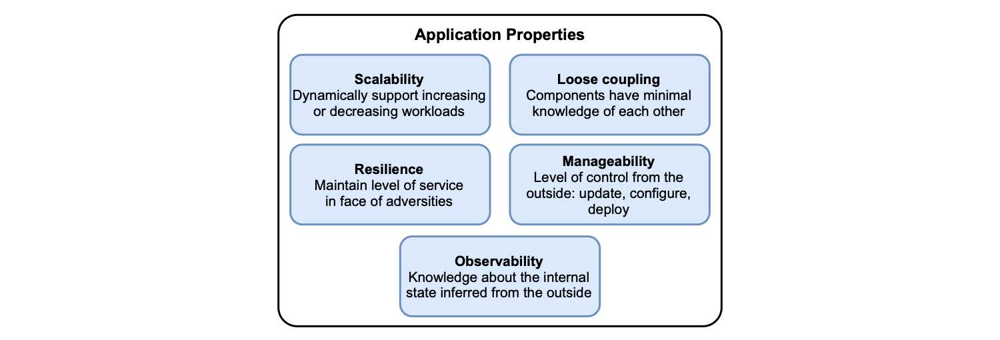

## 1.3 云原生应用的特性

场景已经设置好了：在云中。您应该如何设计应用程序以充分利用它的特点呢？CNCF 确定了云原生应用程序应该有的五个主要特性。就其本身而言，其想法是云原生是一种构建和运行应用程序，以展示出这些特性的方法论。Cornelia Davis 总结道，“云原生软件是由您的计算方式，而不是由在什么地方计算来决定的”。换句话说，云表示的是何处，云原生表示是怎么实现。

前面已经讲述了表示何处的部分：云。现在，让我们继续探索如何进行实现。做为一个快速参考，图 1.4 列出了相关特性和简短说明。

**图 1.4 云原生应用程序的主要属性是可伸缩性、松耦合、弹性、可管理性和可观察性。 **

