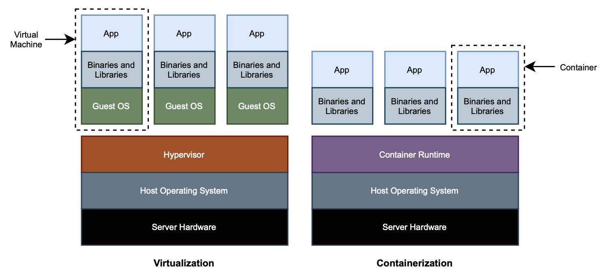

### 1.6.1 容器

想象一下，您加入了一个团队，开始开发一个应用程序。您要做的第一件事就是遵循开发指南，将自己的开发环境设置成与同事类似的环境。您开发一个新特性，然后在质量测试（QA）环境中测试它。一旦验证通过，应用程序就可以准备部署，再经过一些额外的测试，就可以上生产。该应用程序是为在特定的环境中运行而构建的，因此必须使所有涉及的环境尽可能相似。您要怎么保证这一点呢？这就是容器的价值所在。

在使用容器之前，您将依赖虚拟机来保证环境的可复制性、隔离和可配置性。虚拟化通过利用虚拟机监控程序进行硬件抽象，使其能够在同一台物理机上运行多个操作系统，以一种相互隔离的方式。虚拟机监控程序将直接在机器硬件上运行（类型 1 ）或主机操作系统上运行（类型 2 ）。

另一方面，OS 容器是一个轻量级的可执行包，包含所有需要在内部运行应用程序的内容。容器共享同一内核：无需完全引导操作系统来添加新的隔离上下文。在 Linux 上，这可以利用 Linux 内核提供的功能。包括：

* _名称空间（namespaces）_ 用于在进程之间划分资源，以便每个进程（或进程组）只能看到机器上可用资源的子集；
* _控制组（cgroups）_ 用于控制和限制进程（或进程组）的资源使用。

>仅使用虚拟化时，硬件是共享的，而容器也共享相同的操作系统内核。无论如何，两者都提供了用于隔离运行软件的计算环境，即使隔离的程度是不一样的。

图 1.10 显示了虚拟化和容器技术之间的区别。

**图 1.10 虚拟化和容器技术在隔离上下文中共享的内容不同。虚拟机只共享硬件。容器也共享操作系统内核。后者更轻、更便携。**  

为什么容器在云原生应用中如此流行？传统上，您必须在虚拟机上安装并维护 JRE 和中间件，以使应用程序运行起来。而容器可以在几乎任何计算环境中可靠运行，独立于应用程序、其依赖项或中间件。不管是哪种应用程序，用哪种语言编写，或使用哪种库。从外部看，所有容器都有一个相似的形状，就像用于运输的集装箱一样。

因此，容器实现了灵活性、跨不同环境的可移植性和可重复部署性。由于轻量，对资源的要求较低，它们非常适合在云中运行，因为实例都是一次性的，会经常快速地扩缩。相比之下，构建和销毁虚拟机要昂贵得多，而且费时。

>**容器！到处都是容器！**
>
>容器（Container） 是一个可以表示不同事物的词，这取决于文本的上下文。有时候模棱两可会产生一些混乱，所以让我们看看它在不同的语境中意味着什么。
>* 操作系统。操作系统容器是一个与系统其余部分隔离的环境，是在系统中运行一个或多个进程的方法。在本书中，我们将重点介绍 Linux 容器，但请注意 Windows 容器也存在。
>* Docker。Docker 容器是 Linux 容器的实现，开放容器计划（OCI）已将其标准化。
>* Spring。Spring 容器是指应用程序上下文，其中属性和其他应用程序资源被管理和执行。
>* Servlet。利用 Java Servlet API，Servlet 容器为 web 应用程序提供运行时。如 Tomcat 服务器的 Catalina 组件，就是 Servlet 容器的一个示例。

虚拟化和容器并不是相互排斥的。实际上，您可以在云中同时使用它们：在虚拟机组成的基础架构中运行容器。IaaS 模型（基础架构即服务）提供了一个虚拟化层，可以用于引导新的虚拟机。最重要的是，您可以直接运行您的容器。

在开发或执行一些早期测试时，应用程序通常由在同一台机器上运行的不同容器组成。但您很快就会发现，需要管理的容器太多，实在太复杂了。尤其是当您为扩展性而开始复制容器时，将容器分布到不同的机器上。那时，您就应该开始依赖 CaaS 模型（容器即服务）提供更高级别的抽象了。它提供计算机集群中部署和管理容器的功能。请注意，在此场景中，仍然有一个虚拟化层。

即使在使用诸如 Heroku 或 Cloud Foundry 之类的 PaaS 平台时，也会涉及容器。您在这些平台上部署应用程序，只需提供 JAR 工件，平台处理 Java 运行时环境、中间件、操作系统和任何需要的依赖项。在幕后，他们用所有这些组件构建了一个容器，并最终运行了您的 JAR。所不同的是，不再由您负责建造一个容器，而是平台本身为您完成了这一任务。一方面，这很方便，开发人员的责任少了。另一方面，您放弃了对运行时和中间件的控制，只能使用供应商固定提供的中间件类型。

在这本书中，您将学习如何使用 Cloud Native Buildpacks 对 Spring 应用程序进行容器化，您将使用 Docker 在本地环境中运行它们。