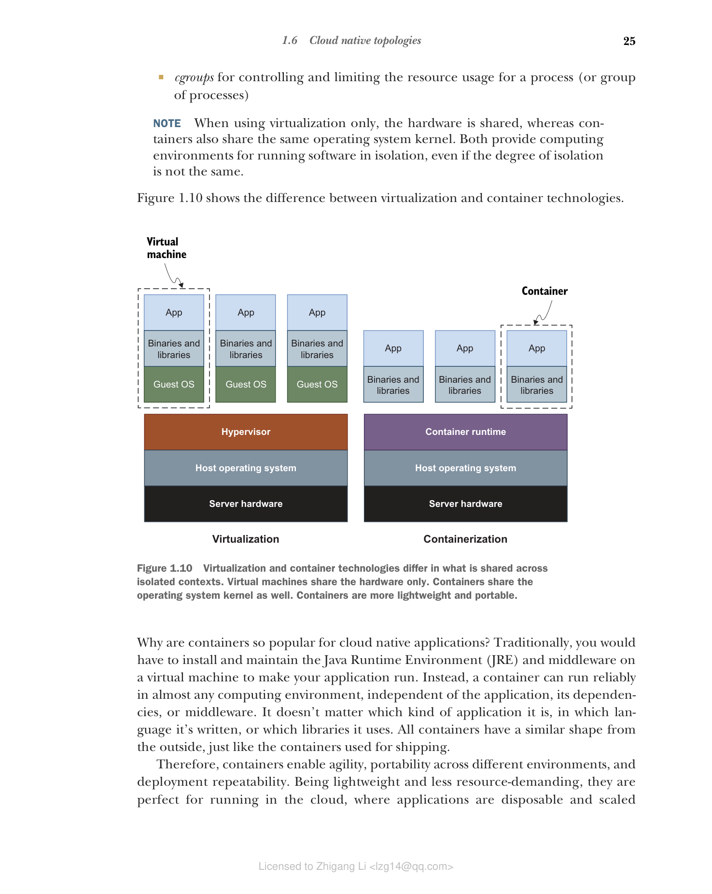

### 1.6.1 容器

容器是一种轻量级的虚拟化技术，它将应用程序及其依赖打包到一个可移植的单元中。与传统的虚拟机不同，容器共享主机操作系统内核，因此更轻量、启动更快。

**容器 vs 虚拟机：**

| 特性 | 容器 | 虚拟机 |
|------|------|--------|
| 启动时间 | 毫秒到秒 | 分钟 |
| 资源占用 | MB 级 | GB 级 |
| 隔离级别 | 进程级 | 硬件级 |
| 可移植性 | 高（一次构建，到处运行） | 中（需要兼容的虚拟化平台） |
| 密度 | 一台机器可运行数百个容器 | 一台机器通常运行几个虚拟机 |



**图 1.10 虚拟化和容器技术的区别在于它们在隔离上下文中共享的内容。虚拟机仅共享硬件。容器同时共享操作系统内核。容器更轻量且可移植。**

**Docker 容器示例：**

```dockerfile
# Dockerfile - 构建 Spring Boot 应用容器
FROM eclipse-temurin:17-jre-alpine
WORKDIR /app
COPY target/catalog-service-*.jar catalog-service.jar
EXPOSE 8080
ENTRYPOINT ["java", "-jar", "catalog-service.jar"]
```

```bash
# 构建和运行容器
docker build -t catalog-service .
docker run -d -p 8080:8080 catalog-service
```

**容器的优势：**

* **一致性**——开发、测试、生产环境完全相同，消除"在我机器上能运行"的问题。
* **可移植性**——容器可以在任何支持容器运行时的环境中运行。
* **隔离性**——每个容器都有自己的文件系统、网络和进程空间。
* **轻量级**——容器共享主机内核，资源占用少。
* **快速启动**——容器可以在毫秒内启动。

**容器的挑战：**

* **状态管理**——容器是无状态的，需要外部服务来管理状态。
* **网络复杂性**——容器间的通信需要仔细配置。
* **安全考虑**——共享内核可能带来安全隐患。
* **存储管理**——需要处理持久化存储问题。

容器是云原生的基础，为微服务架构提供了理想的运行环境。
