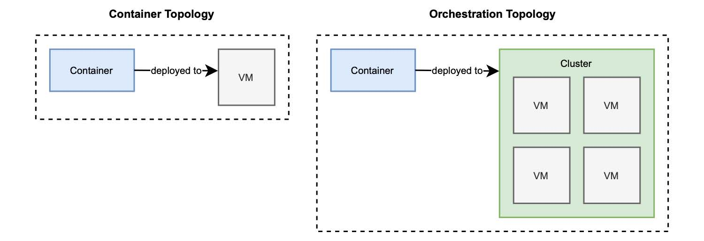

### 1.6.2 编排

现在您决定使用容器了，真是太好了！您可以依靠容器的可移植性，将它们部署到提供容器运行时的任何基础架构中。实现了可再现性，所以将容器从开发环境转移到暂存环境，再转移到生产时都很方便。您可以快速缩放，因为它们是如此轻量。还为您的应用程序提供了高可用性，所以可以快速地对它们进行更新。您已经完全准备好将它们用于您的下一个云原生系统了，是吗？

在一台机器上配置和管理容器非常简单。但是当您开始处理数十个或数百个容器，这些容器被缩放并部署在多台机器上，您还需要别的东西。

当我们从虚拟服务器（IaaS 模型）转移到容器集群（CaaS 模型）时，我们还需要更新我们的观念。在 IaaS 中，我们关注单个计算节点，就是个虚拟服务器。在 CaaS 中，底层基础设施是抽象的，我们关注的是节点集群。有了 CaaS 解决方案提供的新视角，部署目标将不再是一台机器，而是一个集群。像 Kubernetes 这样的 CaaS 平台，为云原生环境中我们所关心的这些问题，提供了解决方案：跨集群编排容器。这两种不同的拓扑如图 1.11 所示。

**图 1.11 容器的部署目标是一台机器，而对于编排器来说，它是一个集群。**  

容器编排可帮助您自动化许多不同的任务：
* 管理集群，必要时启动和关闭机器；
* 将集群中的容器进行调度并部署，直到满足容器对 CPU 和内存的要求；
* 动态扩展容器实例，利用运行状况监测实现高可用性和韧性；
* 为容器建立相互通信的网络，定义路由、服务发现和负载平衡；
* 向因特网公开服务，建立端口和网络；
* 根据特定标准向容器分配资源；
* 配置容器中运行的应用程序；
* 确保安全并强制执行访问控制策略。

指令编排工具是以声明方式完成的，例如，通过 YAML 文件。按照特定工具定义的格式和语言，您通常描述希望实现的状态：希望在集群中部署 3 个 web 应用程序容器副本、向 Internet 公开其服务。

容器编排器可以使用 Kubernetes、Docker Swarm 或 Apache Mesos。在这本书中，您将学习如何使用 Kubernetes 为 Spring 编排应用容器。