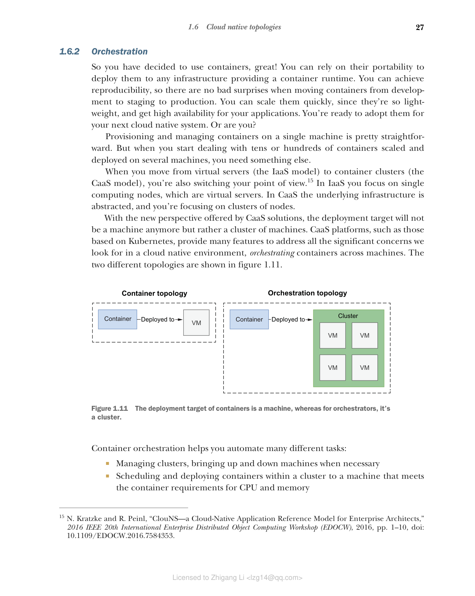

### 1.6.2 编排

容器编排是管理和协调多个容器的过程。在生产环境中，你通常需要运行多个容器实例，处理服务发现、负载均衡、扩展、故障恢复等问题。容器编排工具可以自动化这些任务。



**图 1.11 容器的部署目标是一台机器，而编排器的部署目标是一个集群。**

**Kubernetes 是最流行的容器编排平台：**

Kubernetes（简称 K8s）由 Google 开发并开源，现由 CNCF 维护。它提供了强大的功能来管理容器化应用程序。

**Kubernetes 核心概念：**

* **Pod**——Kubernetes 的最小部署单元，包含一个或多个容器。
* **Deployment**——管理 Pod 的副本数量和滚动更新。
* **Service**——为一组 Pod 提供稳定的网络端点和负载均衡。
* **Namespace**——将集群资源划分为多个虚拟集群。

**Kubernetes 示例：**

```yaml
# Deployment - 管理 Pod 副本
apiVersion: apps/v1
kind: Deployment
metadata:
 name: catalog-service
spec:
 replicas: 3
 selector:
 matchLabels:
 app: catalog-service
 template:
 metadata:
 labels:
 app: catalog-service
 spec:
 containers:
 - name: catalog-service
 image: catalog-service:latest
 ports:
 - containerPort: 8080
 resources:
 requests:
 memory: "256Mi"
 cpu: "250m"
 limits:
 memory: "512Mi"
 cpu: "500m"

---
# Service - 提供负载均衡
apiVersion: v1
kind: Service
metadata:
 name: catalog-service
spec:
 selector:
 app: catalog-service
 ports:
 - port: 80
 targetPort: 8080
 type: LoadBalancer
```

**编排的好处：**

* **自动扩展**——根据负载自动调整实例数量。
* **自动恢复**——当容器或节点故障时，自动重新调度。
* **滚动更新**——零停机时间部署新版本。
* **服务发现**——自动发现和连接服务。
* **负载均衡**——自动分配流量到多个实例。

**编排的挑战：**

* **学习曲线**——Kubernetes 有陡峭的学习曲线。
* **运维复杂性**——需要专门的运维知识来管理集群。
* **资源开销**——编排平台本身需要一定的资源。

编排是管理大规模容器化应用程序的必要工具。
