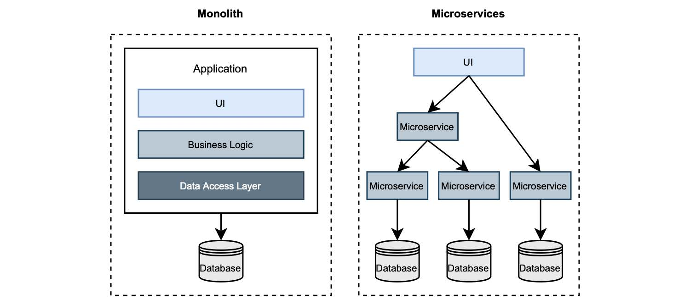

# 1.7.1 从分层到微服务到更高级别

IT 基础设施始终影响着软件的架构设计和运行方式。起初，我们在大型机上部署单个组件组成的单体应用程序。当互联网和个人电脑变得流行时，我们开始根据 `客户端/服务器模式` 设计应用程序。这是一个分层的体系结构。这种模式被广泛用于桌面和 web 应用程序，代码分解为表示层、业务层和数据层。

随着应用程序复杂性的增加和对敏捷性的需求，人们开始探索进一步对代码进行分解的方法。一种新的架构风格进入历史舞台：微服务。近几年来，这种架构风格越来越流行，许多公司决定根据这种新风格重构他们的应用程序。微服务与单体应用程序的异同如图 1.13 所示。

**图 1.13 单体式与微服务。单体结构是多层的。微服务是由可以独立部署的不同组件组成。**  

主要区别在于应用程序的分解方式。单体应用程序分为 3 层。相反，基于微服务的应用程序与多个组件关联，每个组件只实现一项功能。还有很多模式被提出，可将单体应用分解为微服务，以处理多个组件而不是一个组件的复杂性。

>这本书不是关于微服务的。因此，我不会进行更多详述。如果您是对这个话题感兴趣，Manning 出版社有几本关于微服务的书。比如 Chris Richardson 的 “Microservice Patterns”，还有 John Carnell 和 Illary Huaylupo Sanchez 合著的 “Spring Microservices”。如果您不熟悉微服务，不用担心，阅读本书并不要求您必须掌握这这方面的知识。

在经历了多年成功和失败的迁移之后，在开发人员社区，展开了对这种流行的架构风格的激烈讨论。一些开发者建议切换到 `微服务`以减少组件的数量，从而降低管理它们的复杂性。其他人则提出了 `城堡` （[citadel](https://blog.appsignal.com/2020/04/08/the-citadel-architecture-at-appsignal.html)） 架构风格，由一个中心的单体，以及环绕的微服务组成。尽管如此，其他人仍在鼓吹以模块化单体的形式回归单体应用。

最后，我认为重要的是选择一个能够支撑我们的业务，为客户提供价值的架构。这也我们开发应用程序的初衷。

每种架构风格都有其用武之地。世上没有银弹或适用一切的解决方案。大多数与微服务相关的负面体验都是由其他问题导致的，例如错误的代码模块化。单体应用与微服务之间不应水火不容。

在本书中，我有兴趣向您展示如何使用 Spring 构建云原生应用程序，并将其作为 Docker 容器部署到 Kubernetes。云原生应用程序是分布式的，就像微服务一样。您将发现通常讨论的微服务主题，实际上属于分布式系统，例如：路由和服务发现。云原生应用程序是松散耦合的，这是微服务的一个特性。

即使存在很多类似的地方，理解云原生应用程序与微服务不完全一样，也是至关重要的。您可以使用微服务风格来实现云原生应用。事实上，许多开发人员都是这样做的。但这不是一个硬性要求。在这本书中，我将使用可能称之为 `基于服务` 的架构。也许这不是一个吸引人的名字，但这对我们来说已经足够了。我们开发服务，它们可以是任意大小，并且它们可以根据不同的原则进行逻辑封装。以后您想要开发什么样的服务都行，只要根据组织和业务需求来设计。

