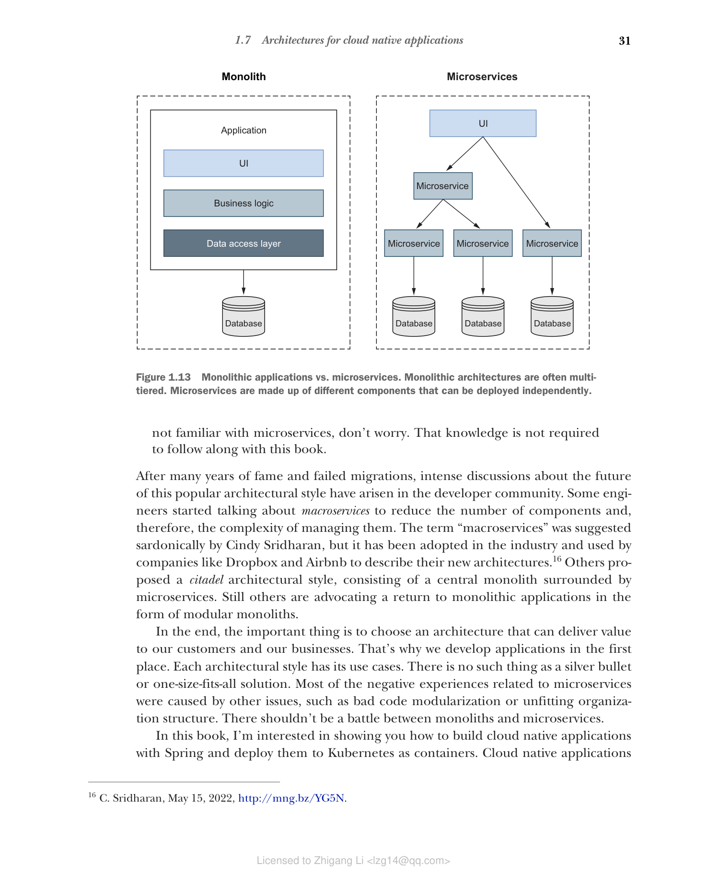

### 1.7.1 从多层架构到微服务架构及更远

软件架构经历了从单体到多层，再到微服务的演进。理解这些架构模式有助于我们更好地设计云原生应用程序。

**单体架构（Monolithic Architecture）：**

传统的单体架构将所有功能打包到一个应用程序中。所有代码、数据库访问和业务逻辑都在一个部署单元中。

```
┌─────────────────────────────────────┐
│ 单体应用程序 │
├─────────────────────────────────────┤
│ 用户管理 │ 订单管理 │ 库存管理 │
├─────────────────────────────────────┤
│ 数据库 │
└─────────────────────────────────────┘
```

**优点：**
* 开发简单，所有代码在一个项目中
* 部署简单，只有一个部署单元
* 调试简单，可以在本地运行完整系统

**缺点：**
* 代码库庞大，难以理解和维护
* 扩展困难，只能整体扩展
* 技术栈单一，难以使用不同的技术
* 故障影响大，一个问题可能导致整个系统崩溃

**多层架构（Multi-tiered Architecture）：**

多层架构将应用程序分为不同的层次，如表示层、业务层和数据层。

```
┌─────────────────────────────────────┐
│ 表示层 │
├─────────────────────────────────────┤
│ 业务层 │
├─────────────────────────────────────┤
│ 数据层 │
└─────────────────────────────────────┘
```

**优点：**
* 关注点分离，各层职责清晰
* 可以独立扩展各层
* 便于团队分工

**缺点：**
* 仍然是单体部署
* 层之间的耦合仍然存在
* 扩展粒度有限

**微服务架构（Microservice Architecture）：**

微服务架构将应用程序拆分为多个小型、独立的服务，每个服务负责一个特定的业务功能。

```
┌──────────┐ ┌──────────┐ ┌──────────┐
│ 用户服务 │ │ 订单服务 │ │ 库存服务 │
└────┬─────┘ └────┬─────┘ └────┬─────┘
 │ │ │
┌────┴─────┐ ┌────┴─────┐ ┌────┴─────┐
│ 用户数据库│ │ 订单数据库│ │ 库存数据库│
└──────────┘ └──────────┘ └──────────┘
```

**优点：**
* 服务独立部署和扩展
* 可以使用不同的技术栈
* 故障隔离，一个问题不会影响所有服务
* 团队自治，可以独立开发和部署

**缺点：**
* 分布式系统的复杂性
* 服务间通信开销
* 数据一致性挑战
* 运维复杂性增加



**图 1.13 单体应用与微服务。单体架构通常是多层的。微服务由可以独立部署的不同组件组成。**

**超越微服务：**

微服务不是终点。根据业务需求，你可能需要：

* **服务网格（Service Mesh）**——处理服务间通信的复杂性
* **事件驱动架构**——使用事件解耦服务
* **CQRS**——分离读写操作
* **领域驱动设计（DDD）**——指导服务边界的划分

选择合适的架构取决于业务需求、团队能力和技术成熟度。没有银弹，只有适合的方案。
