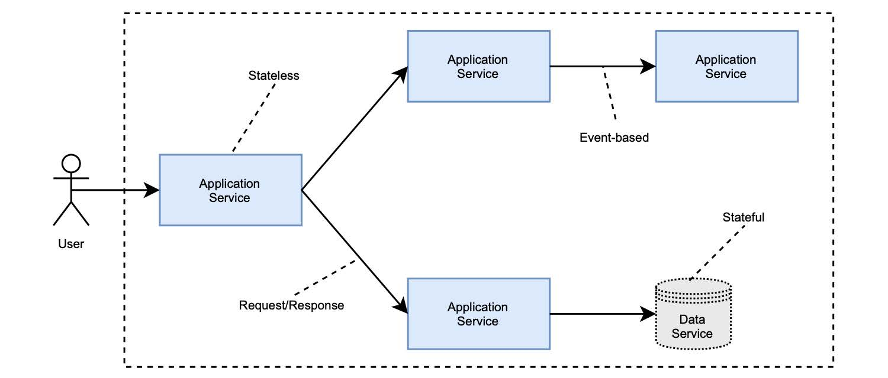

### 1.7.2 基于服务的云原生应用体系结构

在本书中，您将依据 `基于服务` 的体系结构来设计开发云原生应用。

您的主要工作内容，是开发一个可以用不同方式与其他服务交互的服务。利用 Cornelia Davis 提出的区别，我们可以确定这种架构中的两个重要元素：服务和交互。
* **服务（Service）**：向另一个组件提供服务的组件。
* **交互（Interaction）**：完成系统要求的，服务之间的通信。

服务是非常通用的组件，它们可能是任何东西。我们可以对它们进行分类，考虑它们是否存储任何类型的状态，可区分应用程序服务（无状态）和数据服务（有状态）。图 1.14 显示了这种云原生体系结构的要素。

**图 1.14 云原生应用程序的基于服务的体系结构。主要元素是服务（应用程序或数据）以不同方式相互作用。**

#### 应用程序服务

应用程序服务是无状态的，负责实现任何类型的逻辑。他们不必遵守微服务相关的规则，只要它们暴露出云原生应用的属性就行。

最重要的是，在设计每个服务时都要考虑到松耦合和高内聚。服务应尽可能独立。分布式系统是复杂的，所以您应该在设计阶段格外小心。服务数量的增加将导致问题数量的增加。

您可能会独自开发和维护系统中的大多数应用程序服务，但您也可以使用云服务商提供的一些服务，如身份验证或支付服务。

#### 数据服务

数据服务是有状态的，负责存储任何类型的状态。`状态（state）` 就是一切应该保留的信息，比如在关闭服务并启动新实例时。

它们可以是关系数据库（如 PostgreSQL）、键/值存储（如 Redis）或消息代理（如 RabbitMQ）。您可以自己管理这些服务。因为云原生应用要使用存储来保存状态，这会比您的想象要更具挑战，当然您也会因此而将获得更多控制自己数据的便利。另一种选择是使用云服务商的数据服务，服务商将负责管理与存储、恢复、扩展和性能。在这种情况下，还可以利用专门为云端处理大量数据而构建的服务（如 Amazon DynamoDB 或 Google BigQuery）。

云原生数据服务是一个迷人的主题，但在本书中，我们将主要讨论应用程序。与数据相关的问题，如集群、复制、一致性或分布式事务不会在书中详述。我很想介绍这些，但它们值得用专门的一本书去介绍。

#### 交互

云原生服务相互通信以满足系统的需求。通信方式将影响系统的整体特性。例如：选择 `请求/响应` 模式（同步 HTTP 调用）而不是基于事件的方法（通过 RabbitMQ 传输的消息）将导致不同级别的恢复能力。在本书中，您将使用各种不同类型的通讯方式，会了解不同通讯方式之间的差异，以及掌握在何时选择何种方式。
