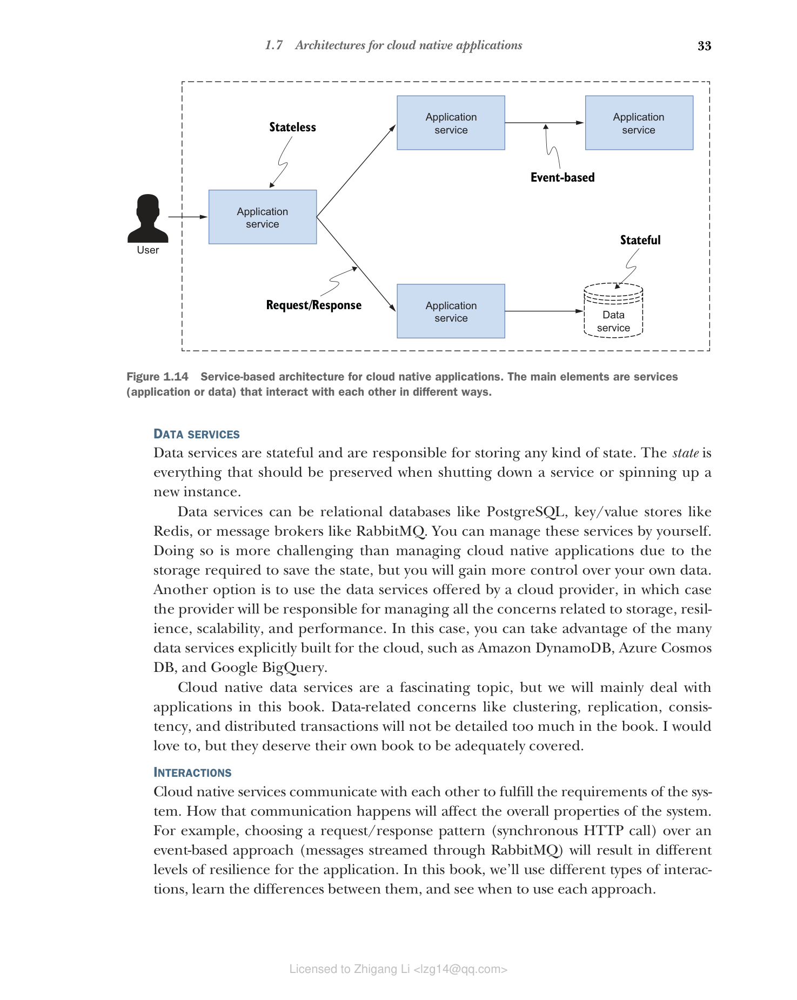

### 1.7.2 云原生应用程序的服务架构

云原生应用程序通常采用基于服务的架构。本节将介绍云原生架构中的关键组件和设计原则。

**云原生架构的核心组件：**

* **应用服务（Application Services）**——实现业务逻辑的微服务。这些服务是松散耦合的、无状态的、可独立部署的。

* **数据服务（Data Services）**——提供数据存储和管理的服务，如数据库、消息队列、缓存等。

* **交互（Interactions）**——服务之间的通信方式，如 HTTP、gRPC、消息传递等。



**图 1.14 云原生应用的基于服务的架构。主要元素是以不同方式相互交互的服务（应用服务或数据服务）。**

**服务设计原则：**

* **单一职责**——每个服务只负责一个特定的业务功能。
* **自治性**——服务可以独立开发、测试、部署和扩展。
* **无状态**——服务实例不保存会话状态，状态存储在外部服务中。
* **松散耦合**——服务之间通过定义良好的 API 通信，不直接访问彼此的内部状态。

**服务间通信模式：**

```java
// 1. 同步通信 - HTTP/REST
@RestController
@RequestMapping("/api/orders")
public class OrderController {
 @Autowired
 private CatalogClient catalogClient; // 调用其他服务
 
 @PostMapping
 public Order createOrder(@RequestBody OrderRequest request) {
 // 同步调用目录服务获取商品信息
 Product product = catalogClient.getProduct(request.getProductId());
 // 创建订单...
 return order;
 }
}

// 2. 异步通信 - 消息队列
@Service
public class OrderService {
 @Autowired
 private RabbitTemplate rabbitTemplate;
 
 public void createOrder(Order order) {
 // 保存订单
 orderRepository.save(order);
 // 异步发送消息，不等待响应
 rabbitTemplate.convertAndSend("order.events", 
 new OrderCreatedEvent(order.getId()));
 }
}

// 3. 事件驱动 - 使用 Spring Cloud Stream
@Bean
public Function<OrderEvent, OrderResponse> processOrder() {
 return event -> {
 // 处理订单事件
 return new OrderResponse(event.getOrderId(), "Processed");
 };
}
```

**数据管理策略：**

* **数据库每服务**——每个服务拥有自己的数据库，不直接访问其他服务的数据库。
* **事件溯源**——通过事件流记录所有状态变更，而不是直接修改数据库。
* **CQRS**——分离读写操作，使用不同的模型和存储。

```java
// 数据库每服务示例
// 订单服务有自己的数据库
@Repository
public interface OrderRepository extends JpaRepository<Order, Long> {
 // 只能访问订单数据库
}

// 目录服务有自己的数据库
@Repository
public interface ProductRepository extends JpaRepository<Product, Long> {
 // 只能访问产品数据库
}
```

**API 网关：**

API 网关是云原生架构的入口点，负责路由、认证、限流等横切关注点。

```yaml
# Spring Cloud Gateway 配置示例
spring:
 cloud:
 gateway:
 routes:
 - id: catalog-service
 uri: lb://catalog-service
 predicates:
 - Path=/api/catalog/**
 filters:
 - StripPrefix=1
 - id: order-service
 uri: lb://order-service
 predicates:
 - Path=/api/orders/**
 filters:
 - StripPrefix=1
```

云原生架构不是一蹴而就的，而是根据业务需求和技术成熟度逐步演进的。从小规模开始，逐步拆分服务，是更稳妥的方法。
