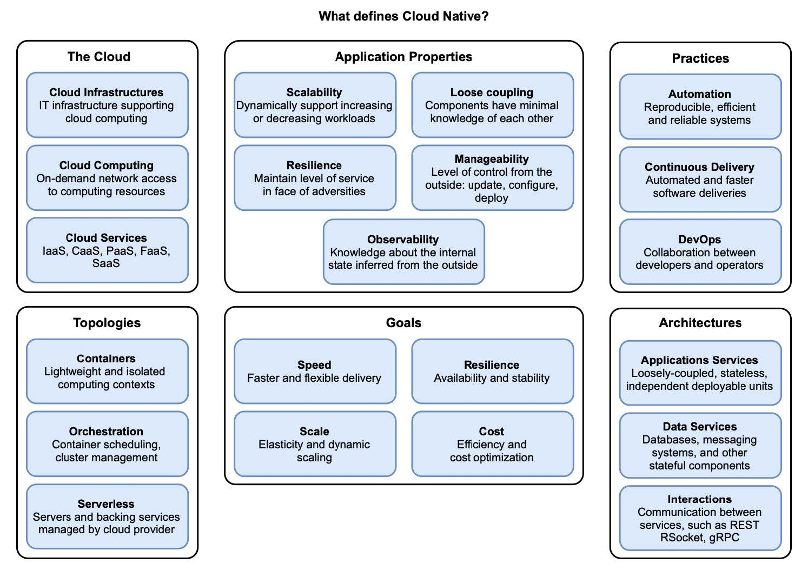

# 第 1 章 云原生简介

本章内容：

* 什么是云和云计算模型
* 云原生的定义
* 云原生应用的特性
* 支持云原生的文化和实践
* 您应该考虑云原生的时间点和原因
* 云原生应用程序的拓扑和体系结构

云原生应用是高度分布式的系统，它们运行在云中，对变化的适应能力很强。系统由多个服务组成，这些服务通过网络进行通信，并部署在动态环境中，其中所有内容都在不断变化。

在深入研究 Spring、Docker 和 Kubernetes 之前，最基本的是首先定义什么是云原生。像我们领域中的其他流行语（如敏捷、DevOps 或 微服务）一样，云原生有时会被误解，并且可能会引起混淆，因为它对不同的人意味着不同的事情。

在本章中，我将为您提供本书其余部分所需的概念。首先，我将定义云原生并说明一个应用成为云原生应用所需的条件。我将解释云原生应用程序的属性，考查云计算模型的特性，并讨论您应该何时以及为什么要迁移到云。我还将介绍一些云原生拓扑和体系结构的基本概念。图 1.1 显示了我将在本章中介绍的所有不同元素的概述，以定义和限定云原生系统。在本章的最后，您将开始使用 Spring 构建云原生应用程序并使用 Kubernetes 部署它们的旅程。

**图 1.1 云原生是一种利用云技术的应用程序开发方法。本章涵盖六个主要领域来定义什么是云原生：云计算、应用程序属性、实践、拓扑、体系结构和目标。**  