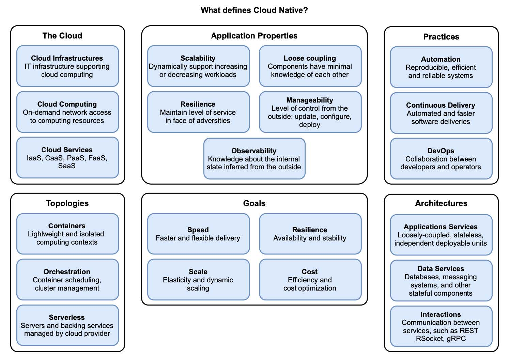

# 第 1 章 云原生简介

本章内容：

- 什么是云以及云计算模型
- 云原生的定义
- 云原生应用程序的特性
- 支持云原生的文化和实践
- 何时以及为什么考虑云原生方法
- 云原生拓扑结构和架构

云原生应用程序是高度分布式的系统，它们运行在云环境中，并且能够弹性应对变化。这些系统由多个通过网络通信的服务组成，部署在一个持续变化的动态环境中。

在深入探讨技术之前，首先要定义什么是云原生。就像我们领域中的其他流行术语（如敏捷、DevOps 或微服务）一样，云原生有时会被误解，并且可能造成困惑，因为不同的人对它有不同的理解。

在本章中，我将为你提供学习本书其余内容所需的概念工具。我将从定义云原生的含义开始，解释云原生应用程序的特性，探讨云计算模型的特点，以及讨论何时以及为何你可能想要迁移到云。我还将介绍一些云原生拓扑和架构的基本概念。

学完本章后，你将准备好开始使用 Spring 构建云原生应用程序并将其部署到 Kubernetes 的旅程。

**图 1.1 云原生是一种旨在利用云技术的应用程序开发方法**
