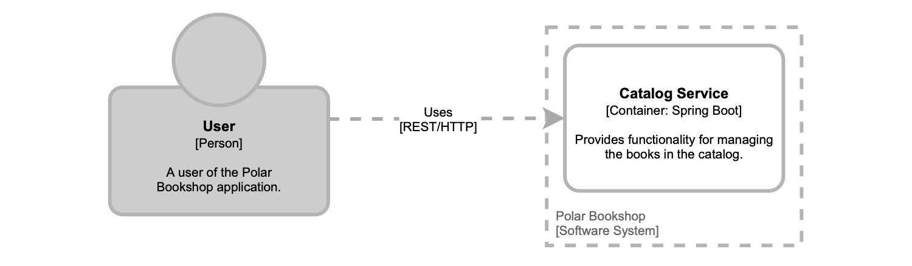
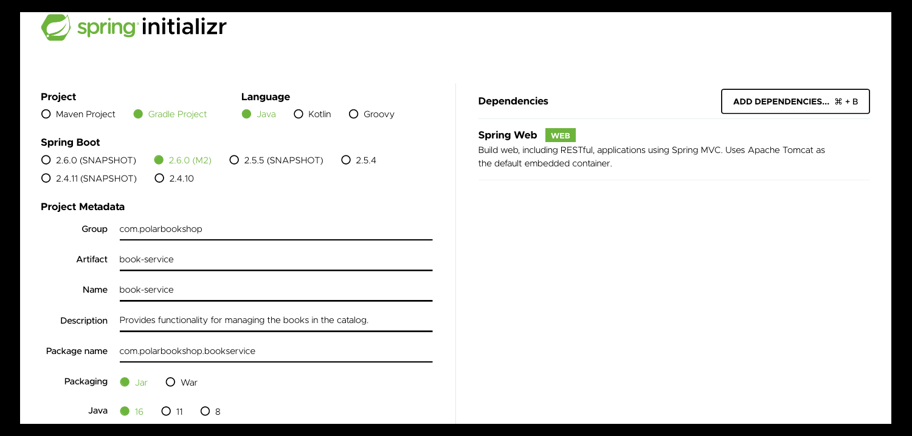
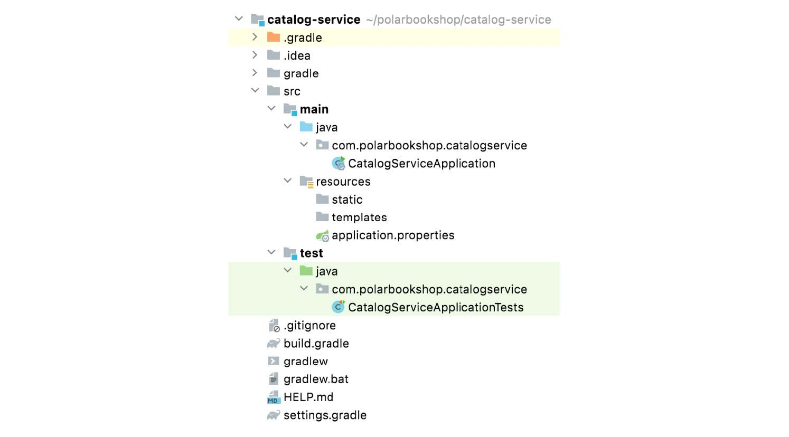
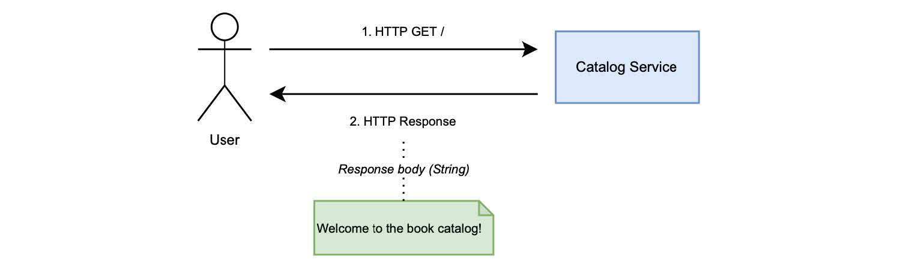
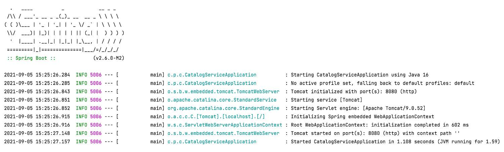

### 2.2.2 创建 Spring Boot 应用

假设您为 Polarsophia 构建一个 `极地书店` 应用程序。该组织管理着一家特殊的书店，希望出售有关北极的书籍。正在考虑采用云原生方法。

作为一个试点项目，您的老板指派您向同事演示，如何在云中开发及部署。要求您构建的 web 应用程序是一个 `目录服务（Catalog Service）`，目前只有一个职责：欢迎用户访问图书目录。

这个试点项目，将为构建出成功并受到好评的云原生应用打下基础。

考虑到任务的目标，您可能会决定将应用程序实现为 RESTful 服务，使用一个 HTTP 端点负责返回欢迎消息。毫无疑问的是，您选择采用 Spring 作为服务（目录服务）的主要技术栈。系统的体系结构如图 2.2 所示。在接下来的部分，您将尝试构建和部署应用程序。


**图 2.2 遵循 C4 模型的 `极地书店` 应用程序的体系结构图。** <br/>

在图 2.2 中，您可以看到一些体系结构符号，这些符号将会贯穿本书。这些符号遵循 [Simon Brown](https://simonbrown.je/) 创建的 [C4](https://c4model.com/) 模型。为描述 `极地书店` 项目，模型中有三个抽象：
* **人**。代表软件系统的一个人类用户。在我们的示例中，它是书店的顾客。
* **系统**。它代表您为向用户提供价值而构建的整体应用程序。在这里表示，`极地书店` 系统。
* **容器**。它表示应用程序或数据的服务。不要与 Docker 混淆了。在我们的示例中，它是 Catalog Service。
>译者注：C4表示上下文（Context）、容器（Container）、组件（Component）和代码（Code）

对于此任务，您可以使用 Spring 框架和 Spring Boot 执行以下操作：
* 声明实现应用程序所需的依赖项；
* 使用 Spring Boot 引导应用程序；
* 实现控制器以公开用于返回欢迎消息的 HTTP 端点；
* 运行并使用应用程序。

本书中的所有示例都基于 Java 17，因此您需要安装 OpenJDK 17。我将使用来自 Adoptium 项目（[adoptium.net](https://adoptium.net/)）的 Eclipse Temurin，以前称为 AdoptOpenJDK。您可以选择其他合适的版本。

>注意：在您的计算机上管理不同的 Java 发行版可能会很困难。我建议使用 SDKMAN（[sdkman.io](https://sdkman.io/)）这样的工具轻松安装、更新，并在不同的 JDK 之间进行切换。

#### 初始化项目

在本书中，我们将构建几个云原生应用程序。我建议您为每个应用建立一个 Git 存储库，并在 GitHub 进行存储。在下一章中，我将更多地讨论如何管理代码库的内容。现在，请创建一个 catalog-service 的 Git 存储库。

然后，您可以使用 Spring Initializr （[start.Spring.io](https://start.spring.io/)）生成项目，并将其存储在刚刚创建的 catalog-service Git 存储库中。Spring Initializr 是一个方便使用的服务，可以从浏览器或通过其 REST API 进行访问，以生成基于 JVM 的工程。它甚至集成进了流行的 IDE 中，如 IntelliJ IDEA、Visual Studio Code 和 Eclipse。初始化 Catalog Service 的参数如图 2.3 所示。


**图 2.3 从Spring Initializr 初始化 Catalog Service 项目的参数。** <br/>

在初始化过程中，您可以提供有关要构建的应用程序的一些详细信息，如表 2.1 所示。

**表 2.1 使用 Spring Initializr 生成项目时，可配置的主要参数。**

| 参数 | 描述 | Catalog Service 服务所用值 |
| :--- | :--- | :--- |
| Project | 您可以使用 Gradle 或 Maven 作为项目的构建工具。这本书中所有的例子都将使用 Gradle。 | Gradle |
| Language | Spring 支持三种主要的 JVM 语言：Java、Kotlin、Groovy。本书中的所有示例都将使用 Java。 | Java |
| Spring Boot | 您可以选择要安装的 Spring Boot 版本。本书中的所有示例都将使用 Spring Boot 2.6.0-RC1，但任何 2.6+ 版本都应可以。 | Spring Boot 2.6.0-RC1 |
| Group | 项目的组 ID，在 Maven 存储库中使用。 | com.polarbookshop.catalogservice |
| Artifact | 项目的工件 ID，在 Maven 存储库中使用。 | catalog-service |
| Name | 工程名称。 | catalog-service |
| Package name | 项目的基本 Java 包。 | com.polarbookshop.catalogservice |
| Packaging | 如何打包项目：WAR（用于在应用服务器上部署）或 JAR（用于独立应用程序）。云原生应用程序应该打包为 JAR，所以
本书中的示例将使用该选项。 | JAR |
| Java | 要用于构建项目的 Java 版本。本书中的所有示例都将使用 Java 17。 | 17 |
| Dependencies | 要包含在项目中的依赖项。 | Spring Web |

新生成项目的结构如图 2.4 所示。在接下来的部分，我带领您一步步操作。



**图 2.4 从Spring Initializr 生成的新 Spring Boot 项目的结构。** <br/>

在本书附带的代码存储库中（[github.com/ThomasVitale/cloud-native-spring-In-action](https://github.com/ThomasVitale/cloud-native-spring-in-action)），对于每一章都可以找到 begin 和 end 文件夹。您都可以从与我相同的设置开始，并检查最终结果。例如，您当前正在阅读第 2 章，因此您将在 Chapter02/02-begin 和 Chapter02/02-end 中找到相关代码。

>注意：在本章的 begin 文件夹中，您可以找到在终端窗口中运行的命令，该窗口下载一个 zip 文件，其中包含您需要下载的所有代码。而无需通过 Spring Initializr 手动生成。

>Gradle 或 Maven?？
>
>在本书中，我使用的是 Gradle，但您也可以使用 Maven。在本书附带的代码存储库中，您可以找到一个 Gradle 命令映射表，以便在使用 Maven 时使用（[github.com/ThomasVitale/cloudnativespring-in-action](https://github.com/ThomasVitale/cloud-native-spring-in-action)）。每个项目有不同的需求，这可能导致您选择某个构建工具。
>
>我选择使用 Gradle 主要有两个原因。使用 Gradle 构建和测试 Java 项目比使用 Maven 要花费更少的时间，这得益于其增量和并行构建以及缓存。此外，我发现 Gradle 构建语言（Gradle DSL）更具可读性，也比 Maven XML 更具表现力和可维护性。在 Spring 的生态系统中，您既可以找到使用 Gradle 的项目，也可以找到使用 Maven 的项目。它们都有各自的拥挤者。我建议您可以都尝试一下，然后再选择让您的生产率更高的那个。

#### 探索构建配置

让我们首先打开您刚刚初始化的项目，并查看 Gradle 构建出来的 Catalog Service 应用程序的配置，这是在 build.gradle 文件中定义的。您可以在那里找到您提供给 Spring Initializr 的所有信息。

**清单 2.1 Catalog Service 项目的构建配置（build.gradle）**

```text
plugins {
  id 'org.springframework.boot' version '2.6.0-RC1'  ❶  
  id 'io.spring.dependency-management' version '1.0.11.RELEASE'  ❷
  id 'java'  ❸
}

group = 'com.polarbookshop'  ❹
version = '0.0.1-SNAPSHOT'  ❺
sourceCompatibility = '17'  ❻

repositories {  ❼
  mavenCentral()
  maven { url 'https://repo.spring.io/milestone' }
}

dependencies {
  implementation 'org.springframework.boot:spring-boot-starter-web'  ❽
  testImplementation 'org.springframework.boot:spring-boot-starter-test'  ❾
}

test {
  useJUnitPlatform()  ❿
}
```

❶ 在 Gradle 中提供 Spring Boot 支持，并声明您想要的版本  
❷ 为 Spring 提供依赖项管理功能。  
❸ 在 Gradle 中提供 Java 支持，设置任务以编译、构建和测试应用  
❹ Catalog Service 项目的组 ID。  
❺ 应用程序的版本。默认情况下为 0.0.1-SNAPSHOT。  
❻ 用于构建项目的 Java 版本。  
❼ 工件存储库，指定搜索依赖项的位置。  
❽ 提供使用 Spring MVC 构建 web 应用程序所需的库，引入 Tomcat 作为默认的嵌入式服务器。  
❾ 提供多个库和实用程序来测试应用程序，包括 Spring Test、JUnit 和 Mockito。自动包含在每个 Spring Boot 项目中。  
❿ 支持使用 JUnit5 提供的 JUnit 平台进行测试。  

项目名称在名为 settings.gradle 的第二个文件中定义。

```text
rootProject.name = 'catalog-service'
```

Spring Boot 提供了方便的 starter 依赖项，特定用例所必需的库都捆绑在了一起，此功能显著简化了构建配置。这个项目使用的主要依赖项是 `org.springframework.boot:spring-boot-starter-web`，在 Spring Initializr 中名为 `Spring Web`。此 starter 用于构建 web 应用程序，包括构建具有 RESTful 服务的功能，并引入 Apache Tomcat 作为默认的嵌入式服务器。

#### 引导应用程序

在上一节中，您初始化了 Catalog Service 项目并选择了 JAR 打包选项。任何打包为 JAR 的 Java 应用程序都必须具有 `public static void main(String[] args)` 方法，以在启动时执行。Spring Boot 也不例外。在 Catalog Service 里，您有了一个 CatalogServiceApplication 类，该类是在初始化时自动生成的：类中定义了 `main()` 方法，也是 Spring Boot 应用程序的入口点。

**清单 2.2 Catalog Service 的引导类（CatalogServiceApplication.java）**

```java
package com.polarbookshop.catalogservice;

import org.springframework.boot.SpringApplication;
import org.springframework.boot.autoconfigure.SpringBootApplication;

@SpringBootApplication  ❶ 
public class CatalogServiceApplication {

  public static void main(String[] args) {  ❷ 
    SpringApplication.run(CatalogServiceApplication.class, args);  ❸ 
  }

}
```

❶ 定义 Spring 配置类，触发组件扫描和 Spring Boot 自动配置。  
❷ 用于启动应用程序的方法。  
❸ 注册要在应用程序引导阶段运行的当前类。  

`@SpringBootApplication` 注解是包含三种不同注解的快捷方式：
* `@Configuration` 将该类标记为 bean 定义源。
* `@ComponentScan` 启动组件扫描，能够在 Spring 上下文中自动查找和注册 bean。
* `@EnableAutoConfiguration` 启用由 Spring Boot 提供的自动配置功能。

Spring Boot 自动配置会根据多种情况被触发，例如：类路径中是否存在某些类、特定 bean 的存在或某些类的属性值。由于 Catalog Service 项目依赖于 spring-boot-starter-web，所以 Spring Boot 将初始化嵌入式 Tomcat 服务器实例并应用最小配置，在几乎零时间内启动并运行 web 应用程序。

应用程序的设置就是这样。让我们继续为 Catalog Service 开发 HTTP 端点。

#### 实现控制器

到目前为止，我们已经了解了由 Spring Initializr 生成的项目。是时候开发一些应用程序的业务逻辑了。Catalog Service 将公开 HTTP 端点并返回欢迎信息。这可以在 REST 控制器中为其定义一个处理程序。它将是一个 GET 端点，向用户返回一条欢迎消息，欢迎用户访问图书目录。图 2.5 显示了交互流程。


**图 2.5 用户和应用程序之间的交互，由 Catalog Service 公开的 HTTP 端点返回欢迎消息。**

在 Catalog Service 项目中，创建一个新的 HomeController 类并实现一个方法，负责处理对根路径（`/`）的 GET 请求。

**清单 2.3 定义一个 GET 端点以返回欢迎消息（HomeController.java）**
```java
package com.polarbookshop.catalogservice;

import org.springframework.web.bind.annotation.GetMapping;
import org.springframework.web.bind.annotation.RestController;

@RestController  ❶ 
public class HomeController {

  @GetMapping("/")  ❷ 
  public String getGreeting() {
    return "Welcome to the book catalog!";
  }

}

```

❶ 定义处理程序的类，标识为 REST 端点。  
❷ 处理对根路径的 GET 请求。  

`@RestController` 注解将类标识为处理传入的 HTTP 请求。使用 `@GetMapping` 注解，可以将 `getGreeting()` 方法标记为：到达根路径 （`/`） GET 请求的处理程序。对该端点的任何 GET 请求都将用这个方法进行处理。在下一章中，我将更详细介绍如何使用 Spring。

#### 测试应用程序

从 Spring Initializr 创建 Spring 项目时，包含基本的测试设置。在 build.gradle 文件中，自动添加了测试 Spring 所需的依赖项。此外，还自动生成一个测试类。让我们来看看自动生成的 CatalogServiceApplicationTests 类是什么样的。

**清单 2.4 验证 Spring 上下文的自动生成的测试类（CatalogServiceApplicationTests.class）**

```java
package com.polarbookshop.catalogservice;

import org.junit.jupiter.api.Test;
import org.springframework.boot.test.context.SpringBootTest;

@SpringBootTest  ❶ 
class CatalogServiceApplicationTests {

  @Test  ❷ 
  void contextLoads() { ❸ 
  }

}
```

❶ 提供用于测试 Spring Boot 应用程序的设置。  
❷ 标识一个测试用例。  
❸ 用于验证应用程序上下文是否正确加载的空测试。  

默认测试类由 `@SpringBootTest 注解标识，该注解提供了许多测试 Spring Boot 应用程序的有用功能。在整本书中，我会更多介绍它们。现在，只需知道它加载了一个完整的 Spring 应用程序上下文就可以了。这里只有一个测试用例，而且是空的：它用于验证 Spring 上下文是否已正确加载。

打开终端窗口，导航到应用程序根文件夹（catalog-service），然后运行 Gradle 任务 test，来执行应用程序测试。

```bash
$ ./gradlew test
```

任务应该是成功的，测试是绿色的，这意味着 Spring 应用程序可以启动，没有错误。但 HTTP 端点呢？让我们来看一看。

#### 运行应用程序

您已经完成了应用程序的创建，因此可以运行它了。有很多不同的方法可以运行应用程序，稍后我将向您展示其中的一些方法。现在，您可以使用 Spring Boot Gradle 插件提供的 bootRun。

在启动测试的同一终端窗口中，运行以下命令：

```bash
$ ./gradlew bootRun
```

几秒钟后，应用程序应该启动并开始运行，并准备好接受请求。在图 2.6 中，您可以看到启动阶段的日志。


**图 2.6 Catalog Service 应用程序的启动日志。**

图 2.6 中的日志中，您可能注意到启动阶段由两个主要步骤组成：
* 初始化和运行嵌入式 Tomcat 服务器（默认情况下，侦听端口 8080）；
* Spring 应用程序上下文的初始化和运行。

现在，您可以验证 HTTP 端点是否按预期工作了。打开浏览器窗口，访问 localhost:8080/ 并准备好接收本书的欢迎目录吧。

```text
Welcome to the book catalog!
```

`极地书店` 应用程序的开发部分已经完成：您有了一个 Catalog Service 欢迎用户使用图书目录。记住终止 bootRun 进程可以使用 `Ctrl+C` 以停止应用程序的执行。

下一步是将应用程序部署到云中。要使其在任何云基础设施上都可运行，您应该首先将其容器化。下面我们讲 Docker。
