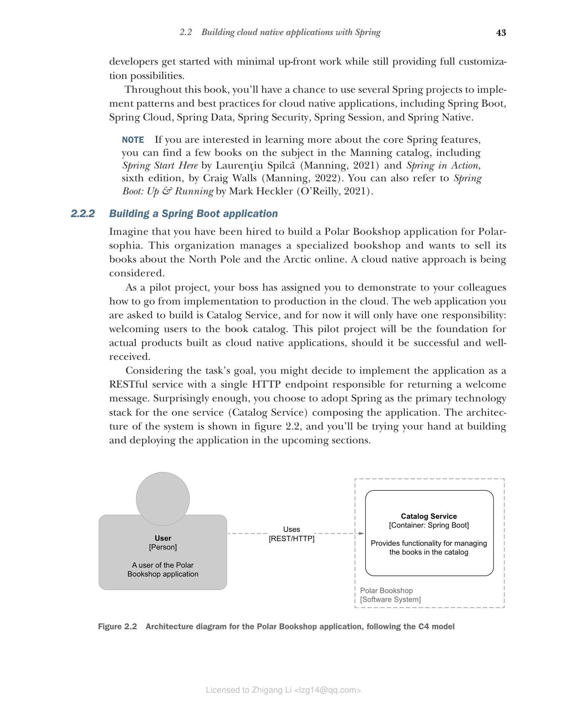
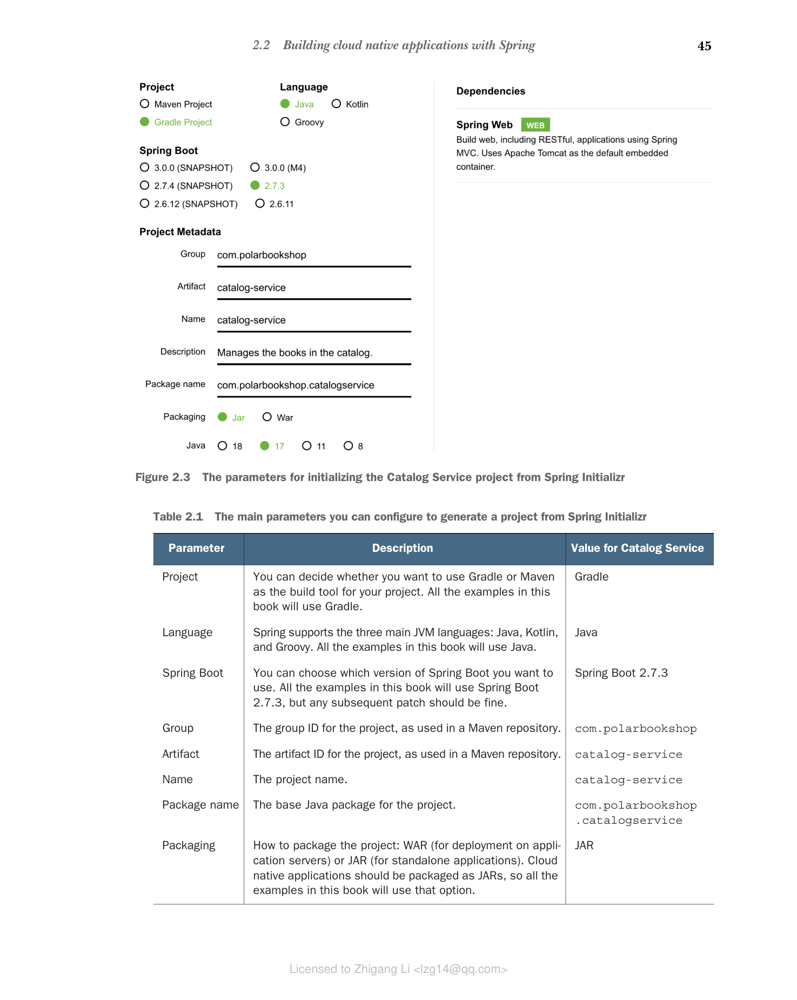
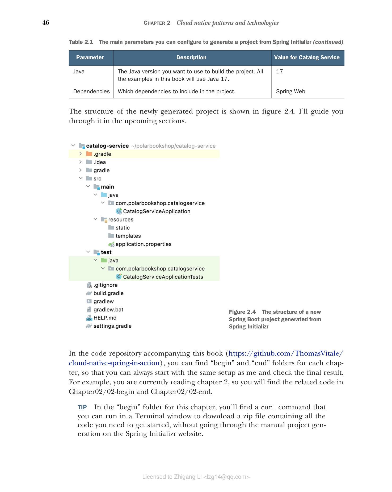
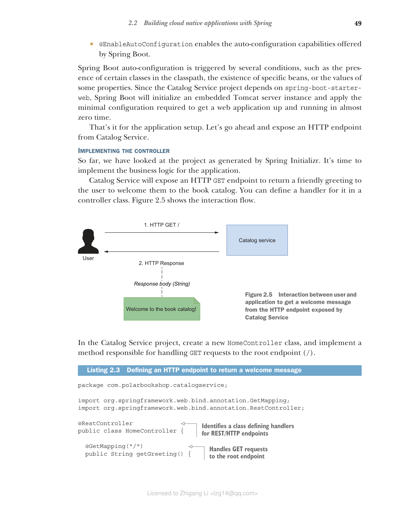
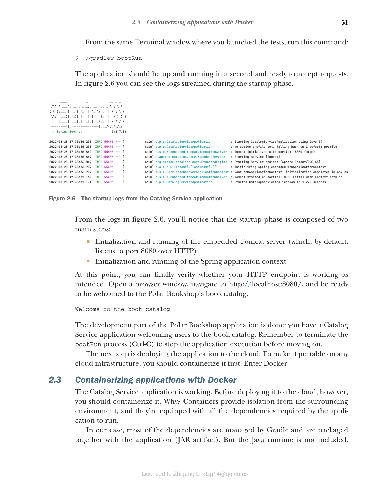

### 2.2.2 构建 Spring Boot 应用

假设您被 Polarsophia 聘请来构建一个 Polar Bookshop 应用。这个组织经营一家专业书店，想要在线销售关于北极和北极地区的书籍。他们正在考虑采用云原生方法。

作为试点项目，您的老板分配您向同事演示如何在云中从实现到生产。您被要求构建的 Web 应用是 Catalog Service，目前它只有一个职责：欢迎用户访问书籍目录。如果这个试点项目成功并且受到好评，它将成为构建云原生应用的实际产品的基础。

考虑到任务的目标，您可能会决定将应用实现为一个 RESTful 服务，只有一个 HTTP 端点负责返回欢迎消息。令人惊讶的是，您选择采用 Spring 作为构成该应用的唯一服务（Catalog Service）的主要技术栈。系统的架构如图 2.2 所示，在接下来的小节中，您将尝试构建和部署该应用。



**图 2.2 遵循 C4 模型的 Polar Bookshop 应用架构图**

在图 2.2 中，您可以看到我在全书用于表示架构图的符号，遵循由 Simon Brown 创建的 C4 模型（[https://c4model.com](https://c4model.com)）。为了描述 Polar Bookshop 项目的架构，我使用了该模型中的三个抽象概念：

- **Person（人）**——代表软件系统的人类用户之一。在我们的例子中，它是书店的顾客。
- **System（系统）**——代表您将构建的、向其用户交付价值的整体应用。在我们的例子中，它是 Polar Bookshop 系统。
- **Container（容器）**——代表一个服务，可以是应用服务或数据服务。不要与 Docker 混淆。在我们的例子中，它是 Catalog Service。

为了完成这个任务，我们将使用 Spring Framework 和 Spring Boot 来做以下工作：

- 声明实现应用所需的依赖。
- 使用 Spring Boot 引导应用。
- 实现一个控制器来暴露 HTTP 端点，用于返回欢迎消息。
- 运行并试用应用。

本书中的所有示例都基于 Java 17，即撰写本文时 Java 的最新长期支持版本。在继续之前，请按照附录 A 的 A.1 节中的说明安装 OpenJDK 17 发行版。然后确保您有一个支持 Java、Gradle 和 Spring 的 IDE。我将使用 IntelliJ IDEA，但您也可以选择其他 IDE，如 Visual Studio Code。最后，如果您还没有 GitHub 账户，请创建一个免费账户（[https://github.com](https://github.com)）。您将用它来存储代码并定义持续交付流水线。

#### 初始化项目

在本书中，我们将构建多个云原生应用。我建议您为每个应用定义一个 Git 仓库，并使用 GitHub 来存储它们。在下一章中，我将更多地讨论代码库管理。现在，请先创建一个 catalog-service Git 仓库。

接下来，您可以从 Spring Initializr（[https://start.spring.io](https://start.spring.io)）生成项目，并将其存储在您刚创建的 catalog-service Git 仓库中。Spring Initializr 是一个便捷的服务，您可以通过浏览器或其 REST API 使用它来生成基于 JVM 的项目。它甚至集成了流行的 IDE，如 IntelliJ IDEA 和 Visual Studio Code。Catalog Service 的初始化参数如图 2.3 所示。



**图 2.3 从 Spring Initializr 初始化 Catalog Service 项目的参数**

在初始化过程中，您可以提供一些关于您想要构建的应用的详细信息，如表 2.1 所示。

**表 2.1 从 Spring Initializr 生成项目时可配置的主要参数**

| 参数 | 描述 | Catalog Service 的值 |
|------|------|---------------------|
| Project | 您可以决定使用 Gradle 还是 Maven 作为项目的构建工具。本书中的所有示例都将使用 Gradle。 | Gradle |
| Language | Spring 支持三种主要的 JVM 语言：Java、Kotlin 和 Groovy。本书中的所有示例都将使用 Java。 | Java |
| Spring Boot | 您可以选择要使用的 Spring Boot 版本。本书中的所有示例都将使用 Spring Boot 2.7.3，但任何后续补丁版本应该都可以。 | Spring Boot 2.7.3 |
| Group | 项目的组 ID，用于 Maven 仓库。 | com.polarbookshop |
| Artifact | 项目的工件 ID，用于 Maven 仓库。 | catalog-service |
| Name | 项目名称。 | catalog-service |
| Package name | 项目的基础 Java 包。 | com.polarbookshop.catalogservice |
| Packaging | 项目的打包方式：WAR（用于部署到应用服务器）或 JAR（用于独立应用）。云原生应用应该打包为 JAR，因此本书中的所有示例都将使用该选项。 | JAR |
| Java | 您想要用于构建项目的 Java 版本。本书中的所有示例都将使用 Java 17。 | 17 |
| Dependencies | 项目中要包含的依赖。 | Spring Web |

新生成项目的结构如图 2.4 所示。我将在接下来的小节中带您了解它。



**图 2.4 从 Spring Initializr 生成的新 Spring Boot 项目结构**

在本书的配套代码仓库（[https://github.com/ThomasVitale/cloud-native-spring-in-action](https://github.com/ThomasVitale/cloud-native-spring-in-action)）中，您可以为每章找到 "begin" 和 "end" 文件夹，这样您就可以始终与我保持相同的起点并检查最终结果。例如，您目前正在阅读第 2 章，因此您可以在 Chapter02/02-begin 和 Chapter02/02-end 中找到相关代码。

> **提示** 在本章的 "begin" 文件夹中，您会找到一个 curl 命令，可以在终端窗口中运行它来下载包含所有入门代码的 zip 文件，无需通过 Spring Initializr 网站手动生成项目。

> **Gradle 还是 Maven？**
>
> 本书使用 Gradle，但您也可以使用 Maven。在本书的配套代码仓库中，您可以找到将 Gradle 命令映射到 Maven 的对照表，以便您在使用 Maven 时也能轻松跟随（[https://github.com/ThomasVitale/cloud-native-spring-in-action](https://github.com/ThomasVitale/cloud-native-spring-in-action)）。每个项目有不同的需求，可能导致您选择不同的构建工具。
>
> 我使用 Gradle 是出于个人偏好，主要有两个原因。使用 Gradle 构建和测试 Java 项目比 Maven 更快，这得益于其增量构建、并行构建和缓存系统。此外，我认为 Gradle 构建语言（Gradle DSL）比 Maven XML 更具可读性、表达力和可维护性。在 Spring 生态系统中，您可以找到使用 Gradle 和 Maven 的项目。它们都是不错的选择。我建议您都尝试一下，选择让您更高效的那个工具。

#### 探索构建配置

在您喜欢的 IDE 中打开刚初始化的项目，查看 Catalog Service 应用的 Gradle 构建配置，它定义在 build.gradle 文件中。您可以在其中找到提供给 Spring Initializr 的所有信息。

**清单 2.1 Catalog Service 的构建配置**

```groovy
plugins {
 id 'org.springframework.boot' version '2.7.3' // 在 Gradle 中提供 Spring Boot 支持，并声明使用哪个版本
 id 'io.spring.dependency-management' version '1.0.13.RELEASE' // 为 Spring 提供依赖管理功能
 id 'java' // 在 Gradle 中提供 Java 支持，设置编译、构建和测试应用的任务
}

group = 'com.polarbookshop' // Catalog Service 项目的组 ID

version = '0.0.1-SNAPSHOT' // 应用的版本。默认为 0.0.1-SNAPSHOT。
sourceCompatibility = '17' // 用于构建项目的 Java 版本

repositories {
 mavenCentral() // 搜索依赖的工件仓库
}

dependencies {
 implementation 'org.springframework.boot:spring-boot-starter-web' // 应用使用的依赖
 testImplementation 'org.springframework.boot:spring-boot-starter-test'
}

tasks.named('test') {
 useJUnitPlatform() // 启用 JUnit 5 提供的 JUnit Platform 进行测试
}
```

该项目包含以下主要依赖：

- **Spring Web**（org.springframework.boot:spring-boot-starter-web）提供了使用 Spring MVC 构建 Web 应用所需的库，并包含 Tomcat 作为默认的嵌入式服务器。
- **Spring Boot Test**（org.springframework.boot:spring-boot-starter-test）提供了多个用于测试应用的库和工具，包括 Spring Test、JUnit、AssertJ 和 Mockito。它会自动包含在每个 Spring Boot 项目中。

> **注意** Spring Boot 提供了便捷的 starter 依赖，将特定用例所需的所有库打包在一起，并负责选择相互兼容的版本。此功能显著简化了您的构建配置。

项目的名称定义在第二个名为 settings.gradle 的文件中：

```groovy
rootProject.name = 'catalog-service'
```

#### 引导应用

在上一节中，您初始化了 Catalog Service 项目并选择了 JAR 打包选项。任何打包为 JAR 的 Java 应用都必须有一个在启动时执行的 `public static void main(String[] args)` 方法，Spring Boot 也不例外。在 Catalog Service 中，初始化期间自动生成了一个 `CatalogServiceApplication` 类；`main()` 方法就定义在那里，这就是 Spring Boot 应用的运行入口。

**清单 2.2 Catalog Service 的引导类**

```java
package com.polarbookshop.catalogservice;

import org.springframework.boot.SpringApplication;
import org.springframework.boot.autoconfigure.SpringBootApplication;

@SpringBootApplication // 定义一个 Spring 配置类，并触发组件扫描和 Spring Boot 自动配置
public class CatalogServiceApplication {

 public static void main(String[] args) { // 用于启动应用的方法。它注册当前类，在应用的引导阶段运行。
 SpringApplication.run(CatalogServiceApplication.class, args);
 }
}
```

`@SpringBootApplication` 注解是一个快捷方式，包含三个不同的注解：

- `@Configuration` 将该类标记为 bean 定义的源。
- `@ComponentScan` 启用组件扫描，以自动在 Spring 上下文中查找并注册 bean。
- `@EnableAutoConfiguration` 启用 Spring Boot 提供的自动配置功能。

Spring Boot 的自动配置由多种条件触发，例如类路径中存在某些类、特定 bean 的存在，或某些属性的值。由于 Catalog Service 项目依赖于 spring-boot-starter-web，Spring Boot 将初始化一个嵌入式 Tomcat 服务器实例，并应用使 Web 应用几乎零时间启动和运行所需的最低配置。

应用设置就这些。接下来让我们从 Catalog Service 暴露一个 HTTP 端点。

#### 实现控制器

到目前为止，我们一直在查看由 Spring Initializr 生成的项目。现在是时候实现应用的业务逻辑了。

Catalog Service 将暴露一个 HTTP GET 端点，向用户返回友好的问候以欢迎他们访问书籍目录。您可以在控制器类中为其定义一个处理方法。图 2.5 展示了交互流程。



**图 2.5 用户与应用之间的交互——从 Catalog Service 暴露的 HTTP 端点获取欢迎消息**

在 Catalog Service 项目中，创建一个新的 `HomeController` 类，并实现一个负责处理对根端点（`/`）的 GET 请求的方法。

**清单 2.3 定义一个返回欢迎消息的 HTTP 端点**

```java
package com.polarbookshop.catalogservice;

import org.springframework.web.bind.annotation.GetMapping;
import org.springframework.web.bind.annotation.RestController;

@RestController // 标识一个定义 REST/HTTP 端点处理器的类
public class HomeController {

 @GetMapping("/") // 处理对根端点的 GET 请求
 public String getGreeting() {
 return "Welcome to the book catalog!";
 }
}
```

`@RestController` 注解将该类标识为处理传入 HTTP 请求的控制器。使用 `@GetMapping` 注解，您可以将 `getGreeting()` 方法标记为对根端点（`/`）的 GET 请求的处理器。任何对该端点的 GET 请求都将由此方法处理。在下一章中，我将更详细地介绍如何使用 Spring 构建 RESTful 服务。

#### 测试应用

从 Spring Initializr 创建 Spring 项目时，会包含基本的测试设置。在 build.gradle 文件中，您会自动获得测试 Spring 应用所需的依赖。此外，还会自动生成一个测试类。让我们看看初始化项目后 `CatalogServiceApplicationTests` 类的样子。

**清单 2.4 自动生成的测试类，用于验证 Spring 上下文**

```java
package com.polarbookshop.catalogservice;

import org.junit.jupiter.api.Test; // 标识一个测试用例
import org.springframework.boot.test.context.SpringBootTest;

@SpringBootTest // 为测试 Spring Boot 应用提供环境
class CatalogServiceApplicationTests {

 @Test
 void contextLoads() { // 用于验证应用上下文是否正确加载的空测试
 }
}
```

默认的测试类由 `@SpringBootTest` 注解标识，它为测试 Spring Boot 应用提供了许多有用的功能。我将在全书中更详细地介绍它们。目前，只需知道它会加载一个完整的 Spring 应用上下文供测试运行就足够了。目前只有一个测试用例，它是空的：用于验证 Spring 上下文是否正确加载。

打开终端窗口，导航到应用根目录（catalog-service），运行 test Gradle 任务来执行应用的测试。

```bash
$ ./gradlew test
```

任务应该成功完成，测试为绿色，这意味着 Spring 应用可以无错误地启动。HTTP 端点呢？让我们来验证一下。

#### 运行应用

您已经完成了应用的实现，可以继续运行它了。有不同的方法可以做到这一点，我将在后面展示其中一些。目前，您可以使用 Spring Boot Gradle 插件提供的任务：bootRun。

从启动测试的同一终端窗口中，运行此命令：

```bash
$ ./gradlew bootRun
```

应用应该在一秒钟内启动并运行，准备好接受请求。在图 2.6 中，您可以看到启动阶段输出的日志。



**图 2.6 Catalog Service 应用的启动日志**

从图 2.6 中的日志，您会注意到启动阶段由两个主要步骤组成：

- 初始化并运行嵌入式 Tomcat 服务器（默认通过 HTTP 监听 8080 端口）
- 初始化并运行 Spring 应用上下文

此时，您终于可以验证 HTTP 端点是否按预期工作了。打开浏览器窗口，导航到 [http://localhost:8080/](http://localhost:8080/)，准备被欢迎来到 Polar Bookshop 的书籍目录。

> Welcome to the book catalog!

Polar Bookshop 应用的开发部分已完成：您有了一个 Catalog Service 应用来欢迎用户访问书籍目录。记得终止 bootRun 进程（Ctrl-C）以停止应用执行，然后再继续。

下一步是将应用部署到云端。为了使其可在任何云基础设施上移植，您应该先将其容器化。这就轮到 Docker 出场了。
