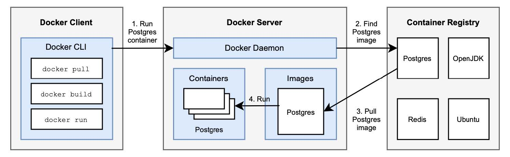

### 2.3.1 Docker 介绍：镜像和容器

在机器上安装 Docker 软件时，您将获得 Docker 引擎包，其基于 `客户机/服务器` 体系结构。Docker 服务器（_Docker server_）包含 Docker 守护进程（_Docker daemon_），j是负责创建和管理 Docker 对象（如：镜像、卷、网络）的后台进程。Docker 服务器运行的机器称为 Docker 主机（_Docker Host_），要运行容器服务的计算机都是 Docker 主机，因此它具有正在运行的 Docker 守护进程。容器的可移植性是通过守护进程实现的。后续介绍中，我可能会混用 Docker 服务器和 Docker 守护进程。

Docker 守护进程公开了一个 REST API，您可以使用它来发送指令。例如：运行容器或创建卷。Docker 客户端通过该 API 与守护进程对话。这个客户端是基于命令行的，可以通过以下两种方式与 Docker 守护进程交互：脚本（例如 Docker Compose）或直接通过 Docker CLI。

除了作为 Docker 引擎特征的客户机和服务器组件之外，另一个重要的平台元素是镜像中心（container registry），它具有与 Maven 存储库类似的功能。Maven 存储库用于托管和分发 Java 库，而镜像中心对容器镜像执行相同的操作。我们区分公共和私有注册中心。Docker 公司提供一个名为 Docker Hub（[Hub.Docker.com](https://hub.docker.com/)）的公共注册中心，这在本地 Docker 安装时是默认配置的，其中为许多常见的应用程序托管镜像，如 Ubuntu、PostgreSQL 和 OpenJDK。

**图 2.8 显示了 Docker 客户端、Docker 服务器和镜像注册中心如何交互。**

Docker 守护进程管理不同的对象。在本节中，我将重点介绍镜像和容器。

容器镜像（或者简单地说，镜像）是一个轻量级的可执行包，包括运行内部应用程序所需的一切。Docker 镜像格式是最常用的镜像格式，后来由开放容器计划（OCI）项目标准化成了 OCI 镜像。通过在 Dockerfile（一个包含生成镜像的所有步骤的，基于文本的文件）中定义指令，可以从头开始创建镜像。通常，镜像是基于另一个镜像的。例如，您可以在 OpenJDK 的基础上构建一个镜像。您可以添加一个 Java 应用程序。创建后，可以将镜像推送到像 DockerHub 这样的镜像中心。一个基本名称和标记用于标识每个镜像，其中标记通常是版本号。例如，版本 20.04 的 Ubuntu 镜像称为 Ubuntu:20.04。冒号用于分隔基本名称和版本。

容器是镜像的可运行实例。您可以从 Docker CLI 或 Docker Compose 管理容器生命周期：可以启动、停止、更新和删除容器。容器由它们所基于的基本镜像和启动时提供的配置定义（例如，用于自定义容器的环境变量）。默认情况下，容器之间，以及容器和主机之间是隔离的。但可以通过特定端口暴露服务，这通过端口转发（port forwarding）或端口映射（port mapping）来实现。容器可以有任意名称。如果未指定，Docker 服务器将分配一个随机的，像 bazinga_schrodinger。要运行容器，您需要 Docker 或任何其他与 OCI 标准兼容的容器运行时。

要运行新容器，可以使用 Docker CLI 与 Docker 守护进程进行交互，它检查指定的镜像是否已存在于本地服务器中。若不存在，将在注册中心查找并下载镜像，然后运行。整个工作流程，同样，如图 2.8 所示。

