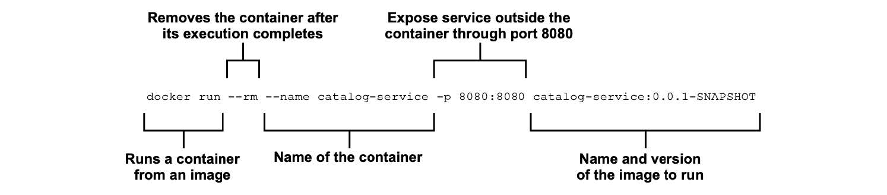

### 2.3.2 运行 Spring 应用容器

让我们回到 Catalog Service，看看如何将其作为容器运行。有很多不同的方法可以实现这一目标。在这里，您将使用开箱即用的 Spring Boot 与 Cloud Native BuildPack。Cloud Native BuildPack 是一个由 Heroku 和 Pivotal 发起的项目，现在由 CNCF 托管。可以自动将应用程序源代码转换为容器镜像，而不是使用低级别的 Dockerfile。

Paketo Buildpacks（一种 Cloud Native Buildpacks 的实现）与 Spring Boot 插件完全集成，适用于 Gradle 和 Maven。这意味着您可以容器化您的 Spring Boot 应用程序，而无需下载任何其他工具，无需任何额外的依赖项，也不需要编写 Dockerfile。

第 6 章将描述 Cloud Native Buildpacks 项目如何工作，以及如何配置它进行容器化 Spring Boot 应用程序。现在，我将给简单您演示下使用方法。

打开终端窗口，导航到 Catalog Service 项目的根文件夹，然后运行 bootBuildImage Gradle 任务。这就会使用 Cloud Native Buildpacks 将应用程序打包为容器镜像。

```text
$ ./gradlew bootBuildImage
```

第一次运行任务时，会需要一段时间来下载 BuildPack 创建容器镜像用到的软件包。第二次，只需要几秒钟。默认情况下，生成的镜像将命名为 catalog service:0.0.1-SNAPSHOT （`<工程名>:<版本>`）。您可以运行以下命令来获取新创建的镜像。

```bash
$ docker images catalog-service:0.0.1-SNAPSHOT
REPOSITORY         TAG               IMAGE ID       CREATED       SIZE
catalog-service    0.0.1-SNAPSHOT    9318f716bfc4   41 years ago  277MB
```

>注意：您可能从上面命令的输出中发现，这个镜像好像是 41 年前生成的。这是 Cloud Native Buildpacks 的约定，以实现可重复的构建。后续执行构建的命令，如果在输入中没有任何更改，build 命令应该给出相同的输出。使用实际的创建时间戳要实现这一点是不可能的，因此 Cloud Native Buildpacks 使用约定的时间戳（1970 年 1 月 1 日）。

最后一件事就是运行镜像，并验证容器化应用程序是否仍然工作正常。打开终端窗口并运行以下命令。

```bash
$ docker run --rm --name catalog-service -p 8080:8080 catalog-service:0.0.1-SNAPSHOT
```

有关该命令的说明，请参考图 2.9。



**图 2.9 从镜像启动容器化 web 应用程序的 Docker 命令。**

打开一个浏览器窗口，导航到 localhost:8080/ 并确认您仍然获得相同的问候返回。

```text
Welcome to the book catalog!
```

完成后，使用 `Ctrl+C` 停止容器。

在第 6 章中，您将进一步了解 Docker 的工作原理，以及如何从 Spring 启动应用程序，还有如何使用容器注册中心。我还将向您展示如何使用 Docker Compose 而不是 Docker CLI 来管理容器。在此之前，如果您想尝试使用容器，我给您留下一个有用的命令列表来控制容器的生命周期（表 2.2）。

**表 2.2 用于管理镜像和容器的有用 Docker CLI 命令。**

| Docker CLI 命令 | 作用 |
| :--- | :--- |
| docker images | 显示所有镜像 |
| docker ps | 显示运行中的容器 |
| docker ps -a | 显示所有容器，无论状态是运行还是终止 |
| docker start <name> | 运行容器 |
| docker stop <name> | 停止容器 |
| docker rm <name> | 移除终止的容器 |
| docker rmi <name> | 移除镜像 |