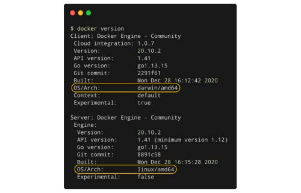

## 2.3 使用 Docker 容器化应用

Catalog Service 应用程序可以运行了。在将其部署到云中之前，您应该对它进行容器化，这是为什么呢？容器提供了与周围环境的隔离，并具有应用程序运行所需的所有依赖项。在我们的例子中，大多数依赖项由 Gradle 管理，并与应用程序打包在一起（JAR 制品）。但 Java 运行时并非如此。将应用程序容器化，意味着它将独立且可跨任何云环境进行移植。如果没有容器，您需要在您想要部署应用程序的计算机上安装 JRE 17（您的应用程序正在使用的版本）。使用容器，您可以用标准方式管理所有应用程序，而不管应用使用的是何种语言和何种框架。

Docker 是 Linux 容器最常用的实现。在 Docker 网站上（[www.docker.com](https://www.docker.com)），您可以找到适用您本地环境的 Docker 设置说明，包括 macOS、Linux 或 Windows。对于 macOS 和 Windows，您可以下载 `Docker Desktop` 应用程序。对于Linux，您可以找到在多个发行版上安装 Docker 的说明。一旦您设置好了 Docker，您就可以继续探索它是如何工作的，以及如何使用它运行容器化的 Spring Boot 应用程序。

> macOS 和 Windows 上的 Docker 是如何工作的？
> 在上一章中，您了解到容器共享相同的操作系统内核并依赖于 Linux 特性，如 namespaces 和 cGroup。我们将在 Linux 的 Docker 容器中运行 Spring Boot 应用程序，但 Docker 也能在 macOS 或 Windows 机器上工作吗？
> 当您在 Linux 操作系统上安装 Docker 时，您将获得完整的 Linux 主机上的 Docker 引擎软件。相反，如果您安装 Docker Desktop for Mac 或 Docker Desktop for Windows，只有 Docker 客户端安装在 macOS/Windows 主机上。在此场景中，会配置一个轻量级 Linux 虚拟机，Docker 服务器组件安装在该虚拟机上。作为使用者，您将获得几乎与 Linux 机器上相同的体验，也几乎不会注意到差别。但实际上，无论何时使用 Docker CLI 执行操作时，您实际上是在与一台虚拟机上的 Docker 服务器进行交互（即运行 Linux 的虚拟机）。
> 您可以通过启动 Docker 并运行 `docker version` 命令来验证它。如图 2.7 所示，您会注意到 Docker 客户端正在 darwin/amd64 体系结构（在 macOS 上）或 windows/amd64 （在 Windows 上）上运行，而 Docker 服务器在 linux/amd64 上运行。
> 
> **图 2.7 在 macOS/Windows 上，Docker 客户端组件在您的计算机上运行，而服务器运行在轻量级 Linux 虚拟机上。**
