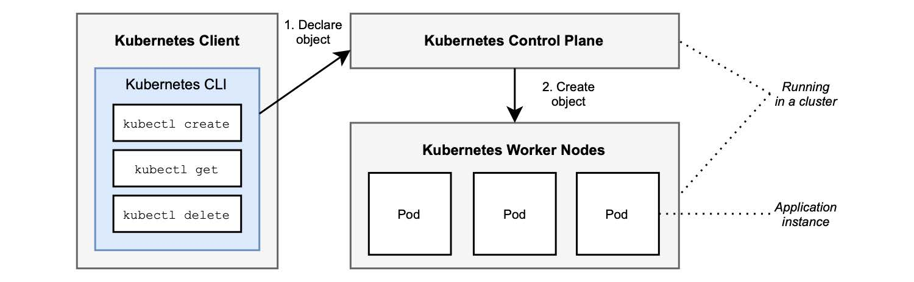

### 2.4.1 介绍 Kubernetes 的 Deployment、Pod 和 Service

Kubernetes 是由 CNCF 托管的开源容器编排器。经过几年发展后，已经成为容器编排最常用的解决方案，所有主要云服务商都支持通过 Kubernetes 提供服务。Kubernetes 可以在桌面、数据中心、内部部署、云计算甚至物联网设备上运行。

在容器拓扑中，您只需要一台带有 Docker 守护进程的机器。使用 Kubernetes，您可以切换到编排器拓扑，这意味着您需要集群。Kubernetes 集群（_cluster_）是一组运行容器化应用程序的工作机器（节点，_Node_）。每个集群至少有一个工作节点。使用 kind，您可以在本地计算机上轻松创建单节点集群。在生产环境，您将使用由云平台（_Azure Kubernetes Service_）管理的集群。

Kubernetes 集群由称为 `工作节点`（_worker nodes_）的机器组成，您在这些机器上部署应用程序。它们提供诸如 CPU、内存、网络和存储等能力，来支持容器运行，并将容器连接到网络。

`控制面板`（_control plane_）是管理工作节点的容器编排层。它暴露用于定义、部署和管理容器生命周期的 API 和接口。它提供了所有实现编排功能的基本元素，如群集管理、定时和健康监测。

您可以通过 CLI 客户端 kubectl 与 Kubernetes 交互，该客户端与 `控制面板 ` 通讯以在 `工作节点` 上执行某些操作。客户端不与 `工作节点` 直接连接。图 2.11 显示了 Kubernetes 组件体系结构。

**图 2.11 Kubernetes 的主要组件是 API、`控制面板` 和 `工作节点`。**

Kubernetes 可以管理许多不同的 `对象` (_object_)，无论是内置的还是自定义的。在本节中，您将使用 Pod、Deployment 和 Service。

* Pod。最小的可部署单元。它可以包括一个或多个容器。通常是一个 Pod  仅包含一个应用程序，并且可能包含支持主应用程序的其他容器（例如，提供日志记录或要在初始化步骤中运行的管理任务）。Kubernetes 管理 Pod 而不是直接使用容器。
* Deployment。它为 Kubernetes 提供了关于如何创建和更新应用实例的指南。对于每个实例，它都会创建一个 Pod。
* Service。一个 Deployment（一组 Pod）可以定义为 Service，以公开给集群中的其他节点或外部使用者。

>注意：在本书中，我将用大写字母拼写 Kubernetes 资源对象。当相同的词与术语一起使用时，以便将它们区分开来。例如，我在引用应用程序时使用服务，而我用 Service 时，我指的是 Kubernetes 对象。
>
>译者注：中文没有这个问题。我们把 Kubernetes Service 对象仍然使用 Service 一词，并不直接翻译成 `服务`。

当您想要运行一个新的应用程序时，您可以定义一个 `资源清单` （_resource manifest_），它描述应用程序所需的状态，例如，应复制 5 次并通过 8080 端口暴露服务。`资源清单` 通常使用 YAML。然后，使用 kubectl 客户端通过 `控制面板` 创建 `资源清单` 描述的相关资源。最后， `控制面板` 使用其内部组件处理请求，并最终在 `工作节点` 中创建资源。 `控制面板` 依赖容器注册中心获取 `资源清单` 中定义的镜像。工作流程同样如图 2.11 所示。
