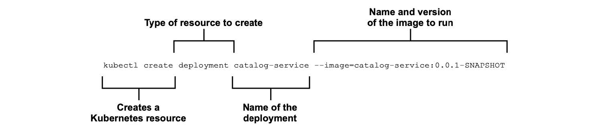
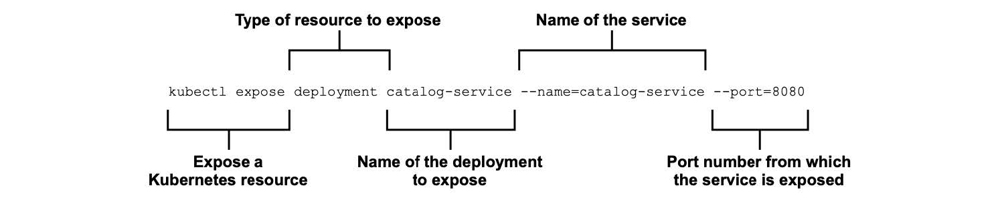

### 2.4.2 在 Kubernetes 是运行 Spring 应用

让我们回到 `极地书店` 项目。在上一节中，您容器化了 Catalog Service 应用程序。现在，是使用 Kubernetes 将其部署到集群的时候了。您已在本地环境中启动并运行了群集，现在需要的是 `资源清单`。

与 Kubernetes 交互的标准方式是通过声明式指令，您可以在 YAML 或 JSON 文件中定义。我将在第 7 章中向您展示如何编写 `资源清单`。在此之前，您将像前面使用 Docker 一样使用 Kubernetes CLI。

首先，您需要告诉 Kubernetes 从容器镜像部署 Catalog Service。您以前构建过一个（Catalog Service:0.0.1-SNAPSHOT）。默认情况下，kind 使用 Docker 注册中心来提取镜像，现在还无法访问您的本地镜像。因此，现在找不到 Catalog Service 应用程序构建的镜像。但不要担心：您可以手动将其导入本地集群。

打开终端窗口，并运行以下命令。

```bash
$ kind load docker-image catalog-service:0.0.1-SNAPSHOT
```

部署单元将是一个 Pod，但您不会直接管理 Pod。相反，您需要让 Kubernetes 来处理。Pod 是应用程序实例，因此它们的生命是短暂的。为了实现云原生目标，您希望平台负责实例化 Pod，以便任何一个坏了，随时可以换成另一个。您需要的是一个 Deployment 指示 Kubernetes 创建作为 Pod 资源的应用程序实例。

在终端窗口中，运行以下命令。

```bash
$ kubectl create deployment catalog-service --image=catalog-service:0.0.1-SNAPSHOT
```

有关该命令的说明，请参考图 2.12。



**图 2.12 从容器镜像创建一个 Deployment 的 Kubernetes 命令。Kubernetes 将为应用程序创建 Pod。**

您可以按如下方式验证 Deployment 对象的创建。

```bash
$ kubectl get deployment
NAME               READY     UP-TO-DATE    AVAILABLE    AGE
catalog-service    1/1       1             1            7s
```

在幕后，Kubernetes 为 Deployment 中定义的应用程序创建了一个 Pod 资源，您可以按如下方式验证 Pod 对象的创建。

```bash
$ kubectl get pod
NAME                                READY   STATUS   RESTARTS   AGE
catalog-service-7fff49dd77-9cnd7    1/1    Running   0          21s
```

默认情况下，无法访问在 Kubernetes 中运行的应用程序。让我们来解决这个问题。首先，您可以通过运行以下命令，在集群中公开 Catalog Service 服务资源。

```bash
$ kubectl expose deployment catalog-service --name=catalog-service --port=8080
```

有关该命令的说明，请参考图 2.13。



**图 2.13 使用 Kubernetes 命令将 Deployment 作为 Service 公开。Catalog Service 应用程序将通过端口 8080 向集群网络公开。**

Service 对象向集群内的其他组件公开应用程序。您可以使用以下命令核实一下是否已正确创建它。

```bash
$ kubectl get service
NAME               TYPE        CLUSTER-IP       EXTERNAL-IP     PORT(S)     AGE
catalog-service    ClusterIP   10.96.141.159    <none>          8080/TCP    7s
```

然后，您可以将流量从计算机上的本地端口（例如 8000）转发到集群内服务公开的端口（8080）。还记得 Docker 中的端口映射 8080 吗？其工作原理相似。命令的输出将告诉您端口转发是否正确配置。

```bash
$ kubectl port-forward service/catalog-service 8000:8080
Forwarding from 127.0.0.1:8000 -> 8080
Forwarding from [::1]:8000 -> 8080
```

有关该命令的说明，请参考图 2.14。


**图 2.14 Kubernetes 命令，用于将端口请求从本地主机转发到集群中的 Service 上。Catalog Service 应用程序通过端口 8000 公开给本地主机。**

现在，每当您访问本地主机上的端口 8000 时，请求将被转发到集群内的 Service 中，负责公开 Catalog Service 应用程序。打开浏览器窗口中，导航到 localhost:8000/（确保使用 8000 而不是 8080）并确认您仍然收到与以前相同的问候语。

```text
Welcome to the book catalog!
```

非常好！您从打包为 JAR 文件的 Spring Boot 应用程序开始。然后使用 Cloud Native Buildpacks 将其封装并在 Docker 上运行。最后，您用 Kubernetes 将应用程序部署到集群。当然，这是一个本地集群，但它也可以是任何远程云端集群。这个过程的美妙之处在于它独立于环境，以同样的方式工作。您可以使用相同的方法来部署 Catalog Service 到任何云基础架构中的集群中。这不是很棒吗？

在第 7 章，您将更多的使用 Kubernetes。现在，请使用 `Ctrl+C` 终止端口转发。使用 kubectl 删除 Service (kubectl delete service catalog-service)，删除 Deployment （kubectl delete deployment catalog-service）。最后，您可以删除集群（kind delete cluster）。如果您想使用 Kubernetes 做一些实验，我在这里给您列举了一些有用的命令（表 2.3）。

**表 2.3 用于管理 Pod、Deployment 和 Service 的 Kubernetes CLI 命令。**

| Kubernetes CLI 命令 | 作用 |
| :--- | :--- |
| kubectl get deployment | 显示所有 Deployment |
| kubectl get pod | 显示所有 Pod |
| kubectl get svc | 显示所有 Service |
| kubectl delete deployment <name> | 删除指定 Deployment |
| kubectl delete pod <name> | 删除指定 Pod |
| kubectl delete svc <service> | 删除指定 Service |