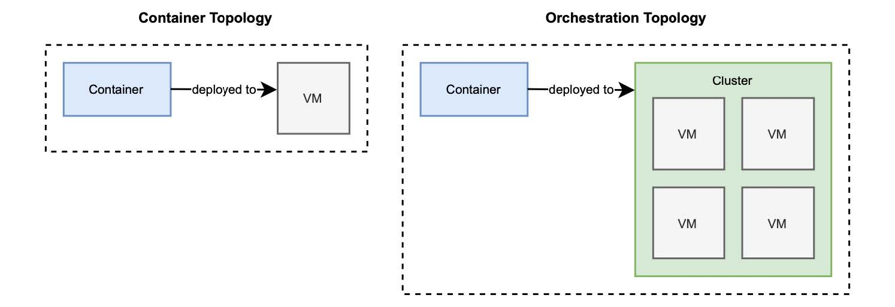

## 2.4 使用 Kubernetes 管理容器

到目前为止，您已经使用 Spring Boot 构建了一个 web 应用程序（Catalog Service），使用 Cloud Native Buildpacks 将其容器化，并使用 Docker 运行它。要完成 `极地书店` 试点项目全过程，您还差最后一步：将应用程序部署到云。

您将使用 Kubernetes，它已成为容器编排的事实标准。我将在后面的章节中详细介绍这个主题，但我想让您先体验一下 Kubernetes 的工作方式，以及如何使用它部署 web 应用程序。

Kubernetes（通常简称为 K8s ）是一个用于自动化部署、扩容和管理容器化应用程序的开源系统（[kubernetes.io](https://kubernetes.io/)）。当使用 Docker 中的容器时，您的部署目标是一台机器，在前面的示例中也就是您的电脑。在其他场景中，它可能是一个虚拟机（VM）。无论如何，都是将容器部署到特定机器上。如果您需要多台机器应该怎么办呢？当要在不停机的情况下部署容器、利用云来弹性扩容、跨不同的主机连接它们，您需要的就不仅仅是容器引擎。

这样，部署目标就从特定计算机转移到计算机集群。Kubernetes 可以为您管理一组计算机。我在上一章介绍拓扑结构时，谈到了这一区别。图 2.10 再次提醒您容器部署拓扑和编排器部署拓扑的不同部署目标。


**图 2.10 容器的部署目标是一台机器，而对于编排器来说，它是一个集群。**

有几种方法可以在本地环境中安装 Kubernetes。方法一是建议安装 Kind，这是一个使用 Docker 容器运行本地 Kubernetes 集群的工具。因为您已经在本地机器上安装了 Docker，所以这是一种方便获得本地 Kubernetes 集群的方法。您可以在项目网站 [kind.sigs.k8s.io](https://kind.sigs.k8s.io/) 中找到安装指南。这也是我将在本书中使用的例子，但是如果您喜欢，可以自由选择其他工具。另一个可行的选择是 minikube ([minikube.sigs.k8s.io](https://minikube.sigs.k8s.io/)）。

在继续后面内容之前，请确保 Docker 引擎在您的机器上正确运行，并且安装了管理本地 Kubernetes 集群的工具。如果您使用的是 kind，请打开终端窗口，并使用以下命令创建本地 Kubernetes 集群。

```bash
$ kind create cluster
```