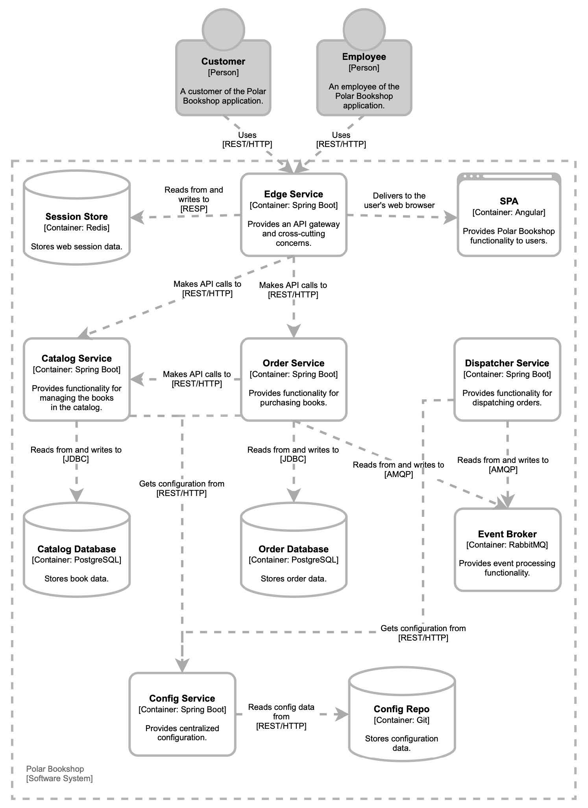

### 2.5.1 理解系统需求

`极地书店` 是一家以传播有关北极和北极地区知识和信息为使命的专业书店，包括历史、地理、动物等等。管理图书馆的组织 Polarsophia 已决定开始在全球范围内在线销售图书。但这只是开始。这个计划雄心勃勃，整体愿景包括开发一整套软件产品来完成 Polarsophia 的商业目标。在一个成功的试点项目之后，该组织决定开始一次云原生之旅。

在本书中，您将构建一个系统的核心部分，该系统在以下方面具有无限的可能性：功能和集成。管理层计划在短时间内交付新功能，缩短上市时间，尽早获得用户反馈。目标是让书店与每个人、每个地方都很紧密相连。因此应用程序应该具有高度的可扩展性。全世界范围的大量用户以及高伸缩性，这样的系统需要高可用性，因此韧性至关重要。

Polarsophia 是一个小型组织，他们需要优化成本。尤其是关于基础设施，他们负担不起建立自己的数据中心，所以他们决定租用来自第三方的硬件。

到目前为止，您可能已经认识到公司转向云计算的一些原因了。这就是 `极地书店` 应用程序的作用。当然，它将是一个云原生应用，书籍将通过该应用程序进行出售。当顾客购买一本书时，可以检查他们订单的状态。两类人将使用 `极地书店` 应用程序：

* 客户可以浏览目录中的书籍，购买一本，并查看订单；
* 员工可以管理书籍、更新现有书籍以及向目录中添加新项目。

图 2.15 描述了 `极地书店` 云原生系统的体系结构。如您所见，它由几个服务组成。有些将实现系统的业务逻辑，其他服务将实现共享服务，如配置中心。为了更清晰，该图没有显示有关安全和可观测相关的服务。您将在稍后的章节中熟悉它们。

在接下来的章节中，我将引导您更详细地浏览图 2.15 中的图表，添加有关特定服务的更多信息，在部署阶段采用不同的视角来观察系统。现在，让我们继续学习项目中使用的技术和模式。

**图 2.15  `极地书店` 的架构。云原生系统包括应用程序和数据服务等具有不同职责的服务。为清楚起见，未显示安全性和可观测性相关服务。**

