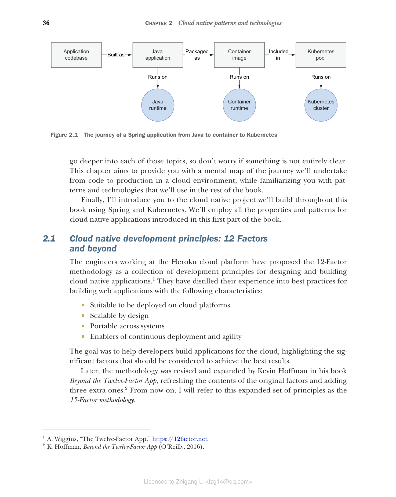

# 第 2 章 云原生模式和技术

本章内容：

* 云原生开发原则：十二要素及更多
* 使用 Spring 构建云原生应用程序
* 使用 Docker 容器化应用程序
* 使用 Kubernetes 管理容器
* Polar Bookshop：一个云原生应用程序示例

在上一章中，我们定义了什么是云原生，并探讨了云原生应用程序的关键特性。在本章中，我们将深入研究云原生开发的模式和技术，为后续章节的实践打下基础。

首先，我们将介绍云原生开发的原则和最佳实践。然后，我们将探讨 Spring 生态系统如何支持云原生开发。接着，我们将学习如何使用 Docker 容器化应用程序，以及如何使用 Kubernetes 管理容器。最后，我们将介绍贯穿本书的示例项目——Polar Bookshop。

**图 2.1 Spring 应用从 Java 到容器到 Kubernetes 的旅程**

不用担心本章的某些内容还不完全清楚。本章的目标是为你提供一个思维导图，概述我们将在云环境中从代码到生产的整个旅程，同时让你熟悉后续章节将使用的技术。
