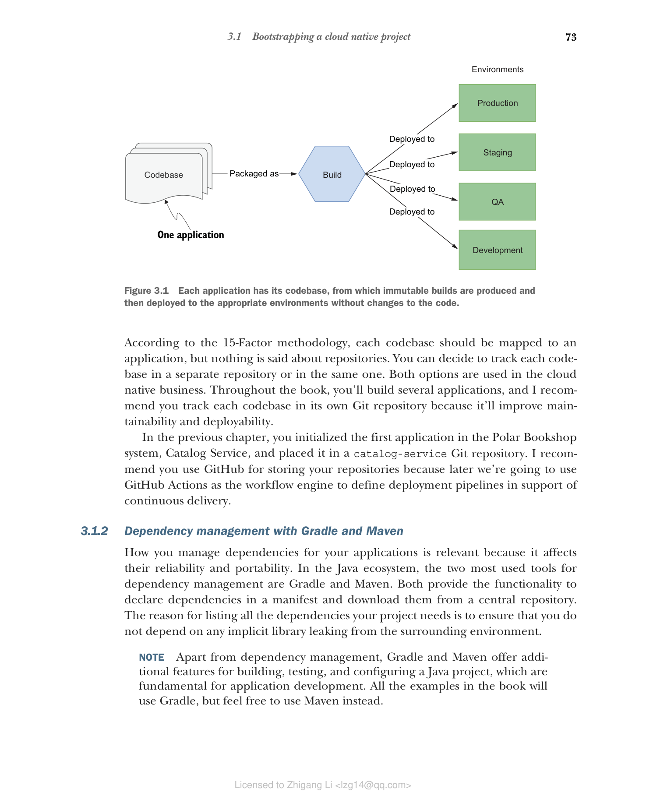

### 3.1.1 一份代码库对应一个应用

云原生应用应由在版本控制系统（如 Git）中跟踪的单一代码库组成。每个代码库必须产生不可变的制品，称为构建（build），这些构建可以部署到多个环境中。图 3.1 展示了代码库、构建和部署之间的关系。

正如您将在下一章中看到的，任何与环境相关的信息（如配置）都必须位于应用代码库之外。如果某些代码被多个应用所需要，您应该将其转化为一个独立的服务，或者将其转化为一个可以作为依赖导入到项目中的库。您应该仔细评估后一种选择，以防止系统变成一个分布式单体。

> **注意** 思考如何将代码组织到代码库和仓库中，可以帮助您更聚焦于系统架构，并识别出那些实际上可以作为独立服务单独存在的部分。如果做得正确，代码库的组织方式可以促进模块化和松耦合。

**图 3.1 每个应用都有自己的代码库，从中产生不可变的构建，然后部署到适当的环境中，而无需更改代码。**

根据 15-Factor 方法论，每个代码库应对应一个应用，但对于仓库并没有做出规定。您可以决定将每个代码库跟踪在单独的仓库中，或者放在同一个仓库中。这两种方式在云原生领域都有使用。在本书中，您将构建多个应用，我建议您将每个代码库跟踪在其自己的 Git 仓库中，因为这将提高可维护性和可部署性。

在上一章中，您初始化了 Polar Bookshop 系统中的第一个应用 —— Catalog Service，并将其放置在 `catalog-service` Git 仓库中。我建议您使用 GitHub 来存储您的仓库，因为稍后我们将使用 GitHub Actions 作为工作流引擎来定义支持持续交付的部署流水线。
