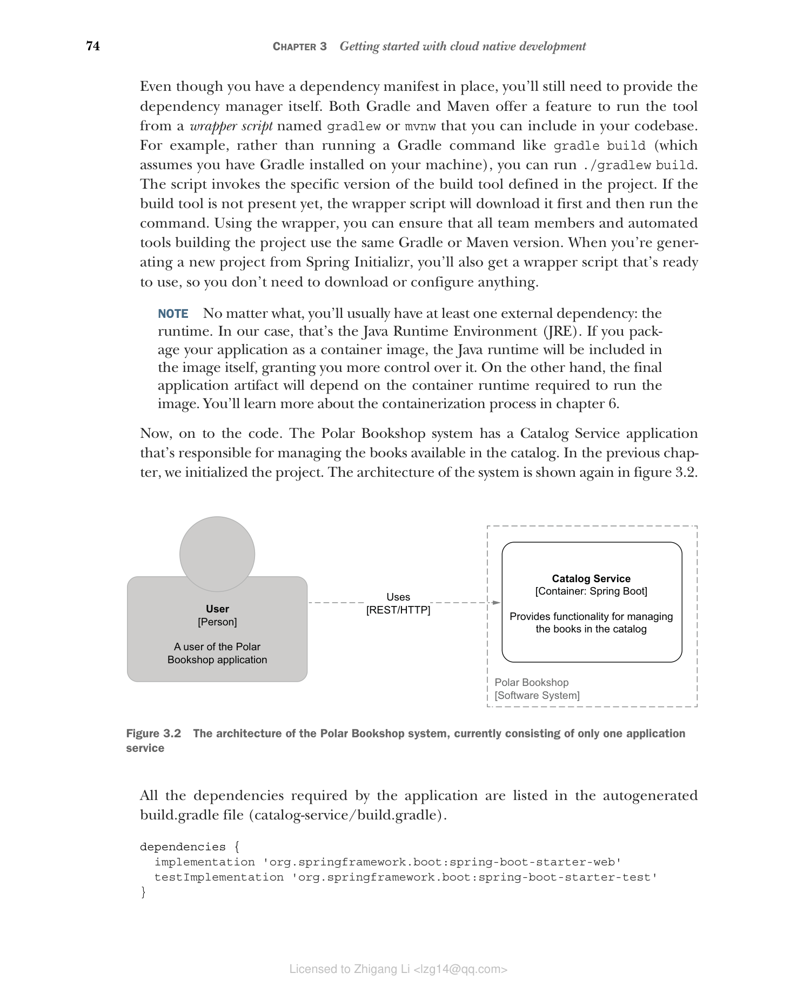

### 3.1.2 使用 Gradle 和 Maven 管理依赖

如何管理应用依赖是一个重要的问题，因为它影响着应用的可靠性和可移植性。在 Java 生态系统中，最常用的两个依赖管理工具是 Gradle 和 Maven。两者都提供了在清单文件中声明依赖并从中央仓库下载它们的功能。列出项目所需的所有依赖的原因是确保您不依赖于从周围环境中泄漏的任何隐式库。

> **注意** 除了依赖管理之外，Gradle 和 Maven 还提供了用于构建、测试和配置 Java 项目的额外功能，这些功能对于应用开发至关重要。本书的所有示例将使用 Gradle，但您也可以使用 Maven。

即使您已经有了依赖清单，您仍然需要提供依赖管理器本身。Gradle 和 Maven 都提供了一种通过名为 `gradlew` 或 `mvnw` 的包装脚本来运行工具的功能，您可以将该脚本包含在代码库中。例如，与其运行像 `gradle build` 这样的 Gradle 命令（假设您的机器上已安装 Gradle），您可以运行 `./gradlew build`。该脚本会调用项目中定义的特定版本的构建工具。如果构建工具尚不存在，包装脚本会先下载它，然后运行命令。使用包装器，您可以确保所有团队成员和构建项目的自动化工具使用相同的 Gradle 或 Maven 版本。当您从 Spring Initializr 生成新项目时，您也会得到一个可以直接使用的包装脚本，因此您不需要下载或配置任何东西。

> **注意** 无论如何，您通常至少会有一个外部依赖：运行时。在我们的例子中，那就是 Java 运行时环境（JRE）。如果您将应用打包为容器镜像，Java 运行时将包含在镜像本身中，从而让您对它有更多的控制。另一方面，最终的应用制品将依赖于运行镜像所需的容器运行时。您将在第 6 章了解更多关于容器化过程的内容。

现在，让我们开始编写代码。Polar Bookshop 系统有一个 Catalog Service 应用，负责管理目录中可用的图书。在上一章中，我们初始化了该项目。系统的架构再次在图 3.2 中展示。


**图 3.2 Polar Bookshop 系统的架构，目前仅由一个应用服务组成**

应用所需的所有依赖都列在自动生成的 `build.gradle` 文件（`catalog-service/build.gradle`）中。

```groovy
dependencies {
 implementation 'org.springframework.boot:spring-boot-starter-web'
 testImplementation 'org.springframework.boot:spring-boot-starter-test'
}
```


