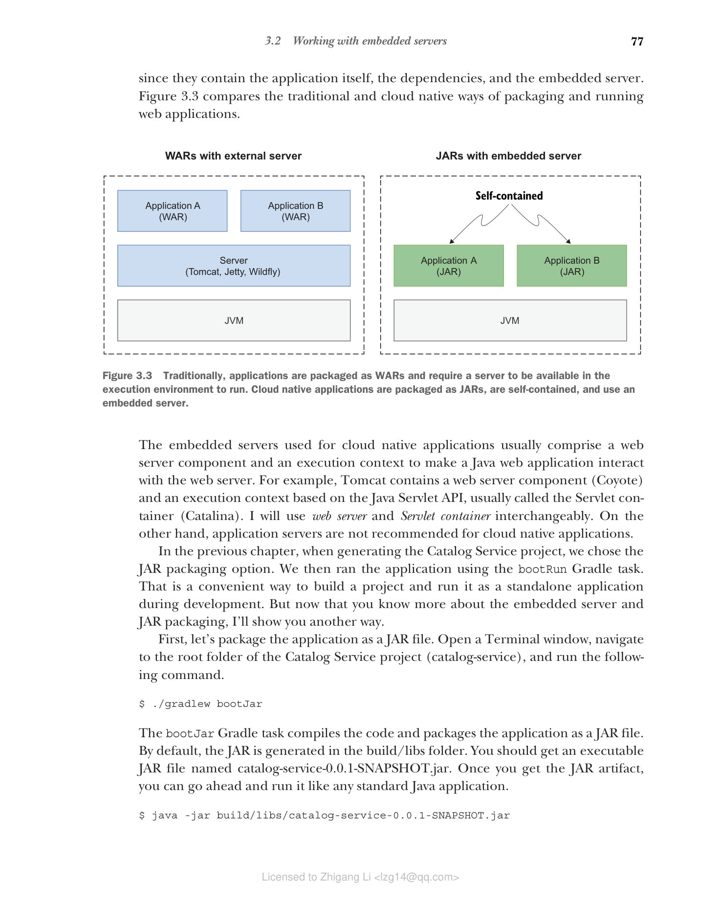
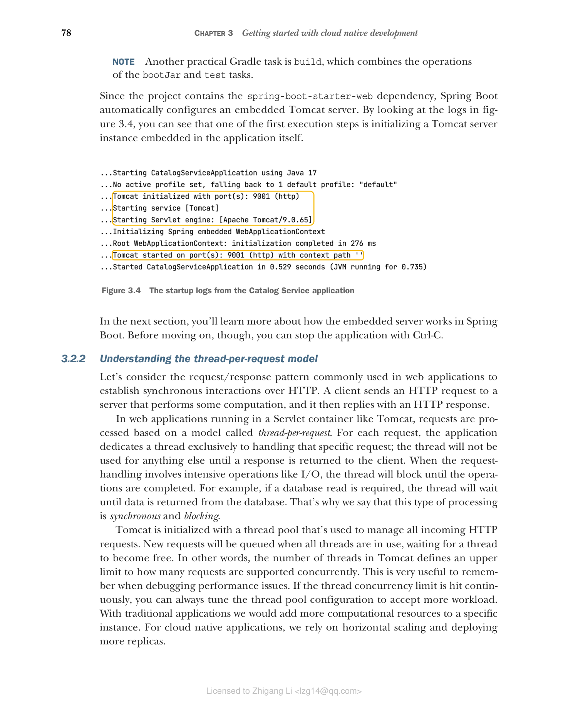

### 3.2.1 可执行 JAR 和内嵌服务器：为云做好准备

传统方法与云原生方法之间的一个区别在于如何打包和部署应用。传统上，我们使用应用服务器或独立的 Web 服务器。它们在生产环境中的设置和维护成本很高，因此为了效率，它们被用来部署多个应用，这些应用被打包为 EAR 或 WAR 制品。这种场景在应用之间产生了耦合。如果其中任何一个应用想要在服务器级别进行更改，该更改必须与其他团队协调并应用到所有应用上，从而限制了敏捷性和应用的演进。此外，应用的部署依赖于机器上有可用的服务器，限制了应用在不同环境之间的可移植性。

当您转向云原生时，情况就不同了。云原生应用应该是自包含的，不依赖于执行环境中可用的服务器。相反，必要的服务器功能被包含在应用本身中。Spring Boot 提供了内置的服务器功能，帮助您消除外部依赖并使应用成为独立的。Spring Boot 内置了一个预配置的 Tomcat 服务器，但也可以将其替换为 Undertow、Jetty 或 Netty。

解决了服务器依赖问题后，我们需要相应地改变应用的打包方式。在 JVM 生态系统中，云原生应用被打包为 JAR 制品。由于它们是自包含的，它们可以作为独立的 Java 应用运行，除了 JVM 之外没有外部依赖。Spring Boot 足够灵活，可以同时支持 JAR 和 WAR 两种打包类型。但对于云原生应用，您需要使用自包含的 JAR，也称为 fat-JAR 或 uber-JAR，因为它们包含应用本身、依赖项和内嵌服务器。图 3.3 比较了传统和云原生的 Web 应用打包和运行方式。


**图 3.3 传统上，应用被打包为 WAR 并要求执行环境中有可用的服务器才能运行。云原生应用被打包为 JAR，是自包含的，并使用内嵌服务器。**

用于云原生应用的内嵌服务器通常包含一个 Web 服务器组件和一个执行上下文，使 Java Web 应用能够与 Web 服务器交互。例如，Tomcat 包含一个 Web 服务器组件（Coyote）和一个基于 Java Servlet API 的执行上下文，通常称为 Servlet 容器（Catalina）。我将交替使用 Web 服务器和 Servlet 容器这两个术语。另一方面，不推荐将应用服务器用于云原生应用。

在上一章中，生成 Catalog Service 项目时，我们选择了 JAR 打包选项。然后我们使用 `bootRun` Gradle 任务运行了应用。这是一种在开发过程中构建项目并将其作为独立应用运行的便捷方式。但现在您已经了解了更多关于内嵌服务器和 JAR 打包的知识，我将向您展示另一种方式。

首先，让我们将应用打包为 JAR 文件。打开终端窗口，导航到 Catalog Service 项目的根文件夹（`catalog-service`），并运行以下命令。

```bash
$ ./gradlew bootJar
```

`bootJar` Gradle 任务会编译代码并将应用打包为 JAR 文件。默认情况下，JAR 生成在 `build/libs` 文件夹中。您应该会得到一个名为 `catalog-service-0.0.1-SNAPSHOT.jar` 的可执行 JAR 文件。获得 JAR 制品后，您可以像运行任何标准 Java 应用一样运行它。

```bash
$ java -jar build/libs/catalog-service-0.0.1-SNAPSHOT.jar
```

> **注意** 另一个实用的 Gradle 任务是 `build`，它结合了 `bootJar` 和 `test` 任务的操作。

由于项目包含 `spring-boot-starter-web` 依赖，Spring Boot 会自动配置一个内嵌的 Tomcat 服务器。通过查看图 3.4 中的日志，您可以看到最初的执行步骤之一就是初始化一个内嵌在应用本身中的 Tomcat 服务器实例。


**图 3.4 Catalog Service 应用的启动日志**

在下一节中，您将了解更多关于 Spring Boot 中内嵌服务器的工作原理。不过，在继续之前，您可以使用 Ctrl-C 停止应用。
