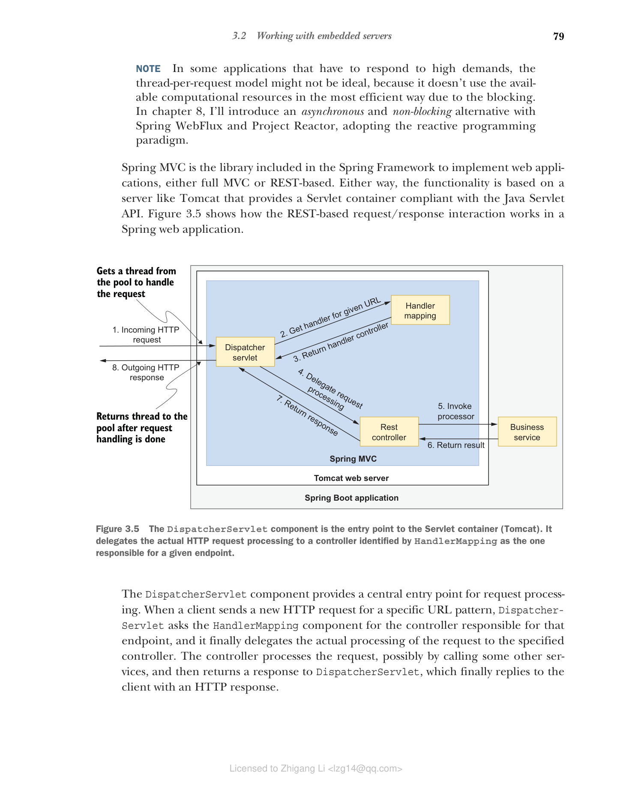

### 3.2.2 理解"一个请求一个线程"模型

让我们考虑 Web 应用中常用的请求/响应模式，用于通过 HTTP 建立同步交互。客户端向服务器发送 HTTP 请求，服务器执行一些计算，然后回复一个 HTTP 响应。

在 Tomcat 等 Servlet 容器中运行的 Web 应用中，请求基于一种称为"一个请求一个线程"（thread-per-request）的模型进行处理。对于每个请求，应用会专门分配一个线程来处理该特定请求；在向客户端返回响应之前，该线程不会用于其他任何事情。当请求处理涉及 I/O 等密集型操作时，线程将阻塞直到操作完成。例如，如果需要读取数据库，线程将等待直到从数据库返回数据。这就是为什么我们说这种类型的处理是同步且阻塞的。

Tomcat 初始化时带有一个线程池，用于管理所有传入的 HTTP 请求。当所有线程都在使用中时，新请求将被排队，等待线程空闲。换句话说，Tomcat 中的线程数定义了可同时支持的请求数上限。这在调试性能问题时非常有用。如果持续达到线程并发限制，您始终可以调整线程池配置以接受更多工作负载。对于传统应用，我们会向特定实例添加更多计算资源。对于云原生应用，我们依赖水平扩展和部署更多副本。

> **注意** 在一些需要响应高需求的应用中，"一个请求一个线程"模型可能并不理想，因为阻塞操作使其无法以最有效的方式利用可用的计算资源。在第 8 章中，我将介绍一种使用 Spring WebFlux 和 Project Reactor 的异步非阻塞替代方案，采用响应式编程范式。

Spring MVC 是 Spring Framework 中包含的用于实现 Web 应用的库，可以是完整的 MVC 或基于 REST 的。无论哪种方式，其功能都基于像 Tomcat 这样提供符合 Java Servlet API 的 Servlet 容器的服务器。图 3.5 展示了基于 REST 的请求/响应交互在 Spring Web 应用中的工作方式。

**图 3.5 DispatcherServlet 组件是 Servlet 容器（Tomcat）的入口点。它将实际的 HTTP 请求处理委托给由 HandlerMapping 识别为负责给定端点的控制器。**

`DispatcherServlet` 组件为请求处理提供了一个中央入口点。当客户端发送针对特定 URL 模式的新 HTTP 请求时，`DispatcherServlet` 向 `HandlerMapping` 组件查询负责该端点的控制器，然后最终将请求的实际处理委托给指定的控制器。控制器处理请求（可能通过调用其他服务），然后向 `DispatcherServlet` 返回响应，后者最终以 HTTP 响应回复客户端。

请注意 Tomcat 服务器是如何内嵌在 Spring Boot 应用中的。Spring MVC 依赖 Web 服务器来完成其功能。任何实现 Servlet API 的 Web 服务器都是如此，但由于我们明确使用的是 Tomcat，让我们继续探索一些配置它的选项。
