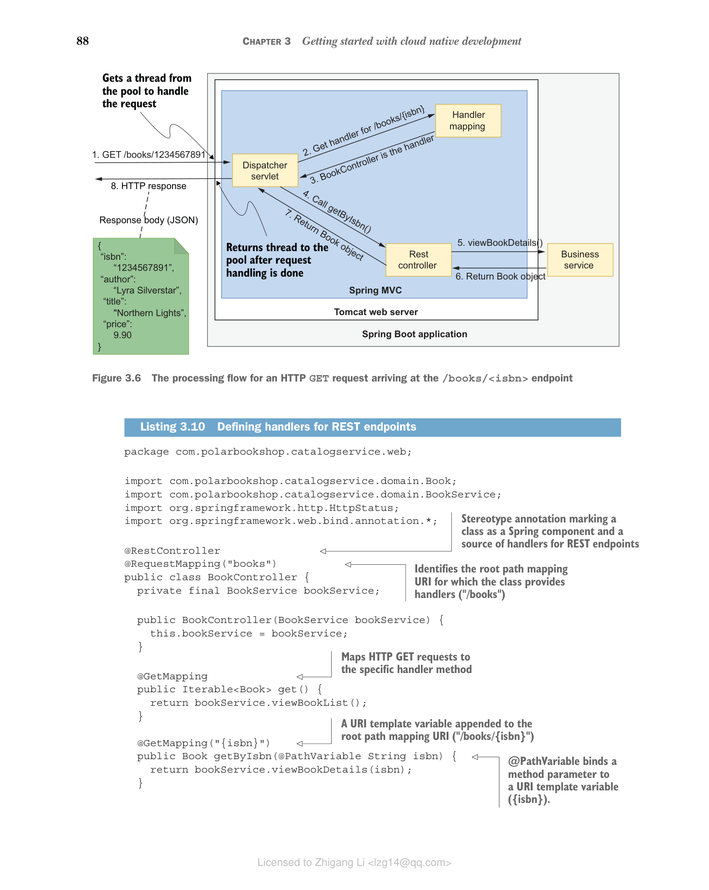

### 3.3.2 使用 Spring MVC 实现 REST API

实现了业务逻辑后，我们可以通过 REST API 暴露这些用例。Spring MVC 提供 `@RestController` 类来定义处理特定 HTTP 方法和资源端点的传入 HTTP 请求的方法。

正如您在上一节中看到的，`DispatcherServlet` 组件将为每个请求调用正确的控制器。图 3.6 展示了客户端发送 HTTP GET 请求来查看特定图书详情的场景。


**图 3.6 到达 `/books/<isbn>` 端点的 HTTP GET 请求的处理流程**

我们希望为应用需求中定义的每个用例实现一个方法处理器，因为我们希望将它们全部提供给客户端。创建一个用于 Web 层的包（`com.polarbookshop.catalogservice.web`），并添加一个 `BookController` 类来负责处理发送到 `/books` 基础端点的 HTTP 请求。

**代码清单 3.10 定义 REST 端点的处理器**

```java
package com.polarbookshop.catalogservice.web;

import com.polarbookshop.catalogservice.domain.Book;
import com.polarbookshop.catalogservice.domain.BookService;
import org.springframework.http.HttpStatus;
import org.springframework.web.bind.annotation.*;

@RestController // 标记类为 Spring 组件和 REST 端点处理器的来源
@RequestMapping("books") // 标识类提供处理器的根路径映射 URI（"/books"）
public class BookController {
 private final BookService bookService;

 public BookController(BookService bookService) {
 this.bookService = bookService;
 }

 @GetMapping // 将 HTTP GET 请求映射到特定处理器方法
 public Iterable<Book> get() {
 return bookService.viewBookList();
 }

 @GetMapping("{isbn}") // 附加到根路径映射 URI 的 URI 模板变量（"/books/{isbn}"）
 public Book getByIsbn(@PathVariable String isbn) {
 // @PathVariable 将方法参数绑定到 URI 模板变量（{isbn}）
 return bookService.viewBookDetails(isbn);
 }

 @PostMapping // 将 HTTP POST 请求映射到特定处理器方法
 @ResponseStatus(HttpStatus.CREATED) // 如果图书创建成功则返回 201 状态码
 public Book post(@RequestBody Book book) {
 // @RequestBody 将方法参数绑定到 Web 请求的请求体
 return bookService.addBookToCatalog(book);
 }

 @PutMapping("{isbn}") // 将 HTTP PUT 请求映射到特定处理器方法
 public Book put(@PathVariable String isbn, @RequestBody Book book) {
 return bookService.editBookDetails(isbn, book);
 }

 @DeleteMapping("{isbn}") // 将 HTTP DELETE 请求映射到特定处理器方法
 @ResponseStatus(HttpStatus.NO_CONTENT) // 如果图书删除成功则返回 204 状态码
 public void delete(@PathVariable String isbn) {
 bookService.removeBookFromCatalog(isbn);
 }
}
```

继续运行应用（`./gradlew bootRun`）。在验证与应用的 HTTP 交互时，您可以使用像 curl 这样的命令行工具，或者像 Insomnia 这样有图形界面的软件。我将使用一个方便的命令行工具 HTTPie（[https://httpie.org](https://httpie.org)）。您可以在附录 A 的 A.4 节找到安装信息。

打开终端窗口，执行一个 HTTP POST 请求来向目录中添加一本书：

```bash
$ http POST :9001/books author="Lyra Silverstar" \
 title="Northern Lights" isbn="1234567891" price=9.90
```

结果应该是一个带有 201 状态码的 HTTP 响应，表示图书已成功创建。让我们通过提交一个 HTTP GET 请求来获取我们创建时使用的 ISBN 对应的图书，以进行双重验证。

```bash
$ http :9001/books/1234567891

HTTP/1.1 200
Content-Type: application/json

{
 "author": "Lyra Silverstar",
 "isbn": "1234567891",
 "price": 9.9,
 "title": "Northern Lights"
}
```

当您试用完应用后，使用 Ctrl-C 停止其执行。

> **关于内容协商**
>
> `BookController` 中的所有处理器方法都操作 `Book` Java 对象。然而，当您执行请求时，您得到的是一个 JSON 对象。这怎么可能呢？
>
> Spring MVC 依赖一个 `HttpMessageConverter` Bean 将返回的对象转换为客户端支持的特定表示。关于内容类型的决策由一个称为内容协商的过程驱动，在此过程中客户端和服务器商定一种双方都能理解的表示。客户端可以通过 HTTP 请求中的 `Accept` 头来通知服务器它支持哪些内容类型。
>
> 默认情况下，Spring Boot 配置了一组 `HttpMessageConverter` Bean 来返回以 JSON 表示的对象，而 HTTPie 工具默认配置为接受任何内容类型。结果是客户端和服务器都支持 JSON 内容类型，因此它们同意使用 JSON 进行通信。

我们到目前为止实现的应用还不完整。例如，没有什么能阻止您发布一本 ISBN 格式错误或没有指定标题的新书。我们需要验证输入。
