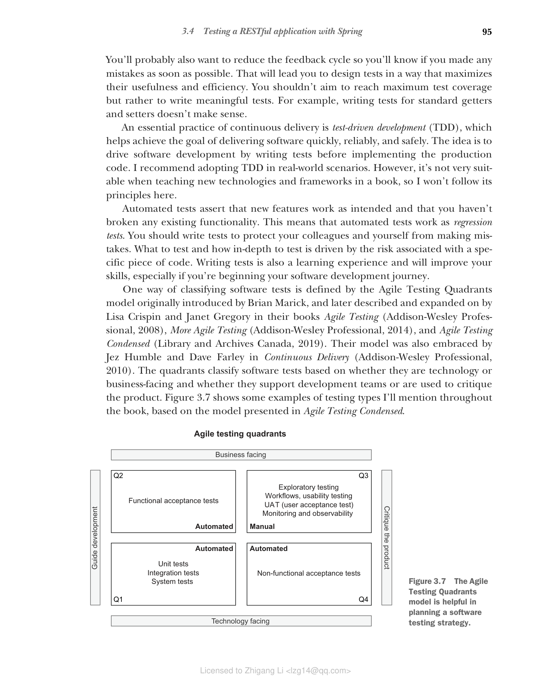

# 3.4 使用 Spring 测试 RESTful 应用

自动化测试对于生产高质量软件至关重要。采用云原生方法的目标之一是速度。如果代码没有得到充分的自动化测试，就不可能快速行动，更不用说实现持续交付流程了。

作为一名开发者，您通常会实现一个功能、交付它，然后转向新的功能，可能还会重构现有代码。重构代码是有风险的，因为您可能会破坏一些现有功能。自动化测试降低了风险并鼓励重构，因为您知道如果破坏了某些东西，测试就会失败。

您可能还希望缩短反馈周期，以便尽快知道自己是否犯了错误。这将引导您以最大化其实用性和效率的方式来设计测试。您不应该以追求最大测试覆盖率为目标，而应该编写有意义的测试。例如，为标准的 getter 和 setter 编写测试没有意义。

持续交付的一个重要实践是测试驱动开发（TDD），它有助于实现快速、可靠和安全地交付软件的目标。其理念是通过在实现生产代码之前编写测试来驱动软件开发。我建议在真实场景中采用 TDD。然而，它不太适合在书中教授新技术和框架，所以我不会在这里遵循其原则。

自动化测试断言新功能按预期工作，以及您没有破坏任何现有功能。这意味着自动化测试充当回归测试。您应该编写测试来保护同事和自己免受错误。测试什么以及测试深度由与特定代码相关的风险驱动。编写测试也是一种学习体验，将提高您的技能，特别是如果您正在开始软件开发之旅。

对软件测试进行分类的一种方式由 Brian Marick 最初引入的敏捷测试象限模型定义，后来由 Lisa Crispin 和 Janet Gregory 在其著作 *Agile Testing*（Addison-Wesley Professional, 2008）、*More Agile Testing*（Addison-Wesley Professional, 2014）和 *Agile Testing Condensed*（Library and Archives Canada, 2019）中描述和扩展。他们的模型还被 Jez Humble 和 Dave Farley 在 *Continuous Delivery*（Addison-Wesley Professional, 2010）中采纳。该象限根据测试是面向技术还是面向业务，以及是支持开发团队还是用于评判产品来对软件测试进行分类。图 3.7 展示了我在全书中将提到的一些测试类型示例，基于 *Agile Testing Condensed* 中提出的模型。

**图 3.7 敏捷测试象限模型有助于规划软件测试策略。**

遵循持续交付实践，我们应该致力于在四个象限中的三个中实现完全自动化测试，如图 3.7 所示。在本书中，我们将主要关注左下象限。在本节中，我们将使用单元测试和集成测试（有时称为组件测试）。我们编写单元测试来验证单个应用组件的独立行为，而集成测试则断言应用不同部分相互交互的整体功能。

在 Gradle 或 Maven 项目中，测试类通常放在 `src/test/java` 文件夹中。在 Spring 中，单元测试不需要加载 Spring 应用上下文，也不依赖任何 Spring 库。另一方面，集成测试需要 Spring 应用上下文才能运行。本节将向您展示如何使用单元测试和集成测试来测试像 Catalog Service 这样的 RESTful 应用。
