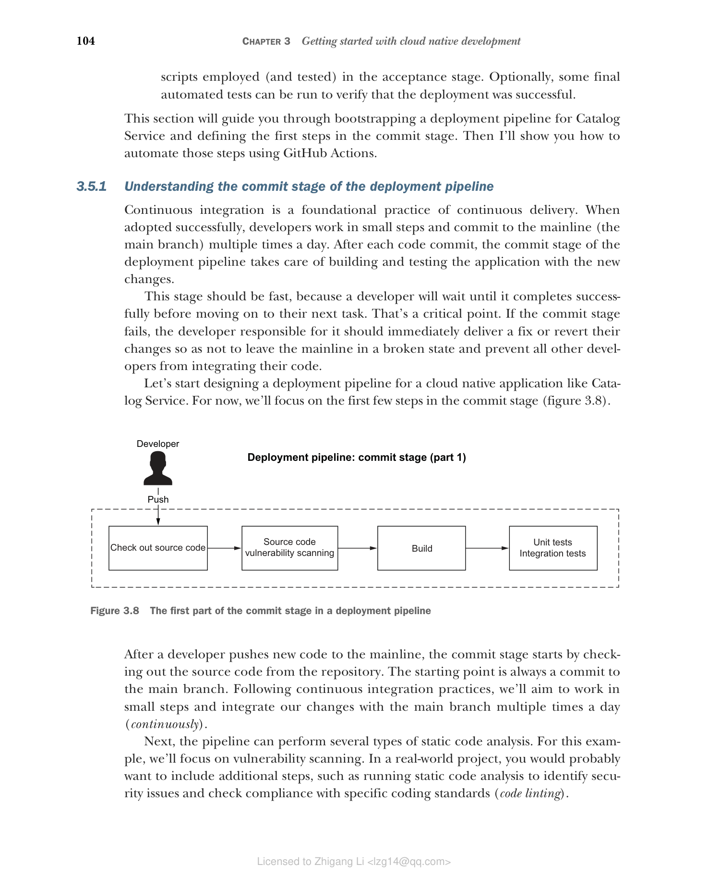
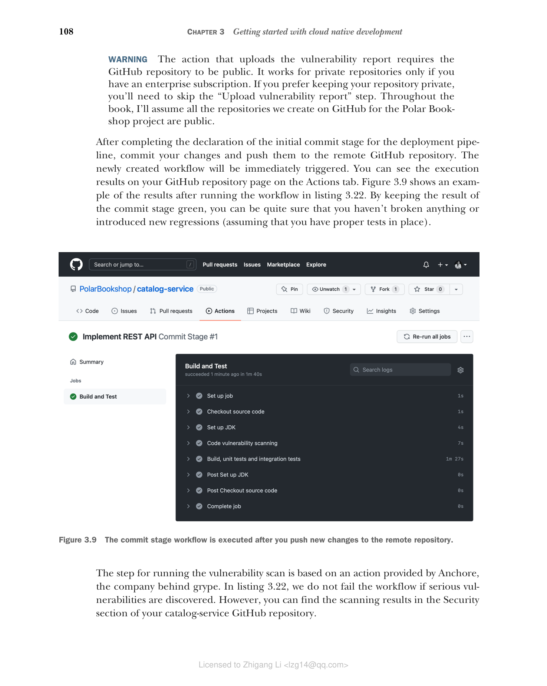
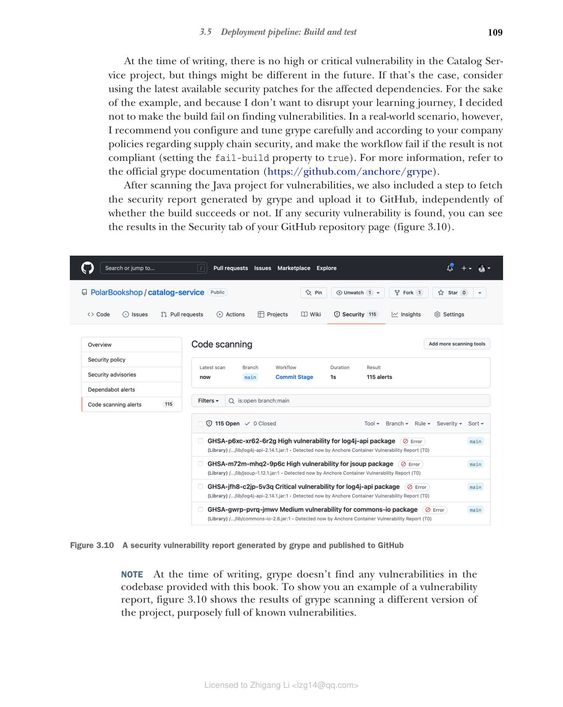

### 3.5.1 理解部署流水线的提交阶段

持续集成是持续交付的基础实践。成功采用时，开发者以小步工作，每天多次提交到主干（main 分支）。每次代码提交后，部署流水线的提交阶段负责使用新更改构建和测试应用。

此阶段应该快速，因为开发者会等待它成功完成后才继续下一个任务。这是一个关键点。如果提交阶段失败，负责的开发者应立即交付修复或回滚其更改，以免使主干处于损坏状态并阻止所有其他开发者集成他们的代码。

让我们开始为像 Catalog Service 这样的云原生应用设计部署流水线。现在，我们将关注提交阶段的前几步（图 3.8）。


**图 3.8 部署流水线中提交阶段的第一部分**

在开发者将新代码推送到主干后，提交阶段从从仓库检出源代码开始。起点始终是对 main 分支的一次提交。遵循持续集成实践，我们将以小步工作，并每天多次（持续地）将我们的更改与 main 分支集成。

接下来，流水线可以执行多种类型的静态代码分析。对于本例，我们将专注于漏洞扫描。在真实项目中，您可能希望包含额外的步骤，例如运行静态代码分析以识别安全问题并检查是否符合特定编码标准（代码 linting）。

最后，流水线构建应用并运行自动化测试。在提交阶段，我们包含不需要部署整个应用的技术导向测试。这些是单元测试，通常还包括集成测试。如果集成测试耗时太长，最好将它们移至验收阶段以保持提交阶段快速。

我们将在 Polar Bookshop 项目中使用的漏洞扫描器是 grype（[https://github.com/anchore/grype](https://github.com/anchore/grype)），这是一个强大的开源工具，在云原生世界中越来越广泛使用。例如，它是 VMware Tanzu Application Platform 提供的供应链安全解决方案的一部分。您可以在附录 A 的 A.4 节找到安装说明。

让我们看看 grype 如何工作。打开终端窗口，导航到 Catalog Service 项目的根文件夹（`catalog-service`），并使用 `./gradlew build` 构建应用。然后使用 grype 扫描您的 Java 代码库中的漏洞。该工具会下载已知漏洞列表（漏洞数据库），并根据它们扫描您的项目。扫描在您的机器上本地进行，这意味着您的文件或制品都不会被发送到外部服务。这使其更适合受监管的环境或气隙场景。

```bash
$ grype .
 Vulnerability DB [updated]
 Indexed . [35 packages]
 Cataloged packages
 Scanned image [0 vulnerabilities]
No vulnerabilities found
```

> **注意** 请记住，安全不是系统的静态属性。在撰写本文时，Catalog Service 使用的依赖项没有已知漏洞，但这并不意味着永远如此。您应该持续扫描您的项目，并在安全补丁发布后立即应用，以修复新发现的漏洞。

第 6 章和第 7 章将涵盖提交阶段的其余步骤。现在，让我们看看如何使用 GitHub Actions 自动化部署流水线。这是下一节的主题。

### 3.5.2 使用 GitHub Actions 实现提交阶段

在自动化部署流水线方面，您可以从许多解决方案中进行选择。在本书中，我将使用 GitHub Actions（[https://github.com/features/actions](https://github.com/features/actions)）。它是一个托管解决方案，提供了我们项目所需的所有功能，而且方便地为所有 GitHub 仓库预配置好了。我在本书早期引入这个主题，以便您可以在全书中处理项目时使用部署流水线来验证您的更改。

> **注意** 在云原生生态系统中，Tekton（[https://tekton.dev](https://tekton.dev)）是定义部署流水线和其他软件工作流的热门选择。它是一个开源的、Kubernetes 原生的解决方案，托管在持续交付基金会（[https://cd.foundation](https://cd.foundation)）。它直接在集群上运行，允许您将流水线和任务声明为 Kubernetes 自定义资源。

GitHub Actions 是内置于 GitHub 的平台，允许您直接从代码仓库自动化软件工作流。工作流就是一个自动化流程。我们将使用工作流来建模部署流水线的提交阶段。每个工作流监听触发其执行的特定事件。

工作流应定义在 GitHub 仓库根目录的 `.github/workflows` 文件夹中，并应遵循 GitHub Actions 提供的 YAML 格式描述。在您的 Catalog Service 项目（`catalog-service`）中，在新的 `.github/workflows` 文件夹下创建一个 `commit-stage.yml` 文件。每当新代码被推送到仓库时，此工作流就会被触发。

**代码清单 3.20 定义工作流名称和触发器**

```yaml
name: Commit Stage # 工作流的名称
on: push # 当新代码被推送到仓库时触发工作流
```

每个工作流被组织为并行运行的作业。目前，我们将定义一个单独的作业来收集前面图 3.8 中描述的步骤。每个作业在运行器实例上执行，运行器是 GitHub 提供的服务器。您可以在 Ubuntu、Windows 和 macOS 之间选择。对于 Catalog Service，我们将在 GitHub 提供的 Ubuntu 运行器上运行一切。我们还需要具体指定每个作业应具有的权限。"Build and Test" 作业将需要对 Git 仓库的读取权限，以及在向 GitHub 提交漏洞报告时对安全事件的写入权限。

**代码清单 3.21 配置用于构建和测试应用的作业**

```yaml
name: Commit Stage
on: push

jobs:
 build: # 作业的唯一标识符
 name: Build and Test # 作业的人类友好名称
 runs-on: ubuntu-22.04 # 作业应运行的机器类型
 permissions: # 授予作业的权限
 contents: read # 检出当前 Git 仓库的权限
 security-events: write # 向 GitHub 提交安全事件的权限
```

每个作业由步骤组成，这些步骤按顺序执行。一个步骤可以是 shell 命令或一个 action。Action 是自定义应用，用于以更结构化和可重复的方式执行复杂任务。例如，您可以有用于将应用打包为可执行文件、运行测试、创建容器镜像或将镜像推送到容器镜像仓库的 action。GitHub 组织提供了一组基础 action，但也有一个市场提供了更多由社区开发的 action。

> **警告** 使用来自 GitHub 市场的 action 时，请像对待任何其他第三方应用一样处理它们，并相应地管理安全风险。优先使用 GitHub 或经验证组织提供的可信 action，而不是其他第三方选项。

让我们通过描述 "Build and Test" 作业应运行的步骤来完成提交阶段的第一部分。最终结果如下面的代码清单所示。

**代码清单 3.22 实现构建和测试应用的步骤**

```yaml
name: Commit Stage
on: push

jobs:
 build:
 name: Build and Test
 runs-on: ubuntu-22.04
 permissions:
 contents: read
 security-events: write
 steps:
 - name: Checkout source code # 检出当前 Git 仓库（catalog-service）
 uses: actions/checkout@v3

 - name: Set up JDK # 安装并配置 Java 运行时
 uses: actions/setup-java@v3
 with: # 定义使用哪个版本、发行版和缓存类型
 distribution: temurin
 java-version: 17
 cache: gradle

 - name: Code vulnerability scanning # 使用 grype 扫描代码库中的漏洞
 uses: anchore/scan-action@v3
 id: scan # 为当前步骤分配标识符，以便后续步骤引用
 with:
 path: "${{ github.workspace }}" # 检出的仓库的路径
 fail-build: false # 是否在发现安全漏洞时使构建失败
 severity-cutoff: high # 被视为错误的最低安全类别（low、medium、high、critical）
 acs-report-enable: true # 是否在扫描完成后启用报告生成

 - name: Upload vulnerability report # 将安全漏洞报告上传到 GitHub（SARIF 格式）
 uses: github/codeql-action/upload-sarif@v2
 if: success() || failure() # 即使上一步失败也上传报告
 with:
 sarif_file: ${{ steps.scan.outputs.sarif }} # 从上一步的输出中获取报告

 - name: Build, unit tests and integration tests
 run: | # 运行 Gradle build 任务，编译代码库并运行单元和集成测试
 chmod +x gradlew # 确保 Gradle 包装器可执行，解决 Windows 不兼容问题
 ./gradlew build
```

> **警告** 上传漏洞报告的 action 要求 GitHub 仓库是公开的。它仅在您拥有企业订阅时才适用于私有仓库。如果您希望保持仓库私有，则需要跳过"上传漏洞报告"步骤。在本书中，我假设我们在 GitHub 上为 Polar Bookshop 项目创建的所有仓库都是公开的。

完成部署流水线初始提交阶段的声明后，提交您的更改并将它们推送到远程 GitHub 仓库。新创建的工作流将立即被触发。您可以在 GitHub 仓库页面的 Actions 标签页上查看执行结果。图 3.9 展示了运行代码清单 3.22 中工作流后的结果示例。通过保持提交阶段的结果为绿色，您可以相当确定您没有破坏任何东西或引入新的回归（假设您有适当的测试）。


**图 3.9 当您将新更改推送到远程仓库后，提交阶段工作流会被执行。**

运行漏洞扫描的步骤基于 Anchore（grype 背后的公司）提供的 action。在代码清单 3.22 中，如果发现严重漏洞，我们不会使工作流失败。但是，您可以在 catalog-service GitHub 仓库的 Security 部分找到扫描结果。

在撰写本文时，Catalog Service 项目中没有高严重性或严重漏洞，但未来可能不同。如果是这种情况，请考虑为受影响的依赖项使用最新的安全补丁。为了示例的目的，也因为我不想中断您的学习之旅，我决定不在发现漏洞时使构建失败。然而，在真实场景中，我建议您根据公司关于供应链安全的政策仔细配置和调整 grype，并在结果不合规时使工作流失败（将 `fail-build` 属性设为 `true`）。更多信息请参阅 grype 官方文档（[https://github.com/anchore/grype](https://github.com/anchore/grype)）。

在扫描 Java 项目的漏洞后，我们还包含了一个步骤来获取 grype 生成的安全报告并将其上传到 GitHub，无论构建是否成功。如果发现任何安全漏洞，您可以在 GitHub 仓库页面的 Security 标签页中查看结果（图 3.10）。


**图 3.10 grype 生成并发布到 GitHub 的安全漏洞报告**

> **注意** 在撰写本文时，grype 在本书附带的代码库中没有发现任何漏洞。为了向您展示漏洞报告的示例，图 3.10 显示了 grype 扫描项目的不同版本的结果，该版本故意充满了已知漏洞。

本章到此结束。接下来，我将介绍云原生开发的主要实践之一：外部化配置。
