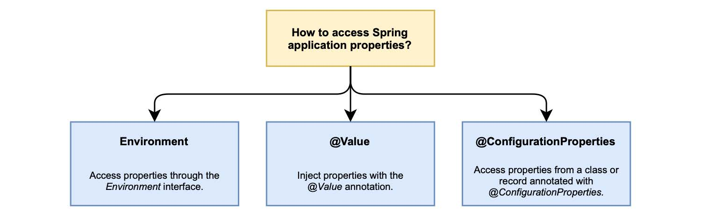

### 4.1.1 Properties：键值对

Properties （属性）是 Java 支持的键/值对，是 `java.util.Properties` 的一等公民。它们在 Java 应用程序中扮演着重要角色，可以在编译的 Java 代码之外存储配置参数，还可以从 Spring Boot 不同来源自动加载。当在多个来源中都定义了同一属性时，有规则决定哪一个优先。例如，如果在属性文件和命令行参数中，都指定了 server.port 属性，则后者优先于前者。以下是一些属性来源的优先级列表，从具有最高优先级的来源开始。完整的列表您可以参考 Spring Boot 文档（[Spring.io/projects/Spring-boot](https://spring.io/projects/spring-boot)）。

1. 添加了 @TestPropertySource 的测试类。
1. 命令行参数。
1. 来自 System.getProperties() 的 JVM 系统属性。
1. 来自 System.getenv() 的 OS 环境变量。
1. 配置数据文件。
1. `@Configuration` 类上的 PropertySource 注解。
1. SpringApplication.setDefaultProperties 的默认属性。

配置数据文件可以进一步划分优先级，从优先级最高的开始。
1. JAR 文件外，application-{profile}.properties 和 application-{profile}.yml 中，特定于配置文件的属性。
1. JAR 文件外，application.properties 和 application.yml 中的应用程序属性。
1. JAR 文件内，application-{profile}.properties 和 application-{profile}.yml 中，特定于配置文件的属性。
1. JAR 文件内，application.properties 和 application.yml 中的应用程序属性。

Spring 中属性处理的美妙之处在于，您不需要从特定来源获取值。Environment 抽象允许您通过统一的接口，访问任何源中定义的任何属性。如果在多个源中定义了相同的属性，则返回优先级最高的。您甚至可以添加自己的自定义源并为其指定优先级。

>注意：Spring 内置了使用 Properties 格式定义属性的支持。除此之外，Spring Boot 还支持使用 YAML 格式。YAML 是 JSON 的超集，提供了比 Properties 更灵活的格式。官方网站（[yaml.org](https://yaml.org/)）将 YAML 描述为“适用于所有编程语言的，人性化的数据序列化标准”。在您的应用程序中，您可以随意选择其中一种。本书中的所有示例都将使用 YAML。

#### 使用应用程序属性

有几种方法可以从 Java 类访问属性，如图 4.3 所示。最通用的方法基于 Environment 接口，当您需要访问应用程序属性时可以自动注入。例如，您可以使用它来访问 server.port 属性，按如下所示。

```java
@Autowired
private Environment environment;

public String getServerPort() {
  return environment.getProperty("server.port");
}
```


**图 4.3 您可以通过不同的方式访问 Spring 属性。**

也可以注入属性，而无需显式调用 Environment 对象。就像使用 @Autowired 注解注入 Spring bean 一样，您可以应用 `@Value` 注解以插入属性值。

```java
@Value("${server.port}")
private String serverPort;

public String getServerPort() {
  return serverPort;
}
```

您可以使用属性配置应用程序，而无需在代码中硬编码属性值，这是我们的目标之一。但在使用 Environment 对象或 `@Value` 注解时，仍然有一个难以管理的硬编码值：属性的键。更健壮的可维护选项（也是 Spring 团队推荐的选项）是使用特殊的，用注解 `@ConfigurationProperties` 标记的 bean 保存配置数据。在学习如何定义自定义属性的同时，您将在下一节中探索此功能。


#### 定义自定义属性

Spring Boot 附带了大量属性来配置应用程序的各个方面，取决于您在项目中导入的 starter 依赖项。不过，迟早您会需要定义自己的属性。

让我们考虑一直在做的 Catalog Service。在第 2 章中，您定义了 HTTP 端点向用户返回欢迎消息。我们现在有一个新的需求：欢迎消息应该是可配置的。这可能不是非常有用的功能，但它将帮助我向您展示不同的配置选项。

要做的第一件事，是告诉 Spring Boot 扫描应用程序上下文中的配置数据 Bean。您可以通过将 `@ConfigurationPropertiesScan` 注解添加到 Catalog Service 工程的 CatalogServiceApplication 类上。

**清单 4.1 启用扫描配置数据 bean（CatalogServiceApplication.java）**
```java
@SpringBootApplication
@ConfigurationPropertiesScan  ❶
public class CatalogServiceApplication {
  public static void main(String[] args) {
    SpringApplication.run(CatalogServiceApplication.class, args);
  }
}
```

❶ 在Spring上 下文中加载配置数据 bean。

然后，定义一个新的 com.polarbookshop.catalogservice.config 包，并创建一个 PolarProperties 记录（record）并添加 `@ConfigurationProperties` 注解，以将其标记为配置数据。`@ConfigurationProperties` 注解可配置前缀参数，前缀与字段名组合形成完整属性键。Spring Boot 将尝试映射所有具有该前缀的属性到类中的字段上。在本例中，只映射了一个属性：polar.greeting。

**清单 4.2 在 Spring bean 中定义自定义属性（PolarProperties.java）**

```java
package com.polarbookshop.catalogservice.config;

import org.springframework.boot.context.properties.ConfigurationProperties;

@ConfigurationProperties(prefix = "polar")  ❶
public record PolarProperties(
  String greeting  ❷
){}
```

❶ 将该类标记为以前缀 “polar”开头的配置属性源。

❷ 自定义“polar.greeting”（前缀+字段名）属性字段，会解析为字符串。


或者，您可以在 build.gradle 文件中添加对 Spring Boot Configuration Processor 的新依赖项。这将在构建时自动为新属性生成元数据，并存储在 META-INF/spring-configuration-metadata.json 中。IDE 可以提取它们，并帮助您进行自动补全和类型检查。记住在新添加后 刷新/重新导入 Gradle 依赖项。

```gradle
configurations {  ❶
  compileOnly {
  extendsFrom annotationProcessor
  }
}

dependencies {
  ...
  annotationProcessor 'org.springframework.boot:spring-boot-configuration-processor'  ❷
}
```

❶ 将 Gradle 配置为在生成项目时使用注解处理器。

❷ 从自定义属性生成元数据。

然后，您可以通过构建项目（./gradlew build）触发元数据生成。这时，可以在 application.yml 为 polar.greeting 定义默认值。当插入新属性时，IDE 应为您提供自动补全和类型检查。

```yaml
polar:
  greeting: Welcome to the local book catalog!
```

在清单 4.2 中， greeting 字段将映射到 polar.greeting，这是您刚刚在 application.yml 中自定义的值。

#### 使用自定义属性

用 `@ConfigurationProperties` 注解的类或记录（record）是标准的 Spring bean，所以可以在任何需要的地方直接注入。Spring Boot 初始化所有配置 bean，并使用任何支持的配置来源数据填充它们。对于 Catalog Service，数据来源于 application.yml 文件。

Catalog Service 的新要求是，使根端点返回的欢迎消息。可通过 polar.greeting 属性进行配置。打开 HomeController 类，并更新处理方法，以从自定义属性而不是使用固定值来获取消息。

**清单 4.3 使用配置 bean 中的自定义属性（HomeController.java）**

```java
package com.polarbookshop.catalogservice.web;

import com.polarbookshop.catalogservice.config.PolarProperties;
import org.springframework.web.bind.annotation.GetMapping;
import org.springframework.web.bind.annotation.RestController;

@RestController
public class HomeController {
  private final PolarProperties polarProperties;  ❶

  public HomeController(PolarProperties polarProperties) {
    this.polarProperties = polarProperties;
  }

  @GetMapping("/")
  public String getGreeting() {
    return polarProperties.greeting();  ❷
  }
}
```

❶ 注入 bean 以访问自定义属性。

❷ 使用来自配置数据 bean 的欢迎消息。

您现在可以构建并运行应用程序，以验证它是否按预期工作（./gradlew bootRun）。然后，打开一个终端窗口，向 Catalog Service 公开的根端点发送 GET 请求。

```bash
$ http :9001/
```

结果应该是您在 application.yml 中为属性 polar.greeting 配置的消息。

```text
Welcome to the local book catalog!
```

>注意：与应用程序一起打包的属性文件，对于定义合理的默认值是非常有用的。它们还可以作为应用程序支持哪些配置属性的规范文件。

以下部分将介绍 Spring Environment 抽像类、profiles，以及如何将它们用于云原生应用程序。在继续后续内容之前，您可以使用 `Ctrl + C` 停止应用程序。
