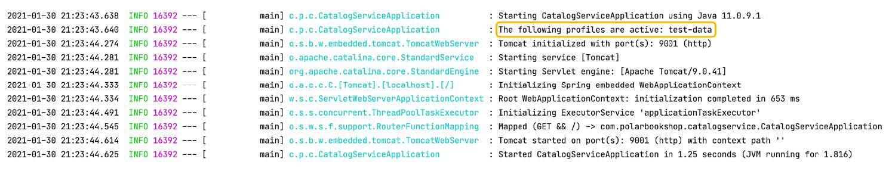

### 4.1.2 Profiles：特性标志和配置分组

有时，您可能希望仅在特定的条件下将 bean 加载到 Spring 上下文中。例如，您可能希望定义一个负责生成测试数据的 bean，仅当在本地工作或测试应用程序时使用。Profiles 是加载 bean 的逻辑组，仅当指定的 Profile 处于活动状态时，才将其导入 Spring 上下文。您可以激活零、一或多个文件。所有未分配给 Profile 文件的 bean 都始终是激活状态。分配给默认 Profile 文件的配置，只有当没有指定 Profile 时，才会被激活。Spring Boot 扩展了这一概念到 Property 文件，允许定义一组配置，仅在特定 Profile 文件处于活动状态时才启用。

本节介绍了 Spring 中 profiles 的两种不同用例：特性标志和配置分组。

#### 将 Profiles 用作特性标志

第一个用例是仅当指定的 Profile 文件处于活动状态时才加载一组配置 bean。部署环境不应该对分组背后的推理产生太大的影响。一个常见的错误是使用像 dev 或 prod 这样的 Profile 文件有条件地加载 bean。如果您这样做，应用程序将与环境耦合，通常不是我们想要的云原生应用程序。

考虑将应用程序部署到三个不同环境的情况（开发、测试和生产），并相应地定义三个 Profile 文件以有条件地加载某些 bean（dev、
test、prod）。这时候，您决定添加一个预发布环境，您还希望在其中启用用 prod 配置文件标记的 bean。您会怎么做呢？有两个选择。一个是在预发布环境中激活 prod （这有点儿不太合理）；另一个是更新源代码以添加一个 staging 文件，并将其分配给标记为 prod 的 bean（这打破了应用程序不变并可部署到任何环境，不需对源代码进行任何更改）。

相反，我建议使用 Profile 文件作为特性标志，与要创建的 bean 组关联以有条件地加载配置。考虑 Profile 文件提供哪些功能，并相应命名而不是考虑在哪里启用。然而，在某些情况下，一个 bean 确实需要处理特定平台上的基础设施。例如，您可能有一些 bean，仅当应用程序部署到 Kubernetes 时才应加载的（无论是预发布还是生产）。在这种情况下，可以定义 `kubernetes` profile。

在第 3 章中，您创建了 Catalog Service 应用程序来管理图书。本地运行时，应用中一本书都还没有，可以手工添加一些书籍以便使用应用程序。当然更好的方式是让应用程序在启动时自动生成一些测试数据，但只在需要时生成（例如，在开发或测试环境中）。是否加载测试数据可以建模为一个特性标志，然后就可以通过配置来启用/禁用这个功能。您可以定义 test-data profile 来触发测试数据的加载。这样，您就可以使用特性标志，使保存于配置文件中的测试数据独立于部署环境，而无需绑定于特定的部署基础设施。我们来实现这一点。

首先，在 Catalog Service 服务中添加一个新的 `com.polarbookshop.catalogservice.demo` 包，并创建 BookDataLoader 类。通过应用 `@profile` 注解，您可以指示 Spring 仅在 test-data profle 激活的情况下加载此类。然后，您可以使用第 3 章中实现的 BookRepository 来保存数据。最后，使用 `@EventListener(ApplicationReadyEvent.class)` 注解将触发测试数据在应用程序完成启动后生成。

**清单 4.4 当 test-data profile 处于活动状态时加载测试数据（BookDataLoader.java）**
```java
package com.polarbookshop.catalogservice.demo;

import com.polarbookshop.catalogservice.domain.Book;
import com.polarbookshop.catalogservice.domain.BookRepository;
import org.springframework.boot.context.event.ApplicationReadyEvent;
import org.springframework.context.annotation.Profile;
import org.springframework.context.event.EventListener;
import org.springframework.stereotype.Component;

@Component
@Profile("test-data")  ❶
public class BookDataLoader {
  private final BookRepository bookRepository;

  public BookDataLoader(BookRepository bookRepository) {
    this.bookRepository = bookRepository;
  }

  @EventListener(ApplicationReadyEvent.class)  ❷
  public void loadBookTestData() {
    var book1 = new Book("1234567891", "Northern Lights", "Lyra Silvertongue", 9.90);
    var book2 = new Book("1234567892", "Polar Journey", "Iorek Polarson", 12.90);
    bookRepository.save(book1);
    bookRepository.save(book2);
  }
}
```

❶ 将类分配给“test-data” profile：仅当“test-data” profile 处于激活状态时才会注册类。

❷ 在发送 ApplicationReadyEvent 时触发测试数据生成，即应用程序启动完成时。

有几种方式可以设置哪个 profile 处于激活状态。在开发环境中，可以在 application.yml 文件中使用 spring.profiles.active 属性指定。

```yaml
spring:
  profiles:
    active: test-data
```

让我们验证一下设置是否有效。构建并运行应用程序（./gradlew bootRun）。首先，可以在应用程序日志中看到一条消息，列出所有激活的 profile（在本例中，它只能是 test-data，但可能还有其他的），如图 4.4 所示。


**图 4.4 “test-data” profile 处于激活状态时 Catalog Service 的日志。**

然后，向应用程序发送请求以获取所有书籍。它应该返回清单 4.4 中创建的测试数据。

```bash
$ http :9001/books
```

验证完成后，使用 Ctrl+C 停止应用程序。
接下来，我将向您展示如何使用 profile 对配置数据进行分组。

#### 将 Profiles  用作配置组

Spring 框架允许您仅在给定的 profile 处于激活状态时才注册 bean。同样，Spring Boot 允许您定义只当特定 profile 处于激活状态时才加载配置数据。一种常见的方法是在配置文件的文件名称中增加 profile 名后缀。比如您可以创建一个新的 application-dev.yml 文件，并为 polar.greeting 定义一个新值，使 Spring 仅在 dev profile 处于活动状态时才加载。特定于 profile 的配置文件优先，于非特定 profile 的配置文件。因此 application-dev.yml 中定义的值优先于 application.yml 中的值。

在这种情况下，profile 用于对配置数据进行分组，并可以映射到部署环境中，而不会面临以前那些弊病。当然不要将特定于 profile 的配置文件与应用打包在一起。`15 因素` 法建议不要批量配置属性并将值分成以环境命名的组，然后与应用程序源代码打包在一起。原因是这样无法扩展：随着项目的发展，可能会为其创建新的环境。开发人员可以创建自己的定制环境配置来尝试新的功能。这样很快就会出现太多的配置组，而需要重新构建应用。相反，您应该让他们呆在应用程序外部。例如，在一个由 Config Server 提供服务的专用存储库中，您将在后续章节看到这一方式。

以下部分将介绍 Spring Boot 如何处理外部配置。教您如何使用命令行参数、JVM 系统属性和环境变量，在使用相同的构建产物时从外部获取配置数据。