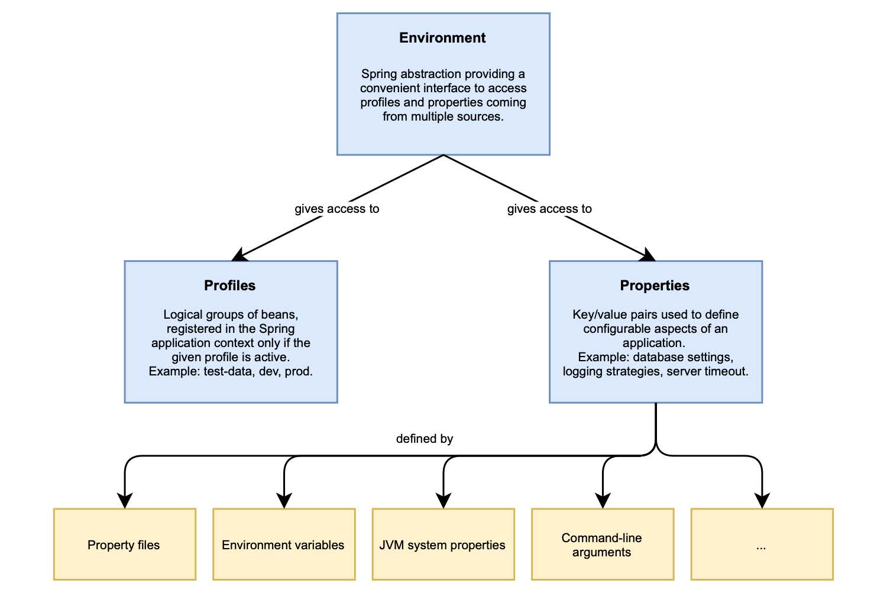

## 4.1 Spring 中的配置：properties 和 profiles

术语 `配置（configuration）` 在不同的上下文中有不同的含义。当讨论 Spring 框架的核心功能及其 ApplicationContext 时，指的是哪些 bean（即在 Spring 中注册的 Java 对象）被定义为由 Spring 容器进行管理，并在需要时自动注入。例如，您有多种方式可以定义 Bean：在 XML 文件中（XML 配置）、在类上添加 @Configuration 注解（Java 配置），或通过注解 @Component（注解驱动配置）。

在本书中，除非另有说明，每当我提到配置时，我不是指以前的概念。而是指在不同部署之间可能会发生变化的一切，这是 `十五要素` 方法论所定义的。

Spring 为您提供了一个方便的环境抽象，允许您访问任何配置数据，而不管其来源如何。Spring 应用程序环境的两个关键方法是 properties 和 profiles。您已经在上一章中使用了 properties。profiles 是一种只有在已启用给定 profile 时，才加载特定标记的一组 bean 或运行时配置数据的工具。图 4.2 显示了 Spring 应用程序的主要配置方法。

**图 4.2 Environment 接口提供了对 Spring 应用程序的两个关键配置方法：properties 和 profiles。**

本节将介绍云原生的 properties 和 profiles，包括如何定义自定义 properties 以及何时使用 profiles。