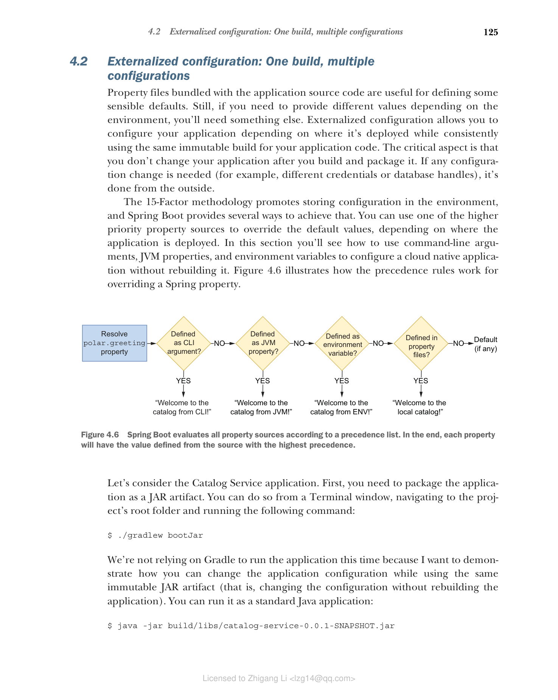

## 4.2 外部化配置：一次构建，多套配置

与应用程序源代码打包在一起的属性文件对于定义一些合理的默认值很有用。但是，如果您需要根据环境提供不同的值，则需要其他方式。外部化配置允许您根据部署位置配置应用程序，同时始终使用相同的不可变构建。关键方面是构建和打包应用程序后不再更改它。如果需要任何配置更改（例如，不同的凭据或数据库句柄），则从外部进行。

15 要素方法论提倡在环境中存储配置，Spring Boot 提供了多种方式来实现这一点。您可以使用优先级更高的属性源来覆盖默认值，具体取决于应用程序部署的位置。在本节中，您将看到如何使用命令行参数、JVM 属性和环境变量来配置云原生应用程序而无需重新构建它。图 4.6 说明了覆盖 Spring 属性时的优先级规则。



**图 4.6 Spring Boot 根据优先级列表评估所有属性源。最终，每个属性将具有来自优先级最高的源的值。**

让我们以 Catalog Service 应用程序为例。首先，您需要将应用程序打包为 JAR 工件。您可以在终端窗口中导航到项目根文件夹并运行以下命令来完成：

```bash
$ ./gradlew bootJar
```

这次我们不依赖 Gradle 来运行应用程序，因为我想演示如何在使用同一个不可变 JAR 工件的同时更改应用程序配置（即在不重新构建应用程序的情况下更改配置）。您可以将其作为标准 Java 应用程序运行：

```bash
$ java -jar build/libs/catalog-service-0.0.1-SNAPSHOT.jar
```

您还没有覆盖任何属性，因此根端点将返回 `application.yml` 文件中定义的 `polar.greeting` 值：

```bash
$ http :9001/
Welcome to the local book catalog!
```

在以下小节中，您将看到如何为 `polar.greeting` 属性提供不同的值。在进入新示例之前，请记得终止 Java 进程（Ctrl-C）。
