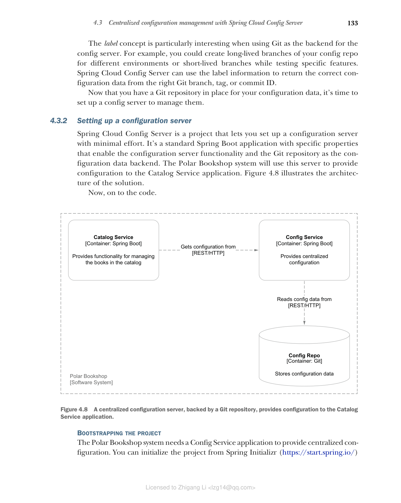
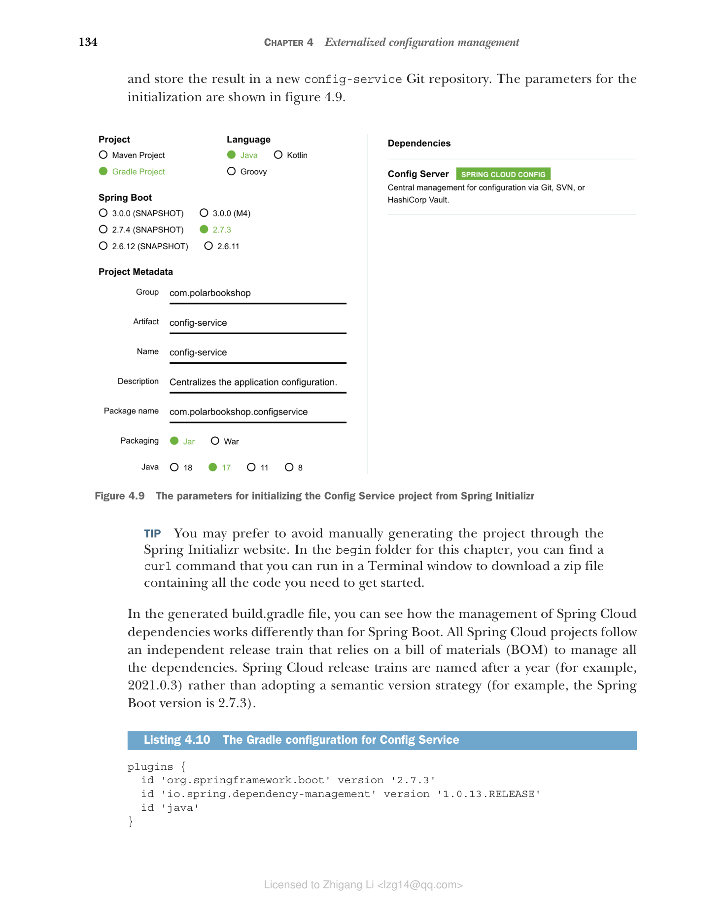

### 4.3.2 设置配置服务器

Spring Cloud Config Server 是一个让您以最小工作量设置配置服务器的项目。它是一个标准的 Spring Boot 应用程序，具有启用配置服务器功能和 Git 仓库作为配置数据后端的特定属性。Polar Bookshop 系统将使用此服务器向 Catalog Service 应用程序提供配置。图 4.8 展示了解决方案的架构。



**图 4.8 由 Git 仓库支持的集中式配置服务器向 Catalog Service 应用程序提供配置。**

现在开始编写代码。

#### 初始化项目

Polar Bookshop 系统需要一个 Config Service 应用程序来提供集中化配置。您可以从 Spring Initializr（[https://start.spring.io/](https://start.spring.io/)）初始化项目，并将结果存储在一个新的 `config-service` Git 仓库中。初始化参数如图 4.9 所示。



**图 4.9 从 Spring Initializr 初始化 Config Service 项目的参数。**

> 提示：您可能更倾向于避免通过 Spring Initializr 网站手动生成项目。在本章的 begin 文件夹中，您可以找到一个 curl 命令，可以在终端窗口中运行以下载包含入门所需所有代码的 zip 文件。

在生成的 `build.gradle` 文件中，您可以看到 Spring Cloud 依赖项的管理方式与 Spring Boot 不同。所有 Spring Cloud 项目都遵循一个独立的发布列车，依赖物料清单（BOM）来管理所有依赖项。Spring Cloud 发布列车以年份命名（例如 2021.0.3），而不是采用语义版本策略（例如 Spring Boot 版本为 2.7.3）。

**代码清单 4.10 Config Service 的 Gradle 配置**

```groovy
plugins {
 id 'org.springframework.boot' version '2.7.3'
 id 'io.spring.dependency-management' version '1.0.13.RELEASE'
 id 'java'
}

group = 'com.polarbookshop'
version = '0.0.1-SNAPSHOT'
sourceCompatibility = '17'

repositories {
 mavenCentral()
}

ext {
 set('springCloudVersion', "2021.0.3") // 定义要使用的 Spring Cloud 版本
}

dependencies {
 implementation 'org.springframework.cloud:spring-cloud-config-server'
 testImplementation 'org.springframework.boot:spring-boot-starter-test'
}

dependencyManagement {
 imports {
 mavenBom "org.springframework.cloud:spring-cloud-dependencies:${springCloudVersion}" // Spring Cloud 依赖管理的 BOM
 }
}

tasks.named('test') {
 useJUnitPlatform()
}
```

这些是主要依赖：

* **Spring Cloud Config Server**（`org.springframework.cloud:spring-cloud-config-server`）— 提供在 Spring Web 之上构建配置服务器的库和工具。
* **Spring Boot Test**（`org.springframework.boot:spring-boot-starter-test`）— 提供多种测试应用程序的库和工具，包括 Spring Test、JUnit、AssertJ 和 Mockito。它自动包含在每个 Spring Boot 项目中。

#### 启用配置服务器

将您之前初始化的项目转变为可运行的配置服务器不需要太多步骤。在 Java 方面，您唯一需要做的是在配置类（如 `ConfigServiceApplication`）上添加 `@EnableConfigServer` 注解。

**代码清单 4.11 在 Spring Boot 中启用配置服务器**

```java
package com.polarbookshop.configservice;

import org.springframework.boot.SpringApplication;
import org.springframework.boot.autoconfigure.SpringBootApplication;
import org.springframework.cloud.config.server.EnableConfigServer;

@SpringBootApplication
@EnableConfigServer // 在 Spring Boot 应用程序中激活配置服务器实现
public class ConfigServiceApplication {

 public static void main(String[] args) {
 SpringApplication.run(ConfigServiceApplication.class, args);
 }

}
```

Java 方面就这些。

#### 配置服务器

下一步是配置服务器的行为。没错，即使是配置服务器也需要配置！首先，Spring Cloud Config Server 运行在内嵌的 Tomcat 服务器上，因此您可以像为 Catalog Service 那样配置连接超时和线程池。

您之前已经初始化了一个 Git 仓库来托管配置数据，现在需要告诉 Spring Cloud Config Server 在哪里找到它。您可以在 Config Service 项目的 `src/main/resources` 路径下的 `application.yml` 文件中完成（将自动生成的 `application.properties` 文件重命名为 `application.yml`）。

`spring.cloud.config.server.git.uri` 属性应指向您定义配置仓库的位置。如果您按照我的做法，它将在 GitHub 上，默认分支名为 `main`。您可以通过设置 `spring.cloud.config.server.git.default-label` 属性来配置服务器默认使用的分支。请记住，使用 Git 仓库时，标签概念是对 Git 分支、标签或提交 ID 的抽象。

**代码清单 4.12 配置服务器与配置仓库之间的集成**

```yaml
server:
 port: 8888 # Config Service 应用程序监听的端口
 tomcat:
 connection-timeout: 2s
 keep-alive-timeout: 15s
 threads:
 max: 50
 min-spare: 5

spring:
 application:
 name: config-service # 当前应用程序的名称
 cloud:
 config:
 server:
 git:
 uri: <your-config-repo-github-url> # 用作配置数据后端的远程 Git 仓库 URL
 default-label: main # 默认情况下，服务器将从 "main" 分支返回配置数据
```

> 警告：我为 Config Service 使用的配置假设配置仓库在 GitHub 上公开可用。当您使用私有仓库时（这对于实际应用程序通常是正确的），您需要使用额外的配置属性指定如何向代码仓库提供商进行身份验证。有关更多信息，请参阅 Spring Cloud Config 官方文档（[https://spring.io/projects/spring-cloud-config](https://spring.io/projects/spring-cloud-config)）。我将在第 14 章进一步讨论凭据处理。
