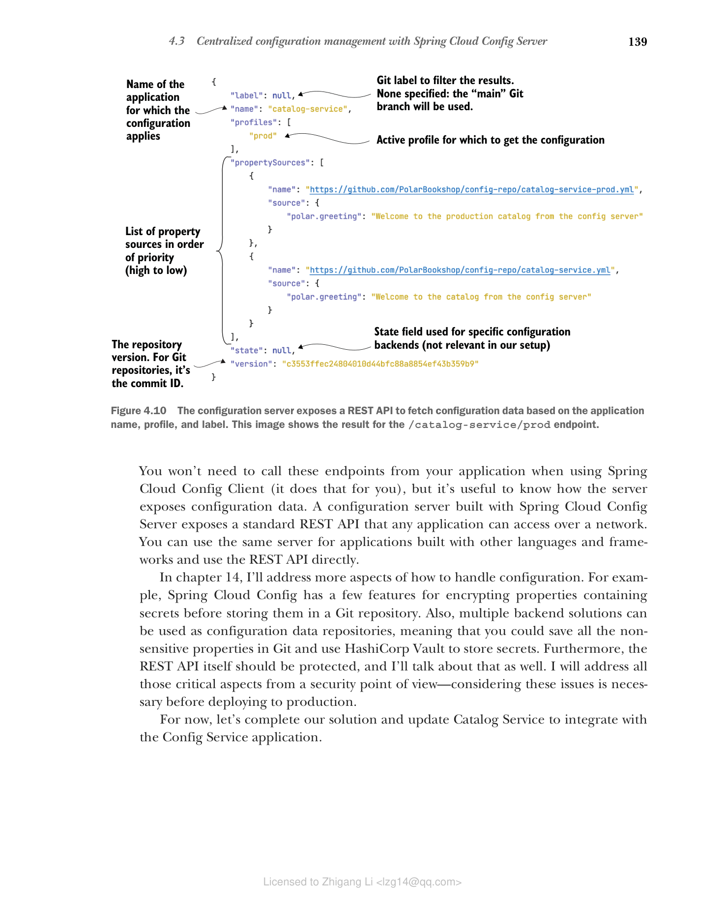

### 4.3.4 理解配置服务器的 REST API

Spring Cloud Config Server 与 Spring Boot 应用程序无缝协作，通过 REST API 以原生格式提供属性。您可以很容易地试用它。构建并运行 Config Service（`./gradlew bootRun`），打开终端窗口，向 `/catalog-service/default` 发送 HTTP GET 请求：

```bash
$ http :8888/catalog-service/default
```

结果是没有 Spring profile 激活时返回的配置。您可以尝试获取 `prod` profile 激活时的配置：

```bash
$ http :8888/catalog-service/prod
```

如图 4.10 所示，结果是配置仓库中 `catalog-service.yml` 和 `catalog-service-prod.yml` 中为 Catalog Service 应用程序定义的配置，其中后者优先于前者，因为指定了 `prod` profile。



**图 4.10 配置服务器暴露 REST API，根据应用程序名称、profile 和标签获取配置数据。此图显示了 /catalog-service/prod 端点的结果。**

测试完应用程序后，使用 Ctrl-C 停止其执行。Spring Cloud Config Server 通过一系列端点暴露属性，使用 `{application}`、`{profile}` 和 `{label}` 参数的不同组合：

```
/{application}/{profile}[/{label}]
/{application}-{profile}.yml
/{label}/{application}-{profile}.yml
/{application}-{profile}.properties
/{label}/{application}-{profile}.properties
```

当您使用 Spring Cloud Config Client 时，不需要从应用程序中调用这些端点（它会替您完成），但了解服务器如何暴露配置数据是很有用的。使用 Spring Cloud Config Server 构建的配置服务器暴露了一个标准 REST API，任何应用程序都可以通过网络访问。您可以将同一服务器用于用其他语言和框架构建的应用程序，并直接使用 REST API。

在第 14 章中，我将讨论更多关于如何处理配置的方面。例如，Spring Cloud Config 有一些功能可以在将包含密钥的属性存储到 Git 仓库之前对其进行加密。此外，多种后端解决方案可用作配置数据仓库，这意味着您可以将所有非敏感属性保存在 Git 中，并使用 HashiCorp Vault 存储密钥。此外，REST API 本身应该受到保护，我也将讨论这一点。我将从安全角度讨论所有这些关键方面——在部署到生产环境之前，考虑这些问题是必要的。

现在，让我们完成解决方案，更新 Catalog Service 以与 Config Service 应用程序集成。
