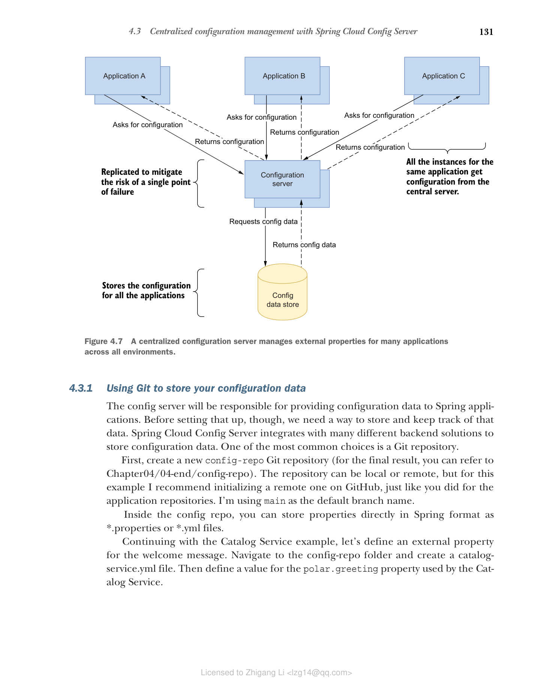

## 4.3 使用 Spring Cloud Config Server 进行集中化配置管理

通过环境变量，您可以外部化应用程序的配置并遵循 15 要素方法论。然而，有一些问题它们无法处理：

* 配置数据与应用程序代码同样重要，因此应该以同样的细心和关注来处理，从持久化开始。您应该在哪里存储配置数据？
* 环境变量不提供细粒度的访问控制功能。如何控制对配置数据的访问？
* 配置数据会演进并需要更改，就像应用程序代码一样。如何跟踪配置数据的修订？如何审核发布中使用的配置？
* 更改配置数据后，如何让应用程序在运行时读取它而无需完全重启？
* 当应用程序实例数量增加时，以分布式方式为每个实例处理配置可能具有挑战性。如何克服这些挑战？
* Spring Boot 属性和环境变量都不支持配置加密，因此您无法安全地存储密码。如何管理密钥？

Spring 生态系统提供了许多选项来解决这些问题。我们可以将它们分为三组。

* **配置服务** — Spring Cloud 项目提供了可用于运行自己的配置服务并配置 Spring Boot 应用程序的模块。
  * Spring Cloud Alibaba 提供使用 Alibaba Nacos 作为数据存储的配置服务。
  * Spring Cloud Config 提供由可插拔数据源（如 Git 仓库、数据存储或 HashiCorp Vault）支持的配置服务。
  * Spring Cloud Consul 提供使用 HashiCorp Consul 作为数据存储的配置服务。
  * Spring Cloud Vault 提供使用 HashiCorp Vault 作为数据存储的配置服务。
  * Spring Cloud Zookeeper 提供使用 Apache Zookeeper 作为数据存储的配置服务。

* **云厂商服务** — 如果您在云厂商提供的平台上运行应用程序，可以考虑使用他们的配置服务之一。Spring Cloud 提供了与主要云厂商配置服务的集成，可用于配置 Spring Boot 应用程序。
  * Spring Cloud AWS 提供与 AWS Parameter Store 和 AWS Secrets Manager 的集成。
  * Spring Cloud Azure 提供与 Azure Key Vault 的集成。
  * Spring Cloud GCP 提供与 GCP Secret Manager 的集成。

* **云平台服务** — 在 Kubernetes 平台上运行应用程序时，您可以无缝使用 ConfigMaps 和 Secrets 来配置 Spring Boot。

本节将展示如何使用 Spring Cloud Config 设置一个集中式配置服务器，负责将存储在 Git 仓库中的配置数据分发给所有应用程序。第 14 章将涵盖更高级的配置主题，包括密钥管理和 Kubernetes 的 ConfigMaps 与 Secrets 等功能。您在使用 Spring Cloud Config 时的许多功能和模式同样适用于涉及配置服务和云厂商服务的其他解决方案。

> 注意：您对配置服务的选择将取决于您的基础设施和需求。例如，假设您已经在 Azure 上运行工作负载，并且需要 GUI 来管理配置数据。在这种情况下，使用 Azure Key Vault 可能比自己运行配置服务更有意义。如果您想用 Git 对配置数据进行版本控制，Spring Cloud Config 或 Kubernetes ConfigMaps 与 Secrets 会是更好的选择。您甚至可以折中，使用 Azure 或 VMware Tanzu 等厂商提供的托管 Spring Cloud Config 服务。

集中化配置的理念围绕两个主要组件构建：

* 用于配置数据的数据存储，提供持久化、版本控制，可能还有访问控制
* 位于数据存储之上的服务器，用于管理配置数据并将其分发给多个应用程序

想象一下有许多部署在不同环境中的应用程序。配置服务器可以从集中位置为所有应用程序管理配置数据，而这些配置数据可以以不同方式存储。例如，您可以使用专用 Git 仓库存储非敏感数据，并使用 HashiCorp Vault 存储密钥。无论数据如何存储，配置服务器都会通过统一接口将其分发给不同的应用程序。图 4.7 展示了集中化配置的工作方式。

**图 4.7 集中式配置服务器为跨所有环境的多个应用程序管理外部属性。**

从图 4.7 中可以清楚地看到，配置服务器成为所有应用程序的后端服务，这意味着它面临成为单点故障的风险。如果它突然不可用，所有应用程序可能都无法启动。通过扩展配置服务器可以轻松缓解这种风险，就像您对需要高可用性的其他应用程序所做的那样。使用配置服务器时，至少部署两个副本是基本要求。

> 注意：您可以将集中式配置服务器用于不依赖于特定基础设施或部署平台的配置数据，如凭据、功能标志、第三方服务 URL、线程池和超时。

我们将使用 Spring Cloud Config Server 为 Polar Bookshop 系统设置集中式配置服务器。该项目还提供了一个客户端库（Spring Cloud Config Client），可用于将 Spring Boot 应用程序与配置服务器集成。

让我们从定义一个用于存储配置数据的仓库开始。
