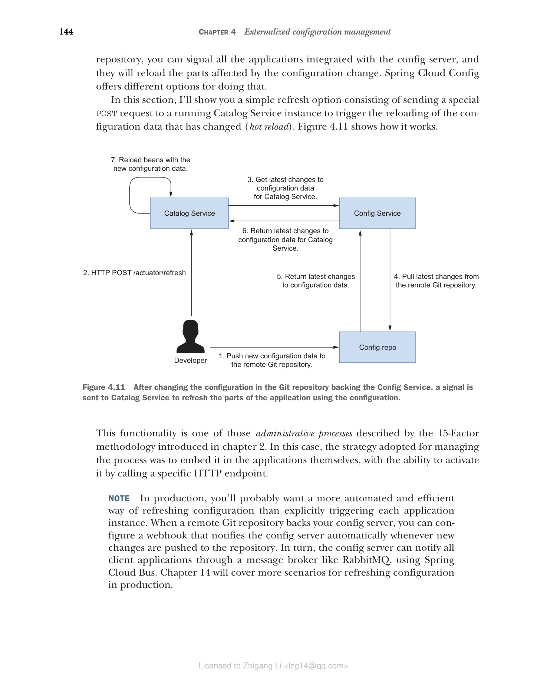

### 4.4.3 在运行时刷新配置

当新更改推送到支持 Config Service 的 Git 仓库时会发生什么？对于标准的 Spring Boot 应用程序，当您更改属性（在属性文件或环境变量中）时，必须重新启动它。然而，Spring Cloud Config 让您有可能在运行时刷新客户端应用程序的配置。每当新的更改推送到配置仓库时，您可以通知所有与配置服务器集成的应用程序，它们将重新加载受配置更改影响的部分。Spring Cloud Config 提供了不同的选项来实现这一点。

在本节中，我将向您展示一个简单的刷新选项，包括向正在运行的 Catalog Service 实例发送一个特殊的 POST 请求，以触发已更改配置数据的重新加载（热重载）。图 4.11 展示了它的工作方式。



**图 4.11 在支持 Config Service 的 Git 仓库中更改配置后，向 Catalog Service 发送信号以刷新使用配置的应用程序部分。**

此功能是第 2 章介绍的 15 要素方法论描述的管理进程之一。在这种情况下，管理进程采用的策略是将其嵌入应用程序本身，并能够通过调用特定的 HTTP 端点来激活它。

> 注意：在生产环境中，您可能希望有一种比显式触发每个应用程序实例更自动化、更高效的配置刷新方式。当配置服务器由远程 Git 仓库支持时，您可以配置一个 webhook，在每次新更改推送到仓库时自动通知配置服务器。反过来，配置服务器可以通过消息代理（如 RabbitMQ）使用 Spring Cloud Bus 通知所有客户端应用程序。第 14 章将介绍更多生产环境中的配置刷新场景。

#### 启用配置刷新

在将新配置更改提交并推送到远程 Git 仓库后，您可以通过特定端点向客户端应用程序发送 POST 请求，这将在应用程序上下文中触发一个 `RefreshScopeRefreshedEvent`。您可以依赖 Spring Boot Actuator 项目来暴露刷新端点，方法是在 Catalog Service 项目的 `build.gradle` 文件中添加新依赖。添加后记得刷新或重新导入 Gradle 依赖。

**代码清单 4.19 在 Catalog Service 中添加 Spring Boot Actuator 依赖**

```groovy
dependencies {
 ...
 implementation 'org.springframework.boot:spring-boot-starter-actuator'
}
```

Spring Boot Actuator 库配置了一个 `/actuator/refresh` 端点来触发刷新事件。默认情况下，该端点未暴露，因此您必须在 Catalog Service 项目的 `application.yml` 文件中显式启用它（`catalog-service`）。

**代码清单 4.20 让 Spring Boot Actuator 暴露刷新端点**

```yaml
management:
 endpoints:
 web:
 exposure:
 include: refresh # 通过 HTTP 暴露 /actuator/refresh 端点
```

> 注意：我将在第 13 章详细讨论 Spring Boot Actuator，所以如果您不完全理解上述配置也不必担心。目前，只需知道 Spring Boot Actuator 提供了许多有用的端点，用于在生产环境中监控和管理应用程序。

刷新事件 `RefreshScopeRefreshedEvent` 如果没有组件监听，将不会有任何效果。您可以在任何希望在触发刷新时重新加载的 bean 上使用 `@RefreshScope` 注解。好的部分是：由于您通过 `@ConfigurationProperties` bean 定义了自定义属性，它默认已经在监听 `RefreshScopeRefreshedEvent`，因此您不需要对代码进行任何更改。当触发刷新时，`PolarProperties` bean 将使用最新可用的配置重新加载。让我们看看它是否有效。

#### 在运行时更改配置

在最后一节中，我将向您展示如何在运行时更改配置。首先，确保 Config Service 和 Catalog Service 都已启动并运行（`./gradlew bootRun`）。然后打开托管配置数据的 `config-repo` 仓库，更改 `config-repo/catalog-service.yml` 文件中 `polar.greeting` 属性的值。

**代码清单 4.21 更新配置仓库中的欢迎消息值**

```yaml
polar:
 greeting: "Welcome to the catalog from a fresh config server"
```

接下来，提交并推送更改。Config Service 现在将返回新的属性值。您可以通过运行 `http :8888/catalog-service/default` 命令来检查。然而，尚未向 Catalog Service 发送任何信号。如果您尝试运行 `http :9001/` 命令，您仍然会得到旧的 "Welcome to the catalog from the config server" 消息。让我们触发刷新。

向 Catalog Service 应用程序的 `/actuator/refresh` 端点发送 POST 请求：

```bash
$ http POST :9001/actuator/refresh
```

此请求将触发一个 `RefreshScopeRefreshedEvent` 事件。`PolarProperties` bean 因为使用了 `@ConfigurationProperties` 注解，将对事件做出反应并读取新的配置数据。让我们验证一下：

```bash
$ http :9001/
Welcome to the catalog from a fresh config server
```

最后，使用 Ctrl-C 停止两个应用程序的执行。做得好！您刚刚在运行时更新了应用程序的配置——无需重启，无需重新构建应用程序，并确保了更改的可追溯性。这非常适合云环境。在第 14 章中，您将学习更多在生产环境中管理配置的高级技术，包括密钥管理、ConfigMaps 和 Secrets。
