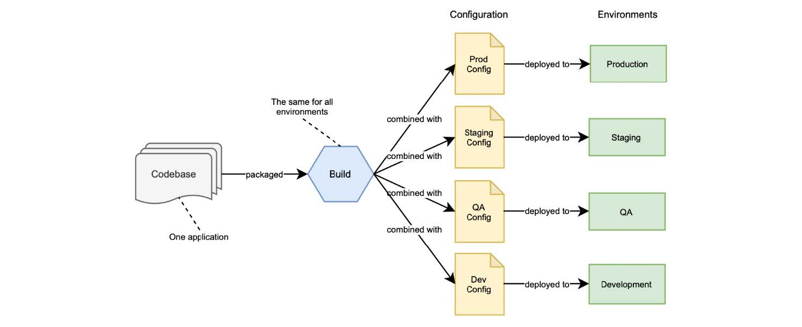

# 第 4 章 配置管理外部化

本章内容：

* 使用 properties 和 profiles 配置 Spring
* 使用 Spring Boot 应用外部配置
* 使用 Spring Cloud Config Server 实现配置服务器
* 使用 Spring Cloud Config Client 配置应用程序

在上一章中，您构建了一个用于管理图书目录的 RESTful 应用程序。作为实现的一部分，您定义了一些数据来配置应用程序的某些方面（在文件中）。例如，Tomcat 线程池或连接超时时间。下一步可能是将应用程序部署到不同的环境：首先是测试环境，然后是预发环境，最后是生产。如果您需要每个环境的都有不同的 Tomcat 配置，如何做到这一点呢？

传统的应用程序通常打包为一个应用包，包括源代码和一系列配置文件。包含不同环境的配置数据，并在运行时标记。这意味着您需要更新特定环境的配置数据时，都必须构建一个新的应用程序包。这一过程的一个改进是为每个环境创建不同的构建，但这意味着您无法保证在预发环境中运行的内容，在生产环境中也会以同样的方式运行，因为它们是不同的打包制品。

`配置（Configuration）`定义为在部署之间可能发生更改的一切（根据 `十五要素` 方法论），如凭据、资源处理程序和支持服务的 URL。根据部署位置的不同，同一应用程序将有不同的需求，并且很可能需要不同的配置。云原生应用程序的一个关键特性是，应用程序制品将在整个环境中保持不变。无论将其部署到哪个环境，都不会更改应用程序制品。

您部署的每个版本都是构建和配置的组合。可以使用相同的构建部署到具有不同配置数据的不同环境，如图 4.1 所示。

**图 4.1 您部署的每个版本都是构建和配置的组合，每个环境都不同。**

可能需要跨部署进行更改的任何内容，都应该是可配置的。例如您可能希望更改凭据以访问支持服务、功能标志和数据库资源或外部 API 的 URL，所有这些都取决于您正在部署应用程序的环境。云原生应用程序支持配置外部化，因此您可以替换它，而无需重新生成代码。关于凭据，它甚至更重要，关键是不要将它们与应用程序代码一起存储。无数的数据泄露，都因为向公开的存储库提交了凭据信息。确保您不会是他们中的一员。

在 Spring 中，配置数据被抽象为 properties，以不同的方式定义键/值对，例如属性文件、JVM 系统属性和系统环境变量。本章介绍在云原生上下文中配置 Spring 应用程序的各个方面。我将介绍有关 Spring 如何处理配置的主要概念，包括 properties 和 profiles，以及如何使用 Spring Boot 应用外部化配置。然后，我将演示如何通过 Git 使用 Spring Cloud Config Server 设置配置服务存储库，作为存储配置数据的后端。最后，您将学习如何通过 Spring Cloud Config Client 访问 Config Server 来配置 Spring Boot 应用程序。

到本章结束时，您将能够根据您的需要和配置数据的类型，使用不同的方法来配置您的云原生 Spring 应用程序。表 4.1 总结了本章介绍的三种主要策略，以定义云原生应用程序的配置数据。第 13 章将进一步扩展本文涵盖的主题，包括机密管理以及如何在 Kubernetes 中使用 ConfigMaps 和 Secrets。

>注意：本章示例的源代码可在 /Chapter04/04-begin 和 /Chapter04/04-end 文件中找到，包含最初和本章结束后的工程状态。（[github.com/ThomasVitale/cloud-native-spring-in-action](https://github.com/ThomasVitale/cloud-native-spring-in-action)）

**表 4.1 可以根据不同的策略配置云原生应用程序。根据配置数据类型和应用程序的要求，您可能会全部使用到它们。**

| 配置策略 | 特征 |
| :--- | :--- |
| 随应用程序打包的属性文件 | · 可以作为应用程序支持的配置数据的规范。  · 用于定义合理的默认值，主要面向开发环境。 |
| 环境变量 | · 任何操作系统都支持环境变量，因此非常方便。  · 大多数编程语言允许您访问环境变量。在 Java 中，可以使用 System.getenv() 方法来实现这一点。在 Spring 里依赖于 Environment 抽象类。  · 用于定义配置数据，具体取决于部署应用程序的基础架构/平台，例如活动配置文件、主机名、服务名和端口号。 |
| 配置服务 | · 提供配置数据持久化、审核和计量。  · 允许使用加密或专用密钥管理机密库。  · 用于定义特定于应用程序的配置数据，例如连接池、凭据、功能标志、线程池和指向第三方服务的 URL。 |

