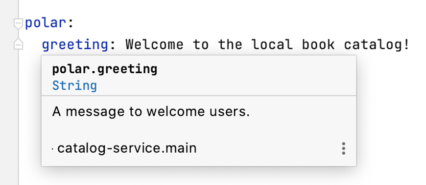
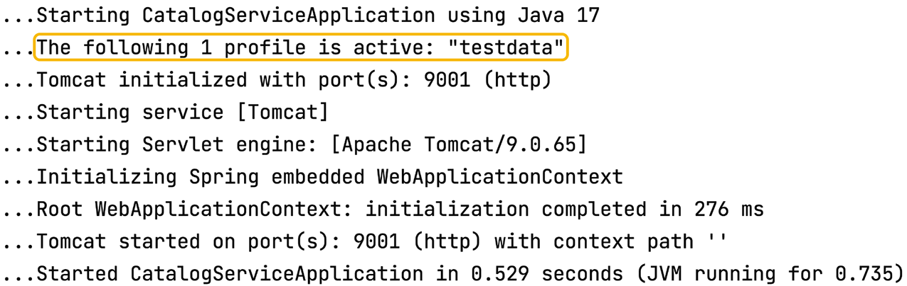

### 5.1.1 云中的数据服务

数据服务是云原生架构中被设计为有状态的组件。通过将应用程序设计为无状态，您可以将云存储挑战限制在少数几个组件上。

传统上，存储由运维工程师和数据库管理员处理。但云和 DevOps 实践使开发人员能够选择最适合应用程序需求的数据服务，并使用与云原生应用程序相同的方法进行部署。数据库管理员等专家被咨询以充分利用开发人员选择的技术，解决性能、安全性和效率等方面的问题。然而，目标是按需提供存储和数据服务，就像您为云原生应用程序所做的那样，并以自助方式配置它们。

应用程序服务和数据服务之间的区别也可以从云基础设施的三个基本构建块来理解：计算、存储和网络。如图 5.1 所示，应用程序服务使用计算和网络资源，因为它们是无状态的。另一方面，数据服务是有状态的，需要存储来持久化状态。

**图 5.1 应用程序服务（无状态）仅使用云基础设施中的计算和网络资源。数据服务（有状态）还需要存储。**

让我们来看看数据服务在云环境中面临的挑战，以及主要的数据服务类别。

#### 数据服务的挑战

云原生系统中的数据服务通常是现成的组件，如数据库和消息代理。在选择最适合您应用程序的技术时，需要考虑以下几个属性：

* **可扩展性** — 云原生应用程序可以动态扩展和收缩。数据服务也不例外：它们应该能够扩展以适应增加或减少的工作负载。新的挑战是在扩展的同时确保对数据存储的安全访问。云中流经系统的数据量比以往任何时候都大，而且可能会突然增加，因此数据服务应该支持工作负载增加的可能性，并具有韧性。

* **韧性** — 与云原生应用程序类似，数据服务应该能够抵御故障。这里的新方面是，使用特定存储技术持久化的数据也应该具有韧性。确保数据韧性并防止数据丢失的关键策略之一是复制。跨不同集群和地理区域复制数据使其更具韧性，但这需要付出代价。关系型数据库等数据服务允许在确保数据一致性的同时进行复制。其他一些非关系型数据库提供高韧性级别，但不能始终保证数据一致性（它们提供所谓的最终一致性）。

* **性能** — 数据复制的方式可能会影响性能，性能还受到特定存储技术的 I/O 访问延迟和网络延迟的限制。存储相对于依赖它的数据服务的位置变得很重要——这是我们在云原生应用程序中没有遇到的问题。

* **合规性** — 您可能在数据服务方面面临比云原生应用程序更多的合规性挑战。持久化的数据通常对业务至关重要，通常包含受特定法律、法规或客户协议保护的信息。例如，在处理个人敏感信息时，您必须根据隐私法律管理数据。在欧洲，这意味着遵守《通用数据保护条例》（GDPR）。在加利福尼亚州，有《加州消费者隐私法案》（CCPA）。在其他领域，适用更多法律。例如，美国的健康数据应符合《健康保险可携带性和责任法案》（HIPAA）的要求。云原生存储和云提供商都应遵守您需要遵守的法律或协议。

#### 数据服务的类别

数据服务可以根据谁负责管理来分类：云提供商或您自己。云提供商提供多种数据服务产品，解决云原生存储的所有主要挑战。

您可以找到行业标准服务，如 PostgreSQL、Redis 和 MariaDB。一些云提供商甚至在此基础上提供增强功能，针对可扩展性、可用性、性能和安全性进行优化。例如，如果您需要关系型数据库，可以使用 Amazon Relational Database Service (RDS)、Azure Database 或 Google Cloud SQL。

云提供商还提供专门为云构建的新型数据服务，并暴露其独特的 API。例如，Google BigQuery 是一个无服务器数据仓库解决方案，特别关注高可扩展性。另一个示例是 Azure 提供的极快的非关系型数据库 Cosmos DB。

另一个选择是自己管理数据服务，这会增加您的复杂性，但让您对解决方案有更多控制权。您可以选择使用基于虚拟机的传统设置，也可以使用容器并利用您在管理云原生应用程序中学到的经验。使用容器将允许您通过统一的接口（如 Kubernetes）管理系统中的所有服务，处理计算和存储资源并降低成本。图 5.2 说明了云的这些数据服务类别。

**图 5.2 数据服务可以由您自己管理（作为容器或虚拟机）或由云提供商管理。在第一种情况下，您可以使用更传统的服务；在第二种情况下，您还可以访问提供商专门为云构建的多种服务。**

> 注意：当选择自己运行和管理数据服务时（无论是虚拟机还是 Kubernetes 上的容器），另一个关键决定是您将使用什么类型的存储。本地持久化存储？远程持久化存储？云原生存储是一个令人着迷的主题，但超出了本书的范围。如果您想了解更多，我建议查看 CNCF 云原生互动全景图中的云原生存储部分（[https://landscape.cncf.io](https://landscape.cncf.io)）。
