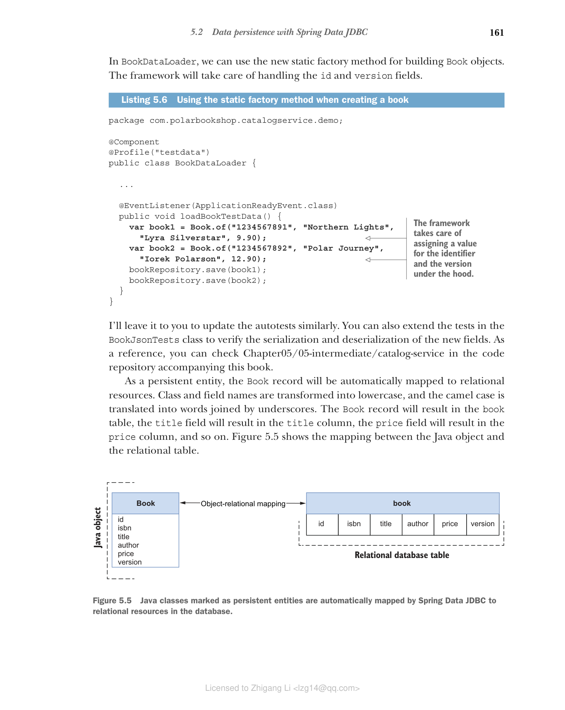

### 5.2.2 使用 Spring Data 定义持久化实体

在 Catalog Service 中，您已经有了一个表示应用程序领域实体的 Book 记录。根据业务领域及其复杂性，您可能想要区分领域实体和持久化实体，使领域层完全独立于持久化层。如果您想探索如何建模这种场景，建议参考领域驱动设计和六边形架构原则。

在这种情况下，业务领域相当简单，因此我们将更新 Book 记录，使其也成为持久化实体。

#### 使领域类持久化

Spring Data JDBC 鼓励使用不可变实体。使用 Java record 来建模实体是一个绝佳的选择，因为它们在设计上就是不可变的，并暴露一个全参数构造函数，框架可以使用它来填充对象。

持久化实体必须有一个作为对象标识符的字段，这将转换为数据库中的主键。您可以使用 @Id 注解（来自 org.springframework.data.annotation 包）将字段标记为标识符。数据库负责为每个创建的对象自动生成唯一标识符。

> 注意：图书由 ISBN 唯一标识，我们可以将其称为领域实体的自然键（或业务键）。我们可以决定也使用它作为主键，或者引入技术键（或代理键）。这两种方法都有优缺点。我选择使用技术键，以便更容易管理，并将领域关注点与持久化实现细节解耦。

这就足以在数据库中创建和持久化 Book。当单个用户独立更新现有的 Book 对象时也可以。但是，如果同一实体被多个用户并发更新会怎样？Spring Data JDBC 支持乐观锁来解决这个问题。用户可以并发读取数据。当用户尝试更新操作时，应用程序检查自上次读取以来是否有任何更改。如果有，操作将不执行，并抛出异常。检查基于一个数字字段，该字段从 0 开始计数，并在每次更新操作时自动增加。您可以使用 @Version 注解（来自 org.springframework.data.annotation 包）标记这样的字段。

当 @Id 字段为 null 且 @Version 字段为 0 时，Spring Data JDBC 假定这是一个新对象。因此，它依赖数据库在向表中插入新行时生成标识符。当提供值时，它期望在数据库中找到该对象并更新它。

让我们继续为 Book 记录添加两个新字段：标识符和版本号。由于两个字段都由 Spring Data JDBC 在底层填充和处理，使用全参数构造函数在生成测试数据等情况下可能太冗长。为方便起见，让我们向 Book 记录添加一个静态工厂方法，通过仅传递业务字段来构建对象。

**代码清单 5.4 为 Book 对象定义标识符和版本**

```java
package com.polarbookshop.catalogservice.domain;

public record Book (
 @Id Long id,

 @NotBlank(message = "The book ISBN must be defined.")
 @Pattern(
 regexp = "^([0-9]{10}|[0-9]{13})$",
 message = "The ISBN format must be valid."
 )
 String isbn,

 @NotBlank(message = "The book title must be defined.")
 String title,

 @NotBlank(message = "The book author must be defined.")
 String author,

 @NotNull(message = "The book price must be defined.")
 @Positive(message = "The book price must be greater than zero.")
 Double price,

 @Version int version
) {
 public static Book of(
 String isbn,
 String title,
 String author,
 Double price
 ) {
 return new Book(
 null,
 isbn,
 title,
 author,
 price,
 0
 );
 }
}
```

> 注意：Spring Data JPA 使用可变对象，因此不能使用 Java record。JPA 实体类必须使用 @Entity 注解标记，并暴露无参构造函数。JPA 标识符使用 javax.persistence 包中的 @Id 和 @Version 注解，而不是 org.springframework.data.annotation。

添加新字段后，我们需要更新一些使用 Book 构造函数的类，现在需要传递 id 和 version 的值。

BookService 类包含更新图书的逻辑。打开它并更改 editBookDetails() 方法，确保在调用数据层时正确传递图书标识符和版本。

**代码清单 5.5 在图书更新时包含现有标识符和版本**

```java
package com.polarbookshop.catalogservice.domain;

@Service
public class BookService {
 ...
 public Book editBookDetails(String isbn, Book book) {
 return bookRepository.findByIsbn(isbn)
 .map(existingBook -> {
 var bookToUpdate = new Book(
 existingBook.id(),
 existingBook.isbn(),
 book.title(),
 book.author(),
 book.price(),
 existingBook.version()
 );
 return bookRepository.save(bookToUpdate);
 })
 .orElseGet(() -> addBookToCatalog(book));
 }
}
```

在 BookDataLoader 中，我们可以使用新的静态工厂方法来构建 Book 对象。框架将负责处理 id 和 version 字段。

**代码清单 5.6 创建图书时使用静态工厂方法**

```java
package com.polarbookshop.catalogservice.demo;

@Component
@Profile("testdata")
public class BookDataLoader {
 ...
}
```

框架负责在底层为标识符和版本字段赋值。

我将把更新自动测试的工作留给您，操作方式类似。您也可以扩展 BookJsonTests 类中的测试，验证新字段的序列化和反序列化。作为参考，您可以查看本书代码仓库中的 Chapter05/05-intermediate/catalog-service。

作为持久化实体，Book 记录将自动映射到关系型资源。类名和字段名会被转换为小写形式，驼峰命名会被转换为下划线连接的单词。Book 记录将对应 book 表，title 字段将对应 title 列，price 字段将对应 price 列，以此类推。图 5.5 展示了 Java 对象和关系表之间的映射。


**图 5.5 标记为持久化实体的 Java 类会被 Spring Data JDBC 自动映射到数据库中的关系型资源。**
