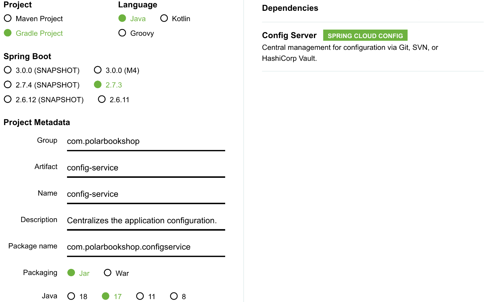
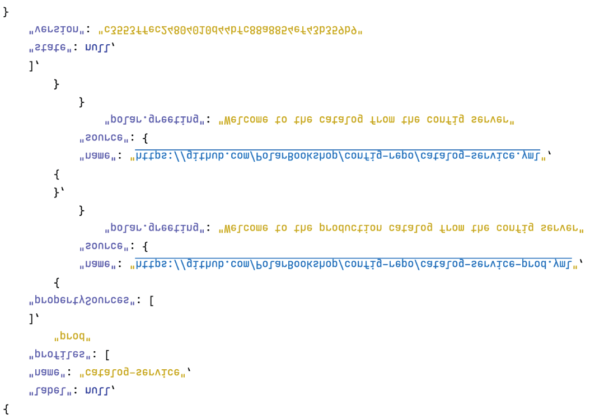

## 5.2 使用 Spring Data JDBC 进行数据持久化

Spring 通过 Spring Data 项目支持多种数据持久化技术，该项目包含专门用于关系型数据库（JDBC、JPA、R2DBC）和非关系型数据库（Cassandra、Redis、Neo4J、MongoDB 等）的模块。Spring Data 提供通用的抽象和模式，使不同模块之间的导航变得简单直观。本节重点介绍关系型数据库，但应用程序与数据库交互的关键点（如图 5.3 所示）适用于所有模块。

**图 5.3 驱动程序配置应用程序与数据库之间的连接。实体表示领域对象，可以通过仓库进行存储和检索。**

图 5.3 中交互的主要元素是数据库驱动程序、实体和仓库：

* **数据库驱动程序** — 提供与特定数据库集成的组件。对于关系型数据库，可以在命令式/阻塞应用程序中使用 JDBC 驱动程序（Java 数据库连接 API），或在响应式/非阻塞应用程序中使用 R2DBC 驱动程序。对于非关系型数据库，每个供应商都有自己的专用解决方案。

* **实体** — 持久化到数据库中的领域对象。它们必须包含一个唯一标识每个实例的字段（主键），并可以使用专用注解配置 Java 对象和数据库条目之间的映射。

* **仓库** — 用于数据存储和检索的抽象。Spring Data 提供基本实现，每个模块进一步扩展这些实现以提供特定数据库的功能。

本节将展示如何使用 Spring Data JDBC 为 Catalog Service 等 Spring Boot 应用程序添加数据持久化功能。您将配置连接池以通过 JDBC 驱动程序与 PostgreSQL 数据库交互，定义要持久化的实体，使用仓库访问数据，并使用事务。图 5.4 展示了本章结束时 Polar Bookshop 架构的样子。

**图 5.4 Catalog Service 应用程序使用 PostgreSQL 数据库持久化图书数据。**

#### Spring Data JDBC 还是 Spring Data JPA？

Spring Data 提供了两个主要选项来通过 JDBC 驱动程序将应用程序与关系型数据库集成：Spring Data JDBC 和 Spring Data JPA。如何选择？答案取决于您的需求和具体场景。

Spring Data JPA（https://spring.io/projects/spring-data-jpa）是 Spring Data 项目中使用最广泛的模块。它基于 Java 持久化 API（JPA），这是 Jakarta EE（以前称为 Java EE）中包含的标准规范。Hibernate 是最流行的实现，它是一个强大且经过实战检验的对象关系映射（ORM）框架，用于管理 Java 应用程序中的数据持久化。Hibernate 提供了许多有用的功能，但它也是一个复杂的框架。如果您不了解持久化上下文、延迟加载、脏检查或会话等方面，可能会遇到难以调试的问题。一旦您更了解这个框架，就会欣赏 Spring Data JPA 如何简化操作并提高生产力。

Spring Data JDBC（https://spring.io/projects/spring-data-jdbc）是 Spring Data 家族中较新的成员。它按照领域驱动设计（DDD）概念（如聚合、聚合根和仓库）与关系型数据库集成。它轻量级、简单，是微服务的绝佳选择，因为微服务中的领域通常被定义为限界上下文（另一个 DDD 概念）。它给开发人员更多控制 SQL 查询的权力，并允许使用不可变实体。作为 Spring Data JPA 的更简单替代方案，它不能在所有场景中替代 JPA，因为它不提供 JPA 的所有功能。

我选择在这里介绍 Spring Data JDBC，是因为它与云原生应用程序的良好契合和简单性。得益于 Spring Data 的通用抽象和模式，您可以轻松地将项目从 Spring Data JDBC 转换为 Spring Data JPA。在接下来的章节中，我将指出两者之间的主要差异，以便您有足够的信息尝试使用 Spring Data JPA 实现相同的需求。
