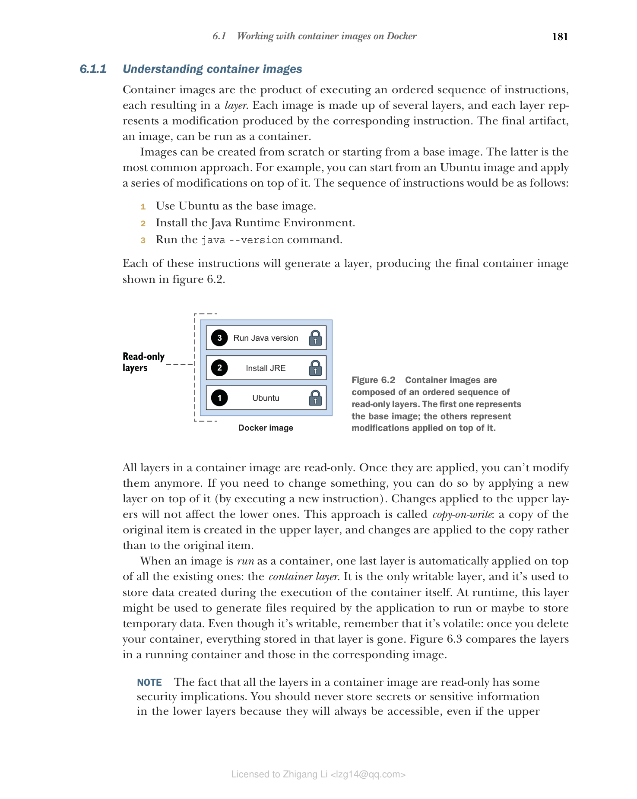

### 6.1.1 理解容器镜像

容器镜像是执行有序指令序列的产物，每条指令产生一个层。每个镜像由多个层组成，每层代表相应指令产生的修改。最终产物（镜像）可以作为容器运行。

镜像可以从头创建，也可以从基础镜像开始创建。后者是最常见的方法。例如，您可以从 Ubuntu 镜像开始，在其上应用一系列修改。指令序列如下：

1. 使用 Ubuntu 作为基础镜像
2. 安装 Java 运行时环境
3. 运行 java --version 命令

每条指令将生成一个层，产生如图 6.2 所示的最终容器镜像。

**图 6.2 容器镜像由有序的只读层序列组成。第一层代表基础镜像；其他层代表在其上应用的修改。**

容器镜像中的所有层都是只读的。一旦应用，就无法再修改。如果需要更改某些内容，可以通过在其上应用新层（执行新指令）来完成。对上层的更改不会影响下层。这种方法称为写时复制：在上层创建原始项目的副本，更改应用于副本而不是原始项目。

当镜像作为容器运行时，最后一层会自动应用于所有现有层之上：容器层。它是唯一的可写层，用于存储容器本身执行期间创建的数据。在运行时，此层可能用于生成应用程序运行所需的文件，或存储临时数据。尽管它是可写的，但请记住它是易失的：一旦删除容器，存储在该层中的所有内容都会消失。图 6.3 比较了运行容器中的层和相应镜像中的层。

**图 6.3 运行的容器在镜像层之上有一个额外的层。这是唯一的可写层，但请记住它是易失的。**

> 注意：容器镜像中的所有层都是只读的这一事实有一些安全方面的影响。您永远不应在下层存储密钥或敏感信息，因为即使上层删除了它们，它们也始终可以访问。例如，不应在容器镜像中打包密码或加密密钥。

到目前为止，您已经了解了容器镜像的组成，但还没有看到如何创建一个。接下来将介绍。
