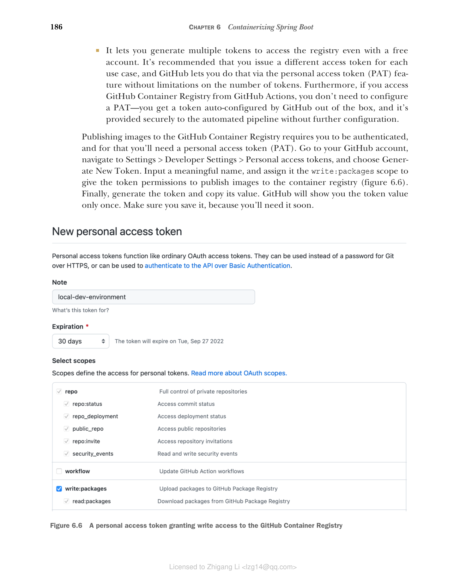
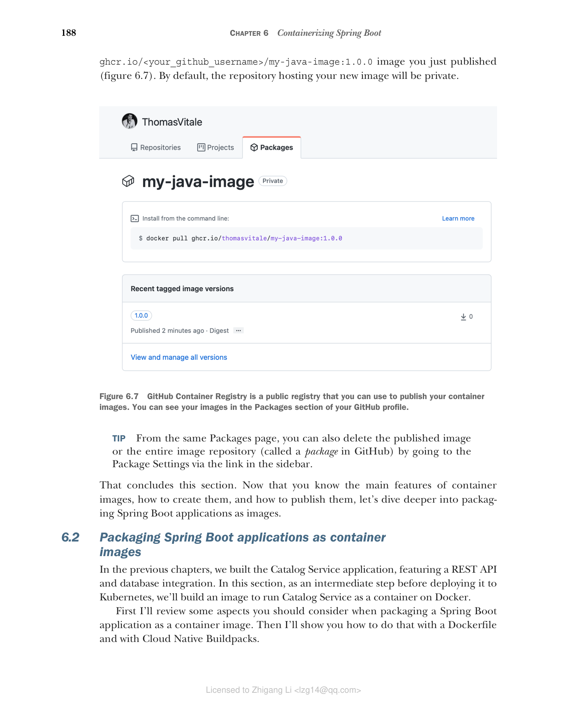

### 6.1.3 在 GitHub Container Registry 上发布镜像

到目前为止，您已经学习了如何定义、构建和运行容器镜像。在本节中，我将通过扩展容器注册表来完成整个过程。

容器注册表之于镜像，就像 Maven 仓库之于 Java 库。许多云提供商提供自己的注册表解决方案，附带额外服务，如漏洞扫描和认证镜像。默认情况下，Docker 安装配置为使用 Docker 公司提供的容器注册表（Docker Hub），它托管许多流行开源项目的镜像，如 PostgreSQL、RabbitMQ 和 Redis。我们将继续使用它来拉取第三方镜像，就像您在上一节中为 Ubuntu 所做的那样。

如何发布您自己的镜像？您当然可以使用 Docker Hub 或云提供商提供的注册表之一（如 Azure Container Registry）。对于我们在本书中处理的特定项目，我选择依赖 GitHub Container Registry（[https://docs.github.com/en/packages](https://docs.github.com/en/packages)），原因如下：

* 它可供所有个人 GitHub 账户使用，公共仓库免费。您也可以将其与私有仓库一起使用，但有一些限制。
* 它允许您匿名访问公共容器镜像，没有速率限制，即使是免费账户。
* 它完全集成到 GitHub 生态系统中，可以无缝地从镜像导航到相关源代码。
* 即使使用免费账户，它也允许您生成多个令牌来访问注册表。建议您为每个用例颁发不同的访问令牌，GitHub 通过个人访问令牌（PAT）功能让您做到这一点，并且对令牌数量没有限制。此外，如果您从 GitHub Actions 访问 GitHub Container Registry，则不需要配置 PAT——您会获得一个由 GitHub 自动配置的令牌，并且它会安全地提供给自动化管道，无需进一步配置。

发布镜像到 GitHub Container Registry 需要您进行身份验证，为此您需要一个个人访问令牌（PAT）。转到您的 GitHub 账户，导航到 Settings > Developer Settings > Personal access tokens，选择 Generate New Token。输入一个有意义的名称，并为其分配 write:packages 范围，以授予令牌发布镜像到容器注册表的权限（图 6.6）。最后，生成令牌并复制其值。GitHub 只会向您显示一次令牌值。请确保保存它，因为您很快就会用到它。


**图 6.6 授予 GitHub Container Registry 写入权限的个人访问令牌**

接下来，打开终端窗口并通过 GitHub Container Registry 进行身份验证（确保您的 Docker Engine 正在运行）。当被询问时，输入用户名（您的 GitHub 用户名）和密码（您的 GitHub PAT）：

```bash
$ docker login ghcr.io
```

如果您跟着操作了，您的机器上应该有自定义的 my-java-image Docker 镜像。如果没有，请确保执行了上一节中描述的操作。

容器镜像遵循通用命名约定，被 OCI 兼容的容器注册表采用：

```
<container_registry>/<namespace>/<name>[:<tag>]
```

* **容器注册表** — 存储镜像的容器注册表的主机名。使用 Docker Hub 时，主机名是 docker.io，通常省略。如果您不指定注册表，Docker Engine 会隐式地在镜像名前添加 docker.io。使用 GitHub Container Registry 时，主机名是 ghcr.io，必须显式指定。
* **命名空间** — 使用 Docker Hub 或 GitHub Container Registry 时，命名空间将是您的 Docker/GitHub 用户名（全小写）。在其他注册表中，它可能是仓库的路径。
* **名称和标签** — 镜像名称表示包含所有版本的镜像的仓库（或包）。后面可选地跟有标签以选择特定版本。如果未定义标签，默认使用 latest 标签。

像 ubuntu 或 postgresql 这样的官方镜像可以仅通过指定名称来下载，它们会被隐式转换为完全限定名称，如 docker.io/library/ubuntu 或 docker.io/library/postgres。

将镜像上传到 GitHub Container Registry 时，您需要使用完全限定名称，遵循 ghcr.io/<your_github_username>/<image_name> 格式。例如，我的 GitHub 用户名是 ThomasVitale，我所有的个人镜像命名为 ghcr.io/thomasvitale/<image_name>（注意用户名如何转换为小写）。

由于您之前构建了名为 my-java-image:1.0.0 的镜像，在发布到容器注册表之前需要为其分配一个完全限定名称（即需要标记镜像）。您可以使用 docker tag 命令来完成：

```bash
$ docker tag my-java-image:1.0.0 \
 ghcr.io/<your_github_username>/my-java-image:1.0.0
```

然后您可以将其推送到 GitHub Container Registry：

```bash
$ docker push ghcr.io/<your_github_username>/my-java-image:1.0.0
```

转到您的 GitHub 账户，导航到个人资料页面，进入 Packages 部分。您应该会看到一个新的 my-java-image 条目。如果点击它，您会找到刚刚发布的 ghcr.io/<your_github_username>/my-java-image:1.0.0 镜像（图 6.7）。默认情况下，托管新镜像的仓库是私有的。


**图 6.7 GitHub Container Registry 是一个公共注册表，您可以用它来发布容器镜像。您可以在 GitHub 个人资料的 Packages 部分看到您的镜像。**

> 提示：从同一个 Packages 页面，您还可以通过侧边栏中的链接进入 Package Settings 来删除已发布的镜像或整个镜像仓库（在 GitHub 中称为 package）。

本节到此结束。现在您已经了解了容器镜像的主要特征、如何创建它们以及如何发布它们，接下来让我们深入了解如何将 Spring Boot 应用程序打包为镜像。
